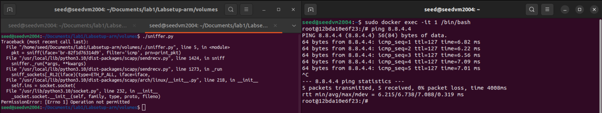
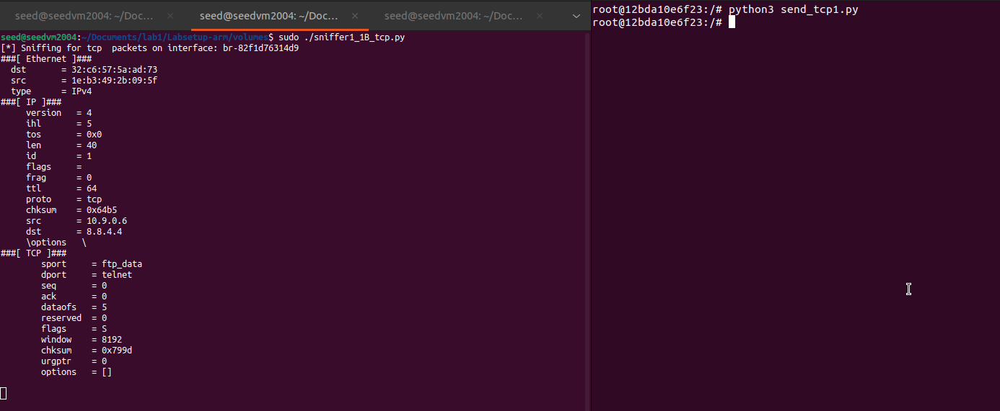
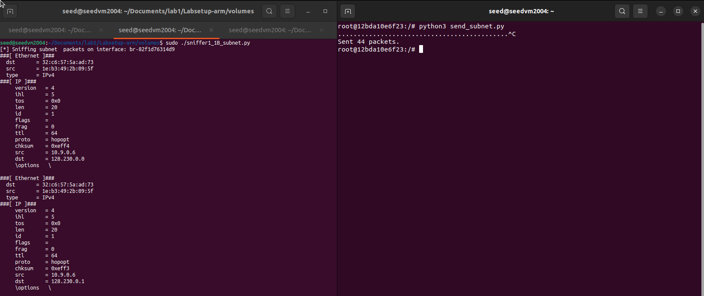
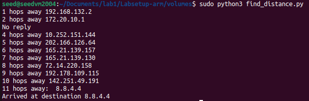
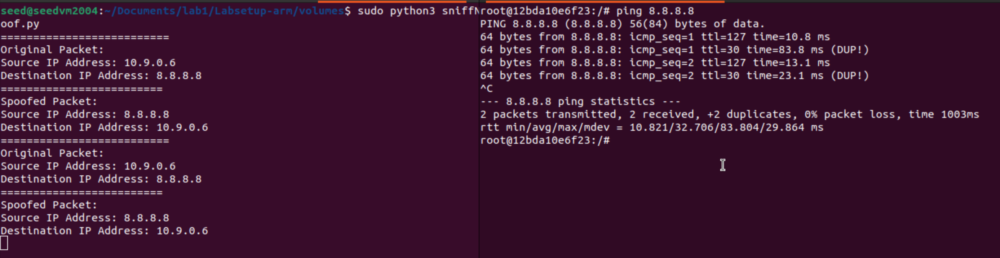
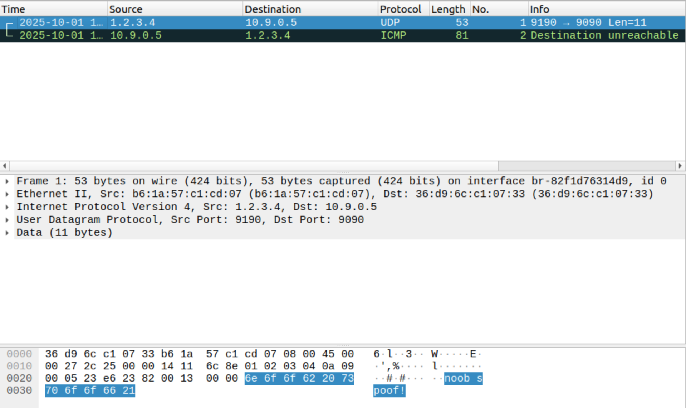

# 50.020 Network Security Lab 1 Writeup

## Setting up the Environment
1. First I setup the 3 containers
    - 

## Task 1.1 Packet Sniffing with Scapy
### Task 1.1A
1. I ran the `sniffer.py` python script with root privileges to capture packets with scapy, that were sent when I ping `8.8.4.4`
    - 
2. I try running the `sniffer.py` script without root privileges, and it throws an error
    - 
    - This happens due to `PermissionError` as we see from the error message, and is expected since we the the packet capturing is running on the OS level, and requires root privileges to access the network interfaces.
### Task 1.1B
1. We want to capture only ICMP packets, can use this code below:
    - ```python
        #!/usr/bin/python3
        from scapy.all import *

        interface_id = 'br-82f1d76314d9'


        def filter_icmp_packets():
            print(f"[*] Sniffing for ICMP echo packets on interface: {interface_id}")

            def process_packet(packet):
                if packet[ICMP].type in [8, 0]: # Filter already ensures ICMP layer exists
                    packet.show()

            sniff(iface=interface_id, filter='icmp', prn=process_packet)

        filter_icmp_packets()
        ```
    - Then we run the script with root privileges, and ping `8.8.4.4` again
    - see that the script captures only ICMP packets
    - 
2. We want to sniff only TCP packets,
    - we can use this code below:
    - ```python 
                #!/usr/bin/python3
        from scapy.all import *

        interface_id ='br-82f1d76314d9'

        def print_pkt(pkt):
            pkt.show()

        def filter_tcp_packets():
            print(f"[*] Sniffing for tcp  packets on interface: {interface_id}")

            pkt = sniff(iface = interface_id, filter = 'tcp and src host 10.9.0.6 and dst port 23' , prn = print_pkt)

        filter_tcp_packets()
        ```
    - then we run the script with root privileges
    - we use another python script on our host B to send a TCP packet to `8.8.4.4` on port `23`
    - ```python
        #!/usr/bin/python3
        from scapy.all import *
        import sys

        def send_tcp_syn(target_ip, target_port):
            # IP layer: Set the destination IP address. Scapy fills in the source IP automatically.
            ip_packet = IP(dst=target_ip)
            tcp_packet = TCP(dport=target_port, flags='S')
            # Combine the layers into a single packet
            packet = ip_packet / tcp_packet
            response = sr1(packet, timeout=2, verbose=0)

        if __name__ == '__main__':
            # target ip address 8.8.4.4
            destination_ip = "8.8.4.4"
            # Using port 23
            destination_port = 23
            send_tcp_syn(destination_ip, destination_port)
        ```
    - We get this from sniffing:
    - 

3. We want to sniff packets to a particular subnet `128.230.0.0/16`
    - use this code to sniff:
    - ```python
        #!/usr/bin/python3
        from scapy.all import *

        interface_id ='br-82f1d76314d9'

        def print_pkt(pkt):
            pkt.show()

        def filter_subnet_packets():
            print(f"[*] Sniffing subnet  packets on interface: {interface_id}")

            pkt = sniff(iface = interface_id, filter = 'dst net 128.230.0.0/16' , prn = print_pkt)

        filter_subnet_packets()
        ```
    - then we run the script with root privileges
    - we use another python script on our host B to send a TCP packet to `128.230.0.0/16`
    - ```python
        #!/usr/bin/python3
        from scapy.all import *

        ip_addr = IP()
        ip_addr.dst = '128.230.0.0/16'
        send(ip_addr, count=1)
        ```
    - we get this result:
    - 

## Task 1.2 Spoofing ICMP packets
- using the script provided in the assignment brief
- ```python 
    #!/usr/bin/python3
    from scapy.all import *

    print('sending spoofed icmp packets')
    a = IP()
    a.dst = '10.0.2.3'
    a.src = '1.1.1.1'
    icmp = ICMP()
    pkt = a/icmp
    pkt.show()
    send(pkt)
    ```
- run the script with root privileges
- then we run `tcpdump` with `sudo` to capture the spoofed packets
- we see that the spoofed ICMP echo request is captured
- `1.1.1.1 > 10.0.2.3` indicates that the source is `1.1.1.1` and the destination is `10.0.2.3`
- screenshot below:
    - 


## Task 1.3 Traceroute
1. wrote this python script to iterate ttl
    - ```python
        #!/usr/bin/env python3
        from scapy.all import *

        DEST = '8.8.4.4'

        a = IP()
        a.dst = DEST
        ttl = 1

        for i in range(30):
            a.ttl = ttl
            b = ICMP()
            pkt = a/b
            response = sr1(pkt,timeout=5,verbose =0)
            if response is None:
                print('No reply')
            elif response[ICMP].type ==0:
                print(f'{a.ttl} hops away: ', response[IP].src)
                print('Arrived at destination',response[IP].src)
                break
            else:
                print(f'{a.ttl} hops away', response[IP].src)
            ttl+=1
        ```
    - then we run the script with root privileges
    - we see the hops taken to reach our destination IP address `8.8.4.4` is `11`
    - 
    - and we can verify this with `Wireshark` as well we see that there are `11` ICMP Echo (ping) requests sent out before we get a reply from `8.8.4.4`
    - 

## Task 1.4 Sniffing then spoofing
1. The task asks us to test what happens when we ping these 3 IP addresses
    - `1.2.3.4` a non-existent IP address on the Internet
    - `10.9.0.99` a non-existent IP address on our LAN
    - `8.8.8.8` a valid IP address on the Internet
2. When we ping these 3 addresses, we see the following results:
    - 
    - pinging `1.2.3.4` results in no reply and 100% packet loss
    - pinging `10.9.0.99` results in Destination Host Unreachable
    - pinging `8.8.8.8` results in a reply from the host
3. we run `ip route get <ip address>` to see the route taken to reach these 3 IP addresses
    - 
    - we see that for `1.2.3.4` even though it is a non-existent IP address, there is a mapping for this IP address in the routing table. It is still routed though `10.9.0.1`, this knowledge will be useful to explain what we see later
    - for `10.9.0.99`, there is no routing for this IP address in the routing table, hence we get Destination Host Unreachable
    - for `8.8.8.8`, there is a valid route to this IP address in the routing table, hence we get a reply from the host as it is a valid IP address on the Internet

3. we craft a python code that sniffs the ICMP packets and swaps their source and destination IP addresses, then spoofs a reply to the source.
    - `sniffNspoof.py` code:
        - ```python
            #!/usr/bin/python3
            from scapy.all import *

            interface_id = 'br-82f1d76314d9'


            def sniffNspoof_pkt(pkt):
                if ICMP in pkt and pkt[ICMP].type == 8:
                    print('==========================')
                    print('Original Packet: ')
                    print(f'Source IP Address: {pkt[IP].src}')
                    print(f'Destination IP Address: {pkt[IP].dst}')

                    spoof_src = pkt[IP].dst
                    spoof_dst = pkt[IP].src
                    spoof_ihl = pkt[IP].ihl

                    spoof_ip = IP(src=spoof_src,dst=spoof_dst,ihl=spoof_ihl,ttl=30)

                    spoof_icmp_id = pkt[ICMP].id
                    spoof_seq = pkt[ICMP].seq

                    spoof_icmp = ICMP(id = spoof_icmp_id, seq = spoof_seq, type =0)

                    data = pkt[Raw].load

                    spoof_pkt = spoof_ip/spoof_icmp/data

                    print('=========================')
                    print('Spoofed Packet:')
                    print(f'Source IP Address: {spoof_pkt[IP].src}')
                    print(f'Destination IP Address: {spoof_pkt[IP].dst}')

                    send(spoof_pkt,verbose =0)

            pkt = sniff(iface = interface_id, filter = 'icmp and src host 10.9.0.6', prn=sniffNspoof_pkt)
            ```
4. when we ping `1.2.3.4`
    - we see this result:
        - 
    - compared to the original ping result, we now receive a reply from `1.2.3.4`
    - this is because our sniffing and spoofing code has successfully intercepted the ICMP echo request and sent a spoofed echo reply back to the original sender.
5. when we ping `10.9.0.99`
    - we see this result (or the lack of it):
        - 
    - compared to the original ping result, we still receive Destination Host Unreachable
    - this is because there is no routing for this IP address in the routing table, hence the ICMP echo request never reaches our sniffing and spoofing code, and we do not get any reply.
6. when we ping `8.8.8.8`
    - we see this result:
        - 
    - compared to the original ping result, we still receive a reply from `8.8.8.8` 
    - however we also see some (DUP!) duplicate packets, this is because our sniffing and spoofing code has intercepted the ICMP echo request and sent a spoofed echo reply back to the original sender, but since `8.8.8.8` is a valid IP address on the Internet, it also replies to the original echo request, resulting in duplicate packets.

## Task 2
### Task 2.1A Write a C program to sniff ICMP packets
1. We are asked to write we a C program that prints out the source and destination IP addresses of sniffed ICMP packets
2. I wrote this code below:
    - ```c
        #include <pcap.h>
        #include <stdio.h>
        #include <stdlib.h>
        #include <string.h>
        #include <netinet/ip.h>
        #include <netinet/if_ether.h>
        #include <arpa/inet.h>

        void got_packet(u_char *args, const struct pcap_pkthdr *header, const u_char *packet) {
            
            const struct ether_header *eth_header;
            const struct ip *ip_header;

            eth_header = (struct ether_header *) packet;

            if (ntohs(eth_header->ether_type) == ETHERTYPE_IP) {
                ip_header = (struct ip *)(packet + sizeof(struct ether_header));

                // Create our own buffer to safely store the source IP string.
                char src_ip_str[INET_ADDRSTRLEN];

                // Copy the result of the first inet_ntoa call for source IP into buffer.
                strcpy(src_ip_str, inet_ntoa(ip_header->ip_src));

                // call inet_ntoa() again for the destination IP.
                char *dest_ip_str = inet_ntoa(ip_header->ip_dst);

                printf("Got Packet! Source IP: %s, Destination IP: %s\n", src_ip_str, dest_ip_str);
            }
        }

        int main() {
            pcap_t *handle;
            char errbuf[PCAP_ERRBUF_SIZE];
            struct bpf_program fp;
            char filter_exp[] = "icmp"; // Filter for ICMP packets
            bpf_u_int32 net;

            handle = pcap_open_live("br-82f1d76314d9", BUFSIZ, 1, 1000, errbuf);
            
            if (handle == NULL) {
                fprintf(stderr, "Could not open device %s: %s\n", "br-82f1d76314d9", errbuf);
                return 1;
            }

            if (pcap_compile(handle, &fp, filter_exp, 0, net) == -1) {
                fprintf(stderr, "Could not parse filter %s: %s\n", filter_exp, pcap_geterr(handle));
                return 1;
            }

            if (pcap_setfilter(handle, &fp) == -1) {
                fprintf(stderr, "Could not install filter %s: %s\n", filter_exp, pcap_geterr(handle));
                return 1;
            }

            printf("Listening... Waiting for ICMP packets.\n");
            pcap_loop(handle, -1, got_packet, NULL);

            pcap_freecode(&fp);
            pcap_close(handle);

            return 0;
        }
        ```
3. Compiled the code with `gcc -o sniff sniff.c -lpcap` then ran with `sudo ./sniff`.
4. I then ping `8.8.8.8` from host B and see that the C program successfully captures the ICMP packets and prints out the source and destination IP addresses.
    - 
### Task 2.1A Questions:
- Question 1: 
    - Please use your own words to describe the sequence of the library calls that are essential for sniffer programs. This is meant to be a summary, not detailed explanation like the one in the tutorial or book.
- Answer 1: 
    - The sequence of library calls are in this order:
        1. `pcap_open_live()`: Thi function opens a specific network interface for sniffing and returns a session handle, all other functions will use this session handle to know which session to work on.
        2. `pcap_compile()`: This function takes a filter expression in human-readable string, in our case "icmp", and compiles it into a low-level format that the packet capturing mechanism can understand.
        3. `pcap_setfilter()`: This function applies the compiled filter from `pcap_compile()` to the packet capture session, this ensures that the session only grabs packets that match the filter rule.
        4. `pcap_loop()`: This function enters a loop to capture packets continuously, for each captured packet, it will call another function to do the processing of the packet, print out source and destination IP address. 
        5. `pcap_close()`: Once done sniffing this function closes the session handle and releases any resources associated with it.

- Question 2: Why do you need the root privilege to run a sniffer program? Where does the program fail if it is executed without the root privilege?
- Answer 2:
    - This is needed to put the network interface card (NIC) into promiscuous mode, which allows the NIC to capture a copy of all the packets that pass through the network, not just those addressed to the host machine. Without root privileges, the program will fail at the `pcap_open_live()` function call, returning a `PermissionError` as it does not have the necessary permissions to access the network interfaces.
- Question 3: Please turn on and turn off the promiscuous mode in your sniffer program. The value 1 of the third parameter in pcap open live() turns on the promiscuous mode (use 0 to turn it off). Can you demonstrate the difference when this mode is on and off? Please describe how you can demonstrate this. You can use the following command to check whether an interface’s promiscuous mode is on or off (look at the promiscuity’s value).
- Answer 3: 
    - When promiscuous mode is on, the network interface captures all packets on the network segment, regardless of their destination. When promiscuous mode is off, the interface only captures packets that are specifically addressed to it.
    - To demonstrate this, I can run the sniffer program with promiscuous mode on `handle = pcap_open_live("br-82f1d76314d9", BUFSIZ, 1, 1000, errbuf);` 
        - then in host B, I can ping `10.9.0.5`, which is the IP address of host A, and I see the ICMP packets are captured by the sniffer program::
        - 
    - Then we set the promiscuous mode off `handle = pcap_open_live("br-82f1d76314d9", BUFSIZ, 0, 1000, errbuf);`
        - then in host B, I can ping `10.9.0.5`, which is the IP address of host A, and I see the ICMP packets are not captured by the sniffer program.
        - 
    - This shows that when promiscuous mode is off, the sniffer program running on the host VM does not capture packets that are not specifically addressed to it, i.e if the packets are addressed to host A, the sniffer program on host VM will not capture it, but when promiscuous mode is on, it captures all packets on the network segment, including those addressed to host A.

### Task2.1B Writing filters
1. We are asked to write a filter that captures only ICMP packets from 2 IP Addresses
    - we can simply change `char filter_exp[] = "icmp and host 10.9.0.5 and host 10.9.0.6";`
    - then from host B, IP `10.9.0.6` we can ping host A, IP `10.9.0.5`
        - 
        - we see that the packets are being captured by out sniffing program
    - then from host B we ping `8.8.8.8`
        - 
        - we see that the packets are not being captured by our sniffing program
2. We are asked to write a filter that captures TCP packets with destination port 10-100
    - we can simply change `char filter_exp[] = "tcp and dst portrange 10-100";`
    - then we use netcat to try to establish a tcp connection with `10.9.0.5:80` and see that the packet is captured below:
    - 
### Task2.1C Intercepting passwords 
- We are asked to now sniff exchange of passwords contained in tcp packets
- For this we use the following C code that also parses the tcp packet payload
    - ```c
        #include <pcap.h>
        #include <stdio.h>
        #include <stdlib.h>
        #include <string.h>
        #include <ctype.h> // For isprint()
        #include <netinet/ip.h>
        #include <netinet/tcp.h>
        #include <netinet/if_ether.h>
        #include <arpa/inet.h>

        void print_payload(const u_char *payload, int len);

        void got_packet(u_char *args, const struct pcap_pkthdr *header, const u_char *packet) {
            
            const struct ip *ip_header;
            const struct tcphdr *tcp_header;
            const u_char *payload;

            int ip_size;
            int tcp_size;
            int payload_size;

            // We assume an Ethernet header from the previous steps
            ip_header = (struct ip*)(packet + sizeof(struct ether_header));
            
            // Calculate the IP header size. ip_hl is in 4-byte words.
            ip_size = ip_header->ip_hl * 4;
            if (ip_size < 20) {
                printf("   * Invalid IP header length: %u bytes\n", ip_size);
                return;
            }

            // Check if it's a TCP packet
            if (ip_header->ip_p != IPPROTO_TCP) {
                return;
            }

            // The TCP header starts after the IP header
            tcp_header = (struct tcphdr*)(packet + sizeof(struct ether_header) + ip_size);
            
            // Calculate the TCP header size. th_off is in 4-byte words.
            tcp_size = tcp_header->th_off * 4;
            if (tcp_size < 20) {
                printf("   * Invalid TCP header length: %u bytes\n", tcp_size);
                return;
            }
            
            // The payload starts after the TCP header
            payload = (u_char *)(packet + sizeof(struct ether_header) + ip_size + tcp_size);
            
            // Calculate the payload size
            payload_size = ntohs(ip_header->ip_len) - (ip_size + tcp_size);
            
            if (payload_size > 0) {
                printf("Got Packet! Source IP: %s, ", inet_ntoa(ip_header->ip_src));
                printf("Destination IP: %s\n", inet_ntoa(ip_header->ip_dst));
                printf("   Payload (%d bytes):\n", payload_size);
                print_payload(payload, payload_size);
            }
        }

        // Helper function to print the payload in a readable format
        void print_payload(const u_char *payload, int len) {
            int i;
            const u_char *ch = payload;

            for(i = 0; i < len; i++) {
                if (isprint(*ch))
                    printf("%c", *ch);
                else
                    printf("."); // Print a dot for non-printable characters
                ch++;
            }
            printf("\n----------------------------------------\n");
        }

        int main() {
            pcap_t *handle;
            char errbuf[PCAP_ERRBUF_SIZE];
            struct bpf_program fp;
            // This filter will capture traffic to and from the Telnet port (23)
            char filter_exp[] = "tcp and port 23";
            bpf_u_int32 net;

            handle = pcap_open_live("br-82f1d76314d9", BUFSIZ, 1, 1000, errbuf);
            
            // ... (the rest of your main function remains the same) ...
            
            if (handle == NULL) {
                fprintf(stderr, "Could not open device %s: %s\n", "br-82f1d76314d9", errbuf);
                return 1;
            }
            if (pcap_compile(handle, &fp, filter_exp, 0, net) == -1) {
                fprintf(stderr, "Could not parse filter %s: %s\n", filter_exp, pcap_geterr(handle));
                return 1;
            }
            if (pcap_setfilter(handle, &fp) == -1) {
                fprintf(stderr, "Could not install filter %s: %s\n", filter_exp, pcap_geterr(handle));
                return 1;
            }
            printf("Sniffer started. Waiting for Telnet traffic on port 23...\n");
            pcap_loop(handle, -1, got_packet, NULL);
            pcap_freecode(&fp);
            pcap_close(handle);

            return 0;
        }
        ```
    - compile this code with `gcc -o sniff_pword sniff_pword.c -lpcap`
    - then run with `sudo ./sniff_pword`
- On host A `10.9.0.5`, we use `telnet` to connect to host B on `10.9.0.6`
- using the credentials `username: seed` and `password: dees`
    - we can see the password being captured in plaintext by our sniffing program
    - 
    - the password can be reconstructed to be `dees`

### Task2.2A
- we are asked to write a C program to spoof UDP packets
- this C code below creates spoofed UDP packets with a custom message `noob spoof!` in the payload, and sends it with the source IP address `1.2.3.4` to target IP address, `10.9.0.5` our host A machine:
    - ```c
        #include <stdio.h>
        #include <string.h>
        #include <unistd.h>
        #include <sys/socket.h>
        #include <netinet/ip.h>
        #include <arpa/inet.h>

        // IP header structure
        struct ipheader {
            unsigned char      iph_ihl:4, iph_ver:4;
            unsigned char      iph_tos;
            unsigned short int iph_len;
            unsigned short int iph_id;
            unsigned short int iph_flag:3, iph_offset:13;
            unsigned char      iph_ttl;
            unsigned char      iph_protocol;
            unsigned short int iph_chksum;
            struct  in_addr    iph_sourceip;
            struct  in_addr    iph_destip;
        };

        // UDP header structure
        struct udpheader {
            unsigned short int udp_sport;
            unsigned short int udp_dport;
            unsigned short int udp_ulen;
            unsigned short int udp_sum;
        };

        void send_raw_ip_packet(struct ipheader* ip) {
            struct sockaddr_in dest_info;
            int enable = 1;
            
            // create a raw network socket
            int sock = socket(AF_INET, SOCK_RAW, IPPROTO_RAW);

            // sets socket option
            setsockopt(sock, IPPROTO_IP, IP_HDRINCL, &enable, sizeof(enable));

            // set destination information
            dest_info.sin_family = AF_INET;
            dest_info.sin_addr = ip->iph_destip;

            // Send the packet
            sendto(sock, ip, ntohs(ip->iph_len), 0, (struct sockaddr *)&dest_info, sizeof(dest_info));
            close(sock);
        }

        void main() {
            int mtu = 1500;
            char buffer[mtu];
            memset(buffer, 0, mtu);

            struct udpheader *udp = (struct udpheader *)(buffer + sizeof(struct ipheader));
            char *data = buffer + sizeof(struct ipheader) + sizeof(struct udpheader);
            char *msg = "noob spoof!";
            int data_len = strlen(msg);
            memcpy(data, msg, data_len);

            udp->udp_sport = htons(9190);
            udp->udp_dport = htons(9090);
            udp->udp_ulen = htons(sizeof(struct udpheader) + data_len);
            udp->udp_sum = 0;

            struct ipheader *ip = (struct ipheader *)buffer;
            ip->iph_ver = 4;
            ip->iph_ihl = 5;
            ip->iph_ttl = 20;
            ip->iph_sourceip.s_addr = inet_addr("1.2.3.4");
            ip->iph_destip.s_addr = inet_addr("10.9.0.5");
            ip->iph_protocol = IPPROTO_UDP;
            ip->iph_len = htons(sizeof(struct ipheader) + sizeof(struct udpheader) + data_len);

            send_raw_ip_packet(ip);
        }
        ```
- compile this code with `gcc -o spoof spoof.c`
- then run with `sudo ./spoof`
- then on the host VM we use wireshark to capture packets on the `br-82f1d76314d9` interface, we see this below which contains our spoofed UDP packet with the message `noob spoof!` in the payload:
    - 
    
### Task2.2B 
1. we are asked to spoof ICMP packets on behalf of another host machine, I chose to spoof on behalf of host B `10.9.0.6`
    - I then modified the provided code to the C code below, this code creates a spoofed ICMP echo request packet with source IP address `10.9.0.6` and destination IP address `8.8.8.8`.
    - ```c
        #include <stdio.h>
        #include <string.h>
        #include <unistd.h>
        #include <sys/socket.h>
        #include <netinet/ip.h>
        #include <netinet/ip_icmp.h>
        #include <arpa/inet.h>

        // A simplified IP header structure
        struct ipheader {
            unsigned char      iph_ihl:4, iph_ver:4;
            unsigned char      iph_tos;
            unsigned short int iph_len;
            unsigned short int iph_id;
            unsigned short int iph_flag:3, iph_offset:13;
            unsigned char      iph_ttl;
            unsigned char      iph_protocol;
            unsigned short int iph_chksum;
            struct  in_addr    iph_sourceip;
            struct  in_addr    iph_destip;
        };

        unsigned short calculate_checksum(unsigned short *ptr, int nbytes){
            long sum;
            unsigned short oddbyte;
            short answer;

            sum = 0;
            while(nbytes > 1) {
                sum += *ptr++;
                nbytes -= 2;
            }
            if (nbytes == 1) {
                oddbyte = 0;
                *((unsigned char *)&oddbyte) = *(unsigned char *)ptr;
                sum += oddbyte;
            }
            sum = (sum >> 16) + (sum & 0xffff);
            sum = sum + (sum >> 16);
            answer = (short)~sum;
            return(answer);
        }

        void send_raw_ip_packet(struct ipheader* ip) {
            struct sockaddr_in dest_info;
            int enable = 1;
            
            // create a raw network socket
            int sock = socket(AF_INET, SOCK_RAW, IPPROTO_RAW);

            // set socket option
            setsockopt(sock, IPPROTO_IP, IP_HDRINCL, &enable, sizeof(enable));

            // provide destination information
            dest_info.sin_family = AF_INET;
            dest_info.sin_addr = ip->iph_destip;

            // send the packet out
            sendto(sock, ip, ntohs(ip->iph_len), 0, (struct sockaddr *)&dest_info, sizeof(dest_info));
            close(sock);
        }

        void main() {
            char buffer[1500];
            memset(buffer, 0, 1500);

            struct icmphdr *icmp = (struct icmphdr *)(buffer + sizeof(struct ipheader));
            icmp->type = ICMP_ECHO; // Echo Request
            icmp->code = 0;
            icmp->un.echo.id = htons(12345);      // Set an arbitrary ID
            icmp->un.echo.sequence = htons(1);  // Set an arbitrary sequence number

            // Calculate the ICMP checksum
            icmp->checksum = 0; // Checksum is calculated with this field set to 0
            icmp->checksum = calculate_checksum((unsigned short *)icmp, sizeof(struct icmphdr));

            struct ipheader *ip = (struct ipheader *)buffer;
            ip->iph_ver = 4;
            ip->iph_ihl = 5;
            ip->iph_ttl = 64;
            ip->iph_sourceip.s_addr = inet_addr("10.9.0.6");
            ip->iph_destip.s_addr = inet_addr("8.8.8.8");
            ip->iph_protocol = IPPROTO_ICMP;
            ip->iph_len = htons(sizeof(struct ipheader) + sizeof(struct icmphdr));

            // Calculate the IP checksum
            ip->iph_chksum = 0; // Checksum is calculated with this field set to 0
            ip->iph_chksum = calculate_checksum((unsigned short *)buffer, sizeof(struct ipheader));

            send_raw_ip_packet(ip);
            printf("Spoofed ICMP packet sent from 10.9.0.6 to 8.8.8.8\n");
        }
        ```
    - compile this code with `gcc -o icmp_spoof icmp_spoof.c`
    - then run with `sudo ./icmp_spoof`
    - then on the host VM we use wireshark to capture packets on the `br-82f1d76314d9` interface, we see this below which contains our spoofed ICMP packet:
        - 
    - The echo reply is sent from `8.8.8.8` to `10.9.0.6`.
    - This is because the spoofed ICMP echo request packet has the source IP address set to `10.9.0.6` and the destination IP address set to `8.8.8.8`. When the packet reaches `8.8.8.8`, it processes the packet and sends an echo reply back to the spoofed source IP address `10.9.0.6`. This is evidence that the spoofing was successful, as the packet was actually sent from the host VM, but appears to come from `10.9.0.6` the host B container.

2. Then we are asked to answer these questions:
    - Question 4: Can you set the IP packet length field to an arbitrary value, regardless of how big the actual packet is?
    - Answer 4: 
        - Yes, technically we can set the IP packet length field to an arbitrary value, regardless of how big the actual packet is but it might result in unwanted behavior. If the length field is smaller than the actual packet size, the receiving host may truncate the packet, leading to data loss and the packet being discarded. In the context of an ICMP echo request, the receiving host will not send an echo reply. If the length field is larger than the actual packet size, the receiving host may wait for additional data that will never arrive, leading to timeouts and potential resource exhaustion. Again, in the context of an ICMP echo request, the receiving host will not send an echo reply. When we test this in our code, however, we see that the packet, when +1000 bytes larger than the actual size, is still sent out and we do receive an echo reply from `8.8.8.8` with the same length, but padded with 0s. This is because the `sendto()` function padded the packet to the specified length before sending it out. But when we send a packet -50 bytes smaller than the actual size, we do not receive an echo reply from `8.8.8.8` as the packet was likely dropped.
        - 
    - Question 5: Using the raw socket programming, do you have to calculate the checksum for the IP header?
    - Answer 5: 
        - Yes we do have to calculate the checksum for the IP header when using raw socket programming. When constructing an IP packet manually in raw socket programming, the checksum field in the IP header must be calculated and set correctly to ensure the integrity of the packet. If the checksum is incorrect or not set, the receiving host may discard the packet, as it will fail the integrity check. That being said, in some modern operating systems, the kernel may automatically calculate and fill in the checksum for certain protocols when using raw sockets, but it is generally good practice to calculate and set the checksum manually to ensure compatibility and correctness.
    - Question 6: Why do you need the root privilege to run the programs that use raw sockets? Where does the program fail if executed without the root privilege?
        - Root is needed to run the programs that use raw sockets as non-root privilege users are not allowed to change all the fields in the protocol headers as it can be used for malicious purposes. If the program is executed without root privilege, it will fail at the `socket()` function call, returning a `PermissionError` as it does not have the necessary permissions to create raw sockets.

### Task 2.2C
- we are asked to combine the sniffer and spoofing code to intercept ICMP echo requests and send spoofed replies
- below is the c code:
    - ```c
        #include <pcap.h>
        #include <stdio.h>
        #include <string.h>
        #include <arpa/inet.h>
        #include <fcntl.h> 
        #include <unistd.h> 
        #include <netinet/in.h> 

        /* Ethernet header */
        struct ethheader {
            unsigned char  ether_dhost[6]; /* destination host address */
            unsigned char  ether_shost[6]; /* source host address */
            unsigned short ether_type;     /* protocol type (IP, ARP, RARP, etc) */
        };

        /* IP Header */
        struct ipheader {
            unsigned char      iph_ihl:4, iph_ver:4; /* IP Header length & Version */
            unsigned char      iph_tos;               /* Type of Service */
            unsigned short int iph_len;               /* Total length */
            unsigned short int iph_id;                /* Identification */
            unsigned short int iph_flag:3,            /* Fragmentation flags */
                            iph_offset:13;         /* Flags offset */
            unsigned char      iph_ttl;               /* Time to Live */
            unsigned char      iph_protocol;          /* Protocol type */
            unsigned short int iph_chksum;            /* IP datagram checksum */
            struct  in_addr    iph_sourceip;        /* Source IP address */
            struct  in_addr    iph_destip;          /* Destination IP address */
        };

        /* UDP Header */
        struct udpheader {
            unsigned short int udp_sport; /* source port */
            unsigned short int udp_dport; /* destination port */
            unsigned short int udp_ulen;  /* udp length */
            unsigned short int udp_sum;   /* udp checksum */
        };

        /* ICMP Header */
        // Note: The struct is correctly named 'icmphdr' in system headers,
        // which is used here to ensure compatibility.
        struct icmpheader {
            unsigned char icmp_type;        // ICMP message type
            unsigned char icmp_code;        // Error code
            unsigned short int icmp_chksum; // Checksum for ICMP
            union {
                struct {
                    unsigned short int id;
                    unsigned short int sequence;
                } echo;                     // For echo request/reply
            } un;
        };

        #define PACKET_LEN 512

        void send_raw_ip_packet(struct ipheader* ip) {
            struct sockaddr_in dest_info;
            int enable = 1;

            // Step 1: Create a raw network socket.
            int sock = socket(AF_INET, SOCK_RAW, IPPROTO_RAW);

            // Step 2: Set socket option.
            setsockopt(sock, IPPROTO_IP, IP_HDRINCL, 
                            &enable, sizeof(enable));

            // Step 3: Provide needed information about destination.
            dest_info.sin_family = AF_INET;
            dest_info.sin_addr = ip->iph_destip;

            // Step 4: Send the packet out.
            sendto(sock, ip, ntohs(ip->iph_len), 0, 
                (struct sockaddr *)&dest_info, sizeof(dest_info));
            close(sock);
        }

        void send_echo_reply(struct ipheader * ip) {
        int ip_header_len = ip->iph_ihl * 4;
        const char buffer[PACKET_LEN];

        // make a copy from original packet to buffer (faked packet)
        memset((char*)buffer, 0, PACKET_LEN);
        memcpy((char*)buffer, ip, ntohs(ip->iph_len));
        struct ipheader* newip = (struct ipheader*)buffer;
        struct icmpheader* newicmp = (struct icmpheader*)(buffer + ip_header_len);

        // Construct IP: swap src and dest in faked ICMP packet
        newip->iph_sourceip = ip->iph_destip;
        newip->iph_destip = ip->iph_sourceip;
        newip->iph_ttl = 64;

        // ICMP Type: 8 is request, 0 is reply.
        newicmp->icmp_type = 0;

        send_raw_ip_packet (newip);
        }
        void got_packet(u_char *args, const struct pcap_pkthdr *header,  const u_char *packet) {
        struct ethheader *eth = (struct ethheader *)packet;
        if (ntohs(eth->ether_type) == 0x0800) { // 0x0800 is IP type
            struct ipheader * ip = (struct ipheader *)
                                (packet + sizeof(struct ethheader)); 
            printf("       From: %s\n", inet_ntoa(ip->iph_sourceip));  
            printf("         To: %s\n", inet_ntoa(ip->iph_destip));   
            /* determine protocol */
            switch(ip->iph_protocol) {                               
                case IPPROTO_TCP:
                    printf("   Protocol: TCP\n");
                    return;
                case IPPROTO_UDP:
                    printf("   Protocol: UDP\n");
                    return;
                case IPPROTO_ICMP:
                    printf("   Protocol: ICMP\n");
                    send_echo_reply(ip);
                    return;
                default:
                    printf("   Protocol: others\n");
                    return;
            }
        }
        }
        int main() {
        pcap_t *handle;
        char errbuf[PCAP_ERRBUF_SIZE];
        struct bpf_program fp;
        char filter_exp[] = "icmp[icmptype] = 8";
        bpf_u_int32 net;
        // open live pcap session on NIC
        handle = pcap_open_live("br-82f1d76314d9", BUFSIZ, 1, 1000, errbuf); 

        // compile filter_exp into BPF psuedo-code
        pcap_compile(handle, &fp, filter_exp, 0, net);      
        pcap_setfilter(handle, &fp);                             

        // capture packets
        pcap_loop(handle, -1, got_packet, NULL);                

        pcap_close(handle);   //Close the handle 
        return 0;
        }
    - compile this code with `gcc -o sniffNspoof sniffNspoof.c -lpcap`
    - then run with `sudo ./sniffNspoof`
    - then we see that when we ping a nonexistent IP address `1.2.3.4` from host B, we still get a reply from `1.2.3.4` when we inspect the network traffic with wireshark:
        - 
    - This proves that our combined sniffer and spoofing code is working as intended, intercepting ICMP echo requests and sending spoofed replies regardless of if the destination IP address is valid or not.