# 50.020 Network Security Lab 1 Writeup

## Setting up the Environment
1. First I setup the 3 containers
    - 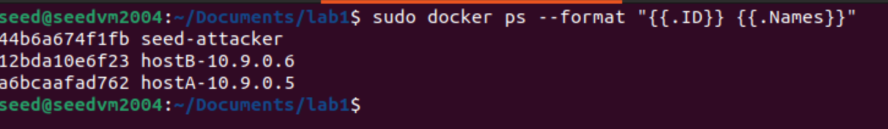

## Task 1.1 Packet Sniffing with Scapy
### Task 1.1A
1. I ran the `sniffer.py` python script with root privileges to capture packets with scapy, that were sent when I ping `8.8.4.4`
    - 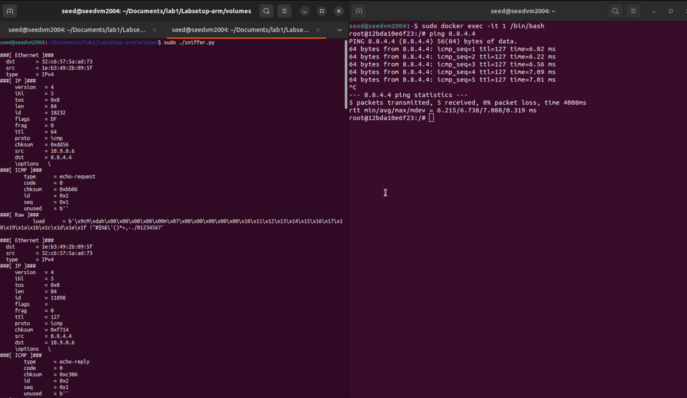
2. I try running the `sniffer.py` script without root privileges, and it throws an error
    - 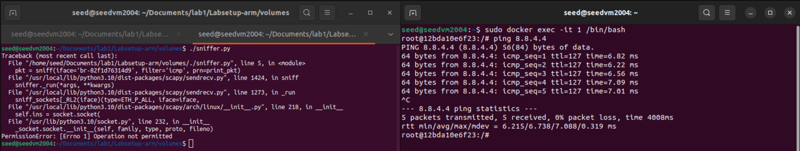
    - This happens due to `PermissionError` as we see from the error message, and is expected since we the the packet capturing is running on the OS level, and requires root privileges to access the network interfaces.
### Task 1.1B
1. We want to capture only ICMP packets, can use this code below:
    - ```python
        #!/usr/bin/python3
        from scapy.all import *

        interface_id = 'br-82f1d76314d9'


        def filter_icmp_packets():
            print(f"[*] Sniffing for ICMP echo packets on interface: {interface_id}")

            def process_packet(packet):
                if packet[ICMP].type in [8, 0]: # Filter already ensures ICMP layer exists
                    packet.show()

            sniff(iface=interface_id, filter='icmp', prn=process_packet)

        filter_icmp_packets()
        ```
    - Then we run the script with root privileges, and ping `8.8.4.4` again
    - see that the script captures only ICMP packets
    - 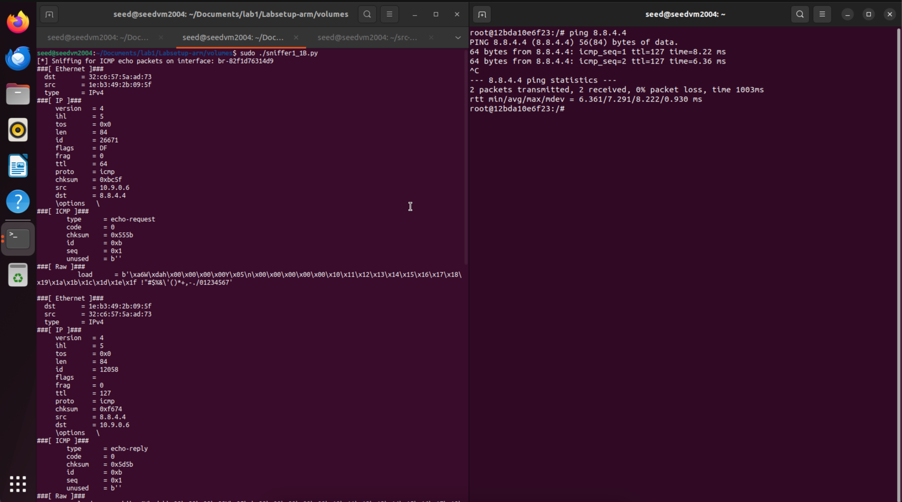
2. We want to sniff only TCP packets,
    - we can use this code below:
    - ```python 
                #!/usr/bin/python3
        from scapy.all import *

        interface_id ='br-82f1d76314d9'

        def print_pkt(pkt):
            pkt.show()

        def filter_tcp_packets():
            print(f"[*] Sniffing for tcp  packets on interface: {interface_id}")

            pkt = sniff(iface = interface_id, filter = 'tcp and src host 10.9.0.6 and dst port 23' , prn = print_pkt)

        filter_tcp_packets()
        ```
    - then we run the script with root privileges
    - we use another python script on our host B to send a TCP packet to `8.8.4.4` on port `23`
    - ```python
        #!/usr/bin/python3
        from scapy.all import *
        import sys

        def send_tcp_syn(target_ip, target_port):
            # IP layer: Set the destination IP address. Scapy fills in the source IP automatically.
            ip_packet = IP(dst=target_ip)
            tcp_packet = TCP(dport=target_port, flags='S')
            # Combine the layers into a single packet
            packet = ip_packet / tcp_packet
            response = sr1(packet, timeout=2, verbose=0)

        if __name__ == '__main__':
            # target ip address 8.8.4.4
            destination_ip = "8.8.4.4"
            # Using port 23
            destination_port = 23
            send_tcp_syn(destination_ip, destination_port)
        ```
    - We get this from sniffing:
    - 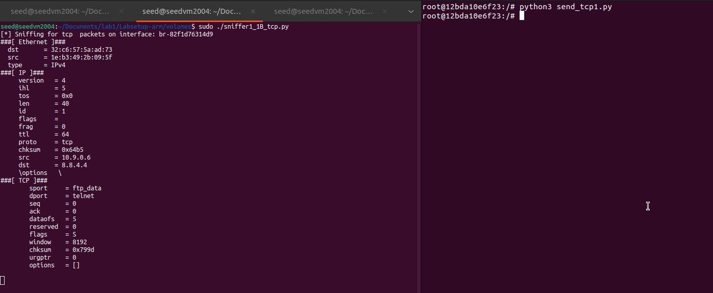

3. We want to sniff packets to a particular subnet `128.230.0.0/16`
    - use this code to sniff:
    - ```python
        #!/usr/bin/python3
        from scapy.all import *

        interface_id ='br-82f1d76314d9'

        def print_pkt(pkt):
            pkt.show()

        def filter_subnet_packets():
            print(f"[*] Sniffing subnet  packets on interface: {interface_id}")

            pkt = sniff(iface = interface_id, filter = 'dst net 128.230.0.0/16' , prn = print_pkt)

        filter_subnet_packets()
        ```
    - then we run the script with root privileges
    - we use another python script on our host B to send a TCP packet to `128.230.0.0/16`
    - ```python
        #!/usr/bin/python3
        from scapy.all import *

        ip_addr = IP()
        ip_addr.dst = '128.230.0.0/16'
        send(ip_addr, count=1)
        ```
    - we get this result:
    - 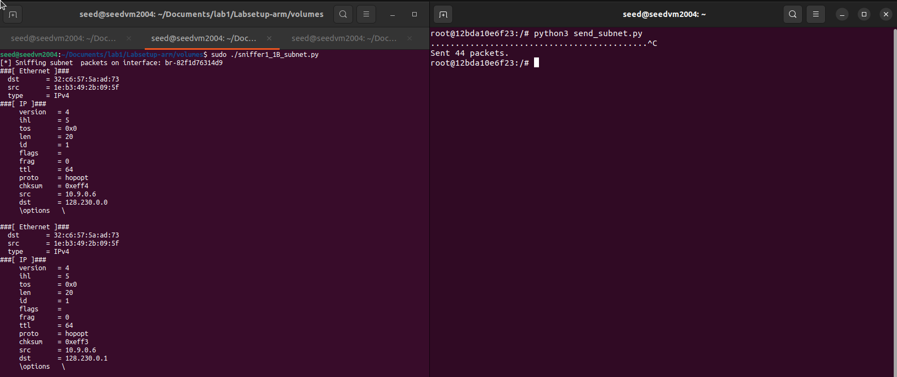

## Task 1.2 Spoofing ICMP packets
- using the script provided in the assignment brief
- ```python 
    #!/usr/bin/python3
    from scapy.all import *

    print('sending spoofed icmp packets')
    a = IP()
    a.dst = '10.0.2.3'
    a.src = '1.1.1.1'
    icmp = ICMP()
    pkt = a/icmp
    pkt.show()
    send(pkt)
    ```
- run the script with root privileges
- then we run `tcpdump` with `sudo` to capture the spoofed packets
- we see that the spoofed ICMP echo request is captured
- `1.1.1.1 > 10.0.2.3` indicates that the source is `1.1.1.1` and the destination is `10.0.2.3`
- screenshot below:
    - 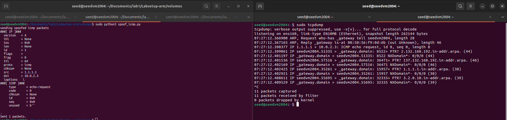


## Task 1.3 Traceroute
1. wrote this python script to iterate ttl
    - ```python
        #!/usr/bin/env python3
        from scapy.all import *

        DEST = '8.8.4.4'

        a = IP()
        a.dst = DEST
        ttl = 1

        for i in range(30):
            a.ttl = ttl
            b = ICMP()
            pkt = a/b
            response = sr1(pkt,timeout=5,verbose =0)
            if response is None:
                print('No reply')
            elif response[ICMP].type ==0:
                print(f'{a.ttl} hops away: ', response[IP].src)
                print('Arrived at destination',response[IP].src)
                break
            else:
                print(f'{a.ttl} hops away', response[IP].src)
            ttl+=1
        ```
    - then we run the script with root privileges
    - we see the hops taken to reach our destination IP address `8.8.4.4` is `11`
    - 
    - and we can verify this with `Wireshark` as well we see that there are `11` ICMP Echo (ping) requests sent out before we get a reply from `8.8.4.4`
    - 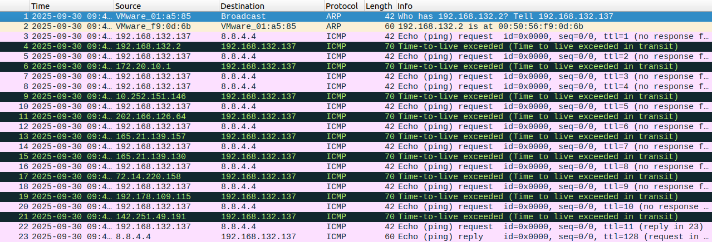

## Task 1.4 Sniffing then spoofing
1. The task asks us to test what happens when we ping these 3 IP addresses
    - `1.2.3.4` a non-existent IP address on the Internet
    - `10.9.0.99` a non-existent IP address on our LAN
    - `8.8.8.8` a valid IP address on the Internet
2. When we ping these 3 addresses, we see the following results:
    - 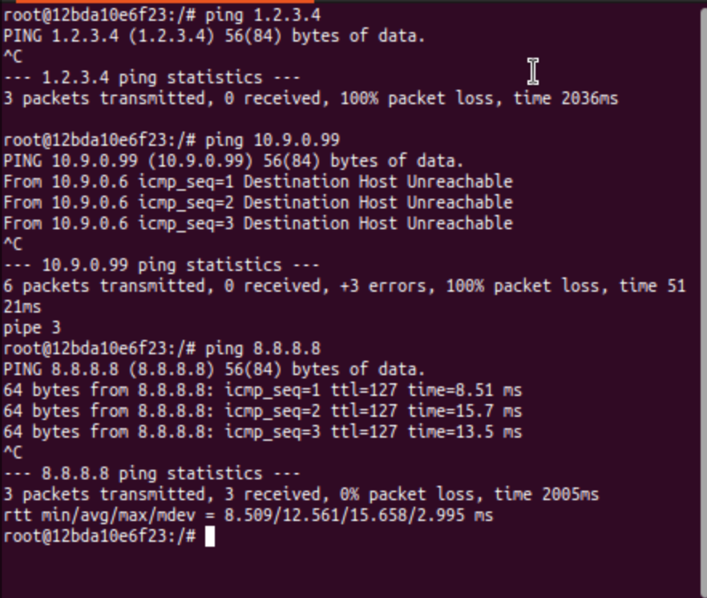
    - pinging `1.2.3.4` results in no reply and 100% packet loss
    - pinging `10.9.0.99` results in Destination Host Unreachable
    - pinging `8.8.8.8` results in a reply from the host
3. we run `ip route get <ip address>` to see the route taken to reach these 3 IP addresses
    - 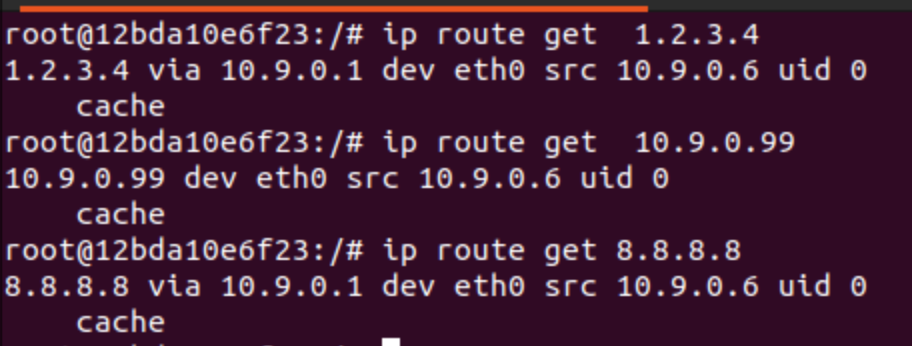
    - we see that for `1.2.3.4` even though it is a non-existent IP address, there is a mapping for this IP address in the routing table. It is still routed though `10.9.0.1`, this knowledge will be useful to explain what we see later
    - for `10.9.0.99`, there is no routing for this IP address in the routing table, hence we get Destination Host Unreachable
    - for `8.8.8.8`, there is a valid route to this IP address in the routing table, hence we get a reply from the host as it is a valid IP address on the Internet

3. we craft a python code that sniffs the ICMP packets and swaps their source and destination IP addresses, then spoofs a reply to the source.
    - `sniffNspoof.py` code:
        - ```python
            #!/usr/bin/python3
            from scapy.all import *

            interface_id = 'br-82f1d76314d9'


            def sniffNspoof_pkt(pkt):
                if ICMP in pkt and pkt[ICMP].type == 8:
                    print('==========================')
                    print('Original Packet: ')
                    print(f'Source IP Address: {pkt[IP].src}')
                    print(f'Destination IP Address: {pkt[IP].dst}')

                    spoof_src = pkt[IP].dst
                    spoof_dst = pkt[IP].src
                    spoof_ihl = pkt[IP].ihl

                    spoof_ip = IP(src=spoof_src,dst=spoof_dst,ihl=spoof_ihl,ttl=30)

                    spoof_icmp_id = pkt[ICMP].id
                    spoof_seq = pkt[ICMP].seq

                    spoof_icmp = ICMP(id = spoof_icmp_id, seq = spoof_seq, type =0)

                    data = pkt[Raw].load

                    spoof_pkt = spoof_ip/spoof_icmp/data

                    print('=========================')
                    print('Spoofed Packet:')
                    print(f'Source IP Address: {spoof_pkt[IP].src}')
                    print(f'Destination IP Address: {spoof_pkt[IP].dst}')

                    send(spoof_pkt,verbose =0)

            pkt = sniff(iface = interface_id, filter = 'icmp and src host 10.9.0.6', prn=sniffNspoof_pkt)
            ```
4. when we ping `1.2.3.4`
    - we see this result:
        - 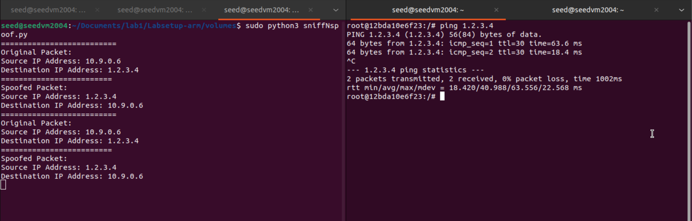
    - compared to the original ping result, we now receive a reply from `1.2.3.4`
    - this is because our sniffing and spoofing code has successfully intercepted the ICMP echo request and sent a spoofed echo reply back to the original sender.
5. when we ping `10.9.0.99`
    - we see this result (or the lack of it):
        - 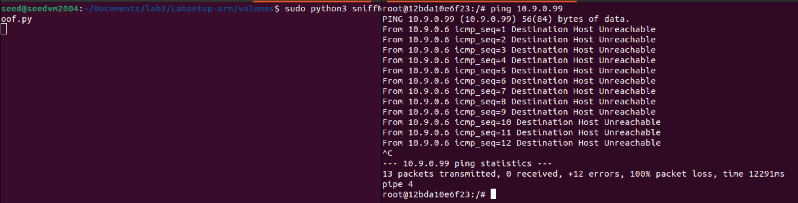
    - compared to the original ping result, we still receive Destination Host Unreachable
    - this is because there is no routing for this IP address in the routing table, hence the ICMP echo request never reaches our sniffing and spoofing code, and we do not get any reply.
6. when we ping `8.8.8.8`
    - we see this result:
        - 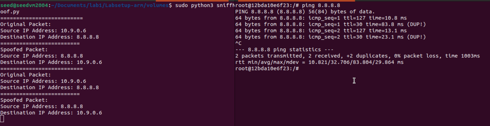
    - compared to the original ping result, we still receive a reply from `8.8.8.8` 
    - however we also see some (DUP!) duplicate packets, this is because our sniffing and spoofing code has intercepted the ICMP echo request and sent a spoofed echo reply back to the original sender, but since `8.8.8.8` is a valid IP address on the Internet, it also replies to the original echo request, resulting in duplicate packets.
