# 50.020 Network Security Lab 4 PKI Writeup

## Setup
1. As instructed in the lab manual, add
- ```
    10.9.0.80 www.amos2025.com
    ```
    to your `/etc/hosts` file to map the domain names to the server's IP address
- 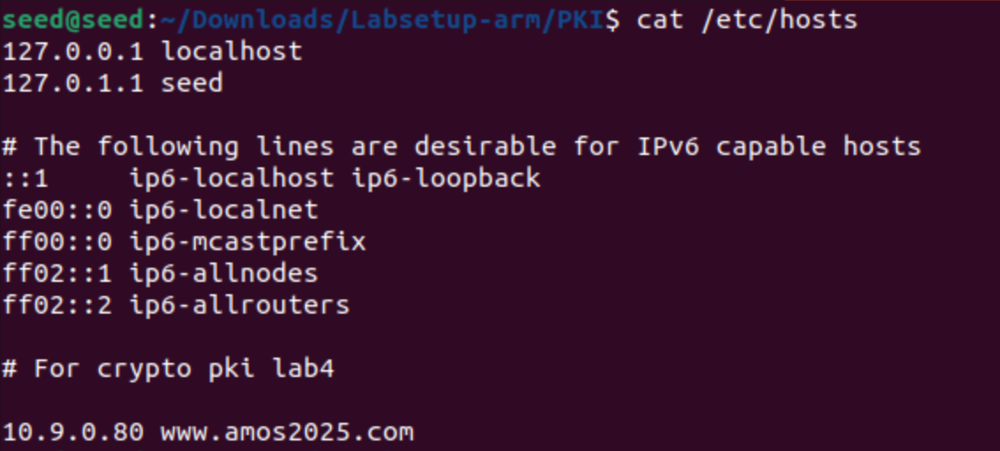{width=50%}

## Task 1: Becoming a Certification Authority
1. Following the instructions i generated a new CA certificate and private key using OpenSSL
- 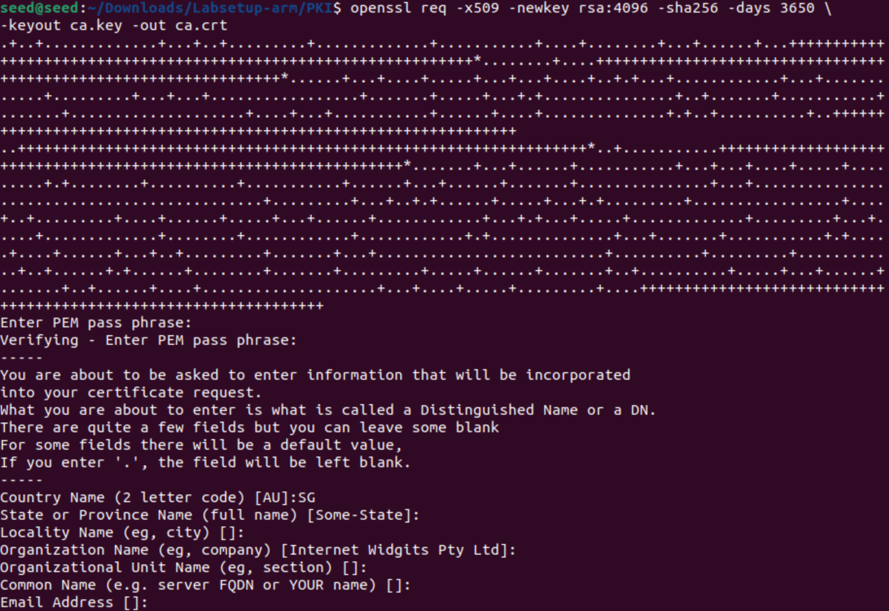
2. Then I run `openssl x509 -in ca.crt -text -noout` and see this output:
    - ```
        Certificate:
            Data:
                Version: 3 (0x2)
                Serial Number:
                    39:86:0a:0f:bd:56:39:35:a2:58:d3:e4:86:49:67:a2:12:2e:1d:10
                Signature Algorithm: sha256WithRSAEncryption
                Issuer: C = SG, ST = Some-State, O = Internet Widgits Pty Ltd
                Validity
                    Not Before: Oct 19 09:54:05 2025 GMT
                    Not After : Oct 17 09:54:05 2035 GMT
                Subject: C = SG, ST = Some-State, O = Internet Widgits Pty Ltd
                Subject Public Key Info:
                    Public Key Algorithm: rsaEncryption
                        Public-Key: (4096 bit)
                        Modulus:
                            00:b0:53:f6:2e:34:9d:72:5c:69:ad:6a:d8:db:f4:
                            42:31:48:72:39:c2:0f:54:d6:22:64:05:7b:b7:d9:
                            f8:1b:ea:df:b0:1c:97:31:7c:12:9c:f9:19:f3:2c:
                            f5:42:a4:5b:14:89:47:a5:a6:a8:f0:bd:64:72:d1:
                            7c:4d:b7:76:38:79:ac:ed:f9:03:13:0d:fb:f5:79:
                            9d:26:b4:7d:19:d9:bc:03:3d:60:3e:fe:db:ff:cf:
                            5b:c5:f8:71:00:65:9e:1d:98:73:f1:77:1c:bb:43:
                            d9:5a:2c:e1:4a:f2:89:5f:02:72:87:dd:6c:74:e5:
                            96:50:5a:f6:ce:f4:9a:9e:e9:00:36:22:bf:d4:be:
                            c8:5c:26:d0:a1:6f:27:c4:64:fa:87:98:50:95:33:
                            4d:86:f3:fe:47:c4:0a:3d:db:d7:e1:90:3f:e9:38:
                            97:2d:34:2f:68:a3:67:34:69:63:3d:7a:2c:e4:d6:
                            66:a2:50:1a:36:95:b2:b5:42:7d:34:93:7b:b8:c4:
                            1b:43:6a:89:d3:df:b3:07:bd:5a:25:b3:38:56:4d:
                            e2:91:c5:ee:79:2c:85:de:33:61:16:7d:9b:8d:f9:
                            09:b5:15:54:79:7f:fa:95:87:00:75:fb:f9:50:c2:
                            7f:89:26:73:9b:7b:47:d8:73:53:e4:37:b5:27:95:
                            96:89:98:75:32:ae:ca:6a:68:a8:f0:f7:93:26:2b:
                            94:20:f4:ae:31:6a:af:4c:40:6b:89:7d:8e:99:e8:
                            de:0c:e2:cc:75:8f:4f:0b:97:a6:13:9f:c3:0f:6a:
                            27:26:a5:d0:fe:ad:2d:98:bd:a0:2e:f0:76:68:d6:
                            89:2c:3c:7d:fc:71:fe:75:df:49:92:0d:b1:3b:3e:
                            12:66:80:05:11:a3:8f:b2:6c:b0:bb:1d:22:15:99:
                            72:44:56:e3:b0:a5:f3:61:39:02:83:93:fe:a5:6b:
                            5b:a8:f7:cd:cf:b8:8f:d4:3e:b3:0f:9f:59:52:09:
                            05:89:45:d9:43:e3:0d:01:31:52:3f:8b:9c:0b:18:
                            59:48:3d:9a:2e:12:73:85:61:51:63:2c:e2:db:71:
                            e5:44:f5:5d:b7:cb:f5:e4:92:26:b0:a1:ea:87:86:
                            11:dc:a0:f2:03:84:47:ab:2a:88:32:60:27:1a:fb:
                            0d:25:df:f7:86:9e:07:99:38:8d:4d:20:3e:77:c4:
                            ee:10:06:e2:6c:8b:ad:e4:74:70:9b:3f:93:10:48:
                            94:11:a0:3c:e2:fb:c0:1f:fa:0a:05:a4:91:ef:07:
                            ff:34:40:99:ec:7a:02:0e:39:b3:d1:2c:eb:af:d7:
                            27:42:6c:52:2f:3e:f1:14:e4:e2:5c:8c:9e:7c:8b:
                            91:60:1b
                        Exponent: 65537 (0x10001)
                X509v3 extensions:
                    X509v3 Subject Key Identifier: 
                        89:93:57:E7:58:22:9D:A0:93:14:45:93:F5:35:CD:2D:6E:B3:58:C6
                    X509v3 Authority Key Identifier: 
                        89:93:57:E7:58:22:9D:A0:93:14:45:93:F5:35:CD:2D:6E:B3:58:C6
                    X509v3 Basic Constraints: critical
                        CA:TRUE
            Signature Algorithm: sha256WithRSAEncryption
            Signature Value:
                af:95:d0:24:27:1e:e2:2d:72:98:d5:52:1d:48:f0:b1:49:89:
                c0:38:20:09:8f:d2:ac:79:6e:7d:ce:ec:3e:1e:42:fb:06:b8:
                4f:4a:b0:1f:d7:85:94:32:9b:d8:04:1f:df:ac:50:fb:7c:86:
                d7:e6:01:e5:0f:f3:b9:c2:a9:8c:90:ad:c9:6d:4c:52:0f:52:
                01:81:95:bc:5e:ea:a0:7e:8a:72:b4:2b:96:01:08:d2:c4:d3:
                ae:8d:77:63:df:79:37:c0:ba:df:e2:c2:b7:2b:cb:b7:13:70:
                ca:e3:9c:a3:59:3b:b1:d5:91:71:c7:37:1e:d5:15:6a:bd:92:
                80:fe:46:ed:21:87:52:c6:93:a2:00:d7:4d:f9:ed:e7:dd:e5:
                2e:7d:88:93:79:f8:5d:13:5a:69:f4:a8:da:92:0c:64:57:31:
                34:f8:e5:2e:fa:32:11:d5:32:69:3e:e7:0b:df:c7:51:3e:d3:
                35:c2:eb:a3:a0:89:08:60:87:14:02:64:7c:12:89:9a:50:3c:
                86:ae:23:22:10:90:76:83:96:d3:27:4f:6b:cc:41:f7:04:5e:
                3e:ed:92:1b:d3:50:ba:3b:d7:de:f9:0d:36:b1:31:54:07:5a:
                30:4a:55:17:4f:7a:44:46:71:52:ea:32:52:be:b9:ee:ce:96:
                99:c2:30:39:87:45:69:04:e9:de:eb:c8:ef:dc:33:07:2b:16:
                13:46:7b:8a:1a:42:35:d6:7e:0e:4a:f6:8d:95:3e:6f:80:c4:
                f2:1b:73:91:23:68:79:23:a5:e5:8a:ca:49:dc:79:53:be:b6:
                9b:5e:d2:bf:74:4d:24:bb:ae:f1:d9:0a:cb:70:9c:b4:83:27:
                35:ef:f5:36:32:ff:a7:4a:89:42:60:31:7a:b5:63:02:ce:78:
                49:c3:93:c9:db:64:d1:0f:f3:b6:0e:69:dc:3f:95:c0:eb:e4:
                ad:4d:8b:69:dd:32:d2:8f:5f:f7:73:bd:9b:13:14:70:f7:e1:
                9d:ef:b1:10:00:30:fc:92:a6:b4:ec:b7:9c:09:98:f2:0e:bf:
                42:c6:18:6d:52:ac:b9:7d:dc:22:fc:c8:ca:fc:e8:ab:6c:3b:
                34:d3:3b:a7:b5:34:91:c5:02:fc:74:97:f3:84:4f:56:88:da:
                15:08:49:c1:a5:a1:86:41:ec:0a:3c:de:e5:95:38:4d:89:bc:
                ed:a3:f5:57:aa:f4:d1:c4:b7:96:87:78:1b:de:a5:f8:77:9a:
                cb:c9:9c:0a:e3:dd:64:6d:37:b5:4d:a7:ed:d7:cc:b4:77:2d:
                7f:58:cb:c5:18:1b:bd:d2:a0:bb:3a:c0:74:70:55:a3:79:a4:
                f4:44:a1:c9:25:f7:4a:ed

    ```
3. Then i run `openssl rsa -in ca.key -text -noout` and enter the passphrase `dees` to see this output:
    - ```
        Private-Key: (4096 bit, 2 primes)
        modulus:
            00:b0:53:f6:2e:34:9d:72:5c:69:ad:6a:d8:db:f4:
            42:31:48:72:39:c2:0f:54:d6:22:64:05:7b:b7:d9:
            f8:1b:ea:df:b0:1c:97:31:7c:12:9c:f9:19:f3:2c:
            f5:42:a4:5b:14:89:47:a5:a6:a8:f0:bd:64:72:d1:
            7c:4d:b7:76:38:79:ac:ed:f9:03:13:0d:fb:f5:79:
            9d:26:b4:7d:19:d9:bc:03:3d:60:3e:fe:db:ff:cf:
            5b:c5:f8:71:00:65:9e:1d:98:73:f1:77:1c:bb:43:
            d9:5a:2c:e1:4a:f2:89:5f:02:72:87:dd:6c:74:e5:
            96:50:5a:f6:ce:f4:9a:9e:e9:00:36:22:bf:d4:be:
            c8:5c:26:d0:a1:6f:27:c4:64:fa:87:98:50:95:33:
            4d:86:f3:fe:47:c4:0a:3d:db:d7:e1:90:3f:e9:38:
            97:2d:34:2f:68:a3:67:34:69:63:3d:7a:2c:e4:d6:
            66:a2:50:1a:36:95:b2:b5:42:7d:34:93:7b:b8:c4:
            1b:43:6a:89:d3:df:b3:07:bd:5a:25:b3:38:56:4d:
            e2:91:c5:ee:79:2c:85:de:33:61:16:7d:9b:8d:f9:
            09:b5:15:54:79:7f:fa:95:87:00:75:fb:f9:50:c2:
            7f:89:26:73:9b:7b:47:d8:73:53:e4:37:b5:27:95:
            96:89:98:75:32:ae:ca:6a:68:a8:f0:f7:93:26:2b:
            94:20:f4:ae:31:6a:af:4c:40:6b:89:7d:8e:99:e8:
            de:0c:e2:cc:75:8f:4f:0b:97:a6:13:9f:c3:0f:6a:
            27:26:a5:d0:fe:ad:2d:98:bd:a0:2e:f0:76:68:d6:
            89:2c:3c:7d:fc:71:fe:75:df:49:92:0d:b1:3b:3e:
            12:66:80:05:11:a3:8f:b2:6c:b0:bb:1d:22:15:99:
            72:44:56:e3:b0:a5:f3:61:39:02:83:93:fe:a5:6b:
            5b:a8:f7:cd:cf:b8:8f:d4:3e:b3:0f:9f:59:52:09:
            05:89:45:d9:43:e3:0d:01:31:52:3f:8b:9c:0b:18:
            59:48:3d:9a:2e:12:73:85:61:51:63:2c:e2:db:71:
            e5:44:f5:5d:b7:cb:f5:e4:92:26:b0:a1:ea:87:86:
            11:dc:a0:f2:03:84:47:ab:2a:88:32:60:27:1a:fb:
            0d:25:df:f7:86:9e:07:99:38:8d:4d:20:3e:77:c4:
            ee:10:06:e2:6c:8b:ad:e4:74:70:9b:3f:93:10:48:
            94:11:a0:3c:e2:fb:c0:1f:fa:0a:05:a4:91:ef:07:
            ff:34:40:99:ec:7a:02:0e:39:b3:d1:2c:eb:af:d7:
            27:42:6c:52:2f:3e:f1:14:e4:e2:5c:8c:9e:7c:8b:
            91:60:1b
        publicExponent: 65537 (0x10001)
        privateExponent:
            07:05:58:d4:8f:28:c3:c0:75:3e:bf:f5:e1:90:30:
            c0:88:9b:6f:bc:4f:e2:f7:61:c8:2c:c5:b7:d4:d8:
            81:b8:10:ef:10:bc:5e:6e:8b:c9:2f:4b:fe:b8:48:
            0d:be:c0:97:a9:3d:ae:95:5b:bd:b6:34:d5:33:8d:
            29:05:08:92:88:19:c0:21:fd:a2:d9:18:32:b6:84:
            70:e1:97:e7:9b:19:56:e1:af:3e:e2:e3:fc:a4:13:
            89:e6:f2:0c:eb:7e:e7:bb:c5:c6:14:11:93:4d:48:
            ce:c3:e1:b6:9b:c0:a7:85:4f:ed:23:fe:69:0b:29:
            38:8a:de:af:ef:e2:66:38:6d:d7:39:fb:fc:6b:1a:
            4c:3d:09:6a:9c:23:ef:b8:7b:97:41:93:d7:d5:02:
            9d:c0:82:5b:f6:2c:d8:38:b4:38:59:87:89:f0:44:
            68:ba:de:b6:62:67:3e:19:82:27:95:01:4b:9d:53:
            d9:db:a9:a7:89:bf:63:63:41:dc:01:91:58:12:8a:
            e9:5c:c9:1f:24:15:9b:55:c9:4c:9d:fd:bc:c5:fe:
            23:02:c8:13:90:17:c6:78:b2:41:74:7f:e8:9f:c5:
            68:ad:f0:3e:a4:3f:64:8b:cb:13:67:94:8e:48:28:
            4e:dc:36:97:36:c9:ee:0e:ed:84:b5:49:23:c9:db:
            84:0f:1e:68:07:57:6c:25:bf:a3:7c:d1:5b:6c:72:
            b1:ef:43:a3:32:79:7c:0d:46:fe:5d:bb:00:f1:5c:
            45:9d:94:29:a9:87:98:81:55:f9:66:e3:3c:23:0d:
            70:32:4e:fa:56:98:be:15:1d:9a:78:95:62:23:95:
            52:a8:1a:07:e7:6d:ce:12:c0:66:f9:da:aa:de:6f:
            a0:5f:aa:6d:e2:58:54:79:86:b0:39:49:cd:b7:37:
            58:60:88:d4:11:a4:72:af:a3:e9:bc:7d:0c:da:b8:
            78:8f:5e:bb:5b:8e:5f:7b:71:07:3b:18:bc:58:b0:
            9d:86:41:ea:42:c0:5e:54:b2:7d:3f:9a:45:22:3e:
            78:b7:f7:a4:bc:bd:e6:b8:85:cc:e6:58:a9:7a:15:
            05:2a:a8:3d:e0:c2:55:59:c1:9c:1f:5e:8b:0b:b3:
            c2:8a:10:a4:ae:4e:30:7d:40:73:1a:19:a0:b1:17:
            f8:d3:36:f9:c8:97:3c:72:32:ed:0d:2a:fa:42:ed:
            4e:06:d9:ee:fe:55:2e:06:d6:8f:d0:77:be:87:88:
            e7:74:16:d9:0a:db:33:0b:5a:8a:cb:d8:29:b3:35:
            56:98:ae:db:9a:57:e8:f7:30:02:55:04:19:3d:24:
            c1:e0:af:36:83:86:1b:da:c4:47:19:a5:93:b6:e4:
            4f:39
        prime1:
            00:da:7d:71:f5:d9:db:ed:69:7d:64:aa:3c:02:bf:
            d3:c2:43:5b:77:64:c2:d0:42:d3:d8:ec:07:52:5f:
            d5:c7:e8:0b:89:85:96:95:6d:f1:93:9f:f3:0a:8c:
            35:6e:00:7d:a2:81:82:c6:a3:00:9b:8d:85:f2:84:
            b6:11:90:dc:ec:1c:5b:9f:54:6c:b2:f5:a4:8a:b8:
            9f:c5:3b:a2:c4:49:b1:5b:b0:fd:0f:c5:94:07:fb:
            22:74:bf:e8:a2:1e:e6:8a:41:51:c7:33:77:c6:00:
            56:2a:7b:84:37:25:39:8e:9d:fd:35:94:7f:ff:6c:
            29:d1:e7:d1:d7:e3:bb:68:2f:37:dc:26:be:b0:65:
            93:dd:5c:60:b5:72:44:db:87:55:e8:92:60:f9:6d:
            94:66:07:92:6d:2e:c8:98:d3:2b:c1:f4:cd:4a:88:
            7f:f9:f4:b4:e3:81:cd:b8:58:ad:f4:68:99:5b:05:
            ac:15:ab:83:43:fa:ef:43:18:48:1a:a2:11:c2:70:
            d0:f8:4f:c0:d9:9c:20:cf:5b:18:79:60:60:c9:a8:
            73:82:ee:68:cd:a9:2e:1b:2d:24:ed:9d:0e:85:3f:
            1c:4c:b8:6b:82:b3:4e:50:ba:f7:2d:13:5b:7f:be:
            49:d3:8c:26:21:07:94:1a:6d:da:29:5f:34:fa:82:
            df:63
        prime2:
            00:ce:99:82:a5:dd:08:fe:d3:38:78:95:99:fa:b5:
            8e:c8:68:ed:30:96:77:4f:fa:0c:25:e6:0c:ef:8c:
            b0:14:af:37:f8:9d:a6:8e:b4:74:90:ce:e3:0d:95:
            6c:8e:f6:42:65:43:32:2e:f0:45:9c:e1:f2:bc:d4:
            38:6b:50:02:af:43:20:53:a1:32:47:64:73:85:3e:
            21:40:07:b9:41:a6:5b:ec:89:a6:9b:9b:af:22:9a:
            57:9b:4a:08:07:b4:12:af:48:d5:8b:2f:03:7b:ec:
            e1:82:31:e6:09:e7:7c:57:d6:6a:8b:e9:77:b1:1d:
            27:40:97:94:ce:07:c3:27:ad:43:39:95:e5:01:08:
            10:8c:be:a3:f9:9c:e5:70:fd:44:ed:0b:ad:2a:79:
            d2:d4:5c:6b:ce:e3:8c:64:2a:15:16:a2:d6:b5:1a:
            f8:e6:0d:46:19:1b:eb:ec:09:1f:cf:b0:4d:43:f1:
            82:35:71:ee:1b:1d:49:ec:19:ce:e8:aa:ec:b6:f1:
            80:c5:4b:37:c2:ba:db:d3:54:b9:2b:62:b5:0f:6e:
            c8:59:37:cd:73:14:d8:68:58:85:a3:18:3d:21:f7:
            c9:45:9a:f0:89:df:52:c2:c3:6e:b8:a1:05:fb:7c:
            e2:48:b6:6a:f3:91:90:cb:3a:1a:1c:8b:e9:64:06:
            65:e9
        exponent1:
            00:9e:1e:12:8e:dd:2e:ef:cd:5b:d5:b1:ec:e4:00:
            76:fb:2b:4b:d2:47:b5:44:8a:58:4d:af:e2:4c:96:
            d6:5b:69:6e:90:03:81:4a:7a:da:4c:ff:80:1f:ae:
            00:2c:af:66:3c:68:85:7f:c3:0e:f9:83:9d:e0:38:
            72:9a:9b:bf:85:8f:b0:2e:ca:26:30:0c:dd:1b:17:
            29:68:cf:13:a8:01:bc:bc:a2:85:41:18:b7:5c:5f:
            3e:3c:47:75:cf:7d:95:51:90:9b:e2:11:39:28:ad:
            ad:ad:e8:dd:72:1b:1a:60:3f:ad:b3:4c:d8:a4:bc:
            5e:37:6e:10:ca:b0:20:3b:f1:8f:f7:5e:82:b9:9d:
            89:38:b5:55:b7:7a:0e:a2:e0:7a:27:69:67:8c:9a:
            e4:be:41:d4:91:f7:3d:6c:7b:c6:3b:03:32:5e:32:
            12:8b:8d:b0:2a:c5:11:5f:cb:ad:78:27:0a:74:78:
            d2:64:8c:4e:de:af:86:df:83:7f:0a:e7:26:fb:14:
            31:e6:c1:b0:ca:ca:d6:63:b9:85:28:b1:ba:d9:b5:
            72:82:da:8e:35:e7:ad:5a:35:7d:78:08:25:2e:00:
            d2:36:23:70:8a:91:c0:a7:63:e6:e5:54:10:ef:8d:
            82:57:fa:20:cd:de:72:2b:fe:3b:d7:9c:f2:f6:28:
            28:09
        exponent2:
            00:b1:db:1f:c8:f0:4f:45:28:cb:0d:ac:24:81:db:
            79:0e:f8:9d:70:dd:a7:db:36:f4:ec:4f:6e:c5:6e:
            c5:4b:19:48:c3:03:dd:16:2f:2d:c6:58:04:c9:75:
            e0:9d:f6:4c:54:66:93:b6:2a:ec:92:d1:45:29:e0:
            3c:ad:cd:94:72:13:04:aa:5a:34:31:97:bd:87:70:
            64:29:7e:3c:b2:d2:a7:82:2b:42:3d:e5:b9:d0:bd:
            34:3c:20:70:67:49:53:68:88:f8:25:39:14:f3:c3:
            8a:a3:8d:97:6e:e1:54:7f:3d:bc:3d:b4:80:70:fe:
            1b:03:95:3a:ea:5f:6e:57:22:e6:a3:95:72:2f:00:
            25:57:34:eb:6f:00:ed:d8:e6:80:46:dd:6d:77:0a:
            a7:40:60:4c:03:30:8b:74:d3:71:92:2a:1f:52:8b:
            e4:c8:0f:97:50:18:64:72:af:ac:2e:1c:a5:77:9f:
            5a:ab:ed:e7:c0:79:e7:60:95:1b:35:db:a7:ab:1a:
            9e:f3:b9:fc:47:ec:9b:40:04:48:e0:9b:ba:29:8e:
            02:76:23:fe:ff:5a:6b:ae:f0:be:23:18:c3:d0:11:
            43:b9:63:58:3e:28:fe:53:62:f1:57:8a:6f:de:ff:
            b4:c2:4a:20:2a:8d:1f:2c:85:59:63:47:e3:65:53:
            c8:b9
        coefficient:
            00:ab:24:1c:a1:40:6a:e7:15:1a:97:84:b3:bc:82:
            4b:10:dc:bc:f2:95:90:35:1d:0c:a8:8c:c5:78:ac:
            ec:e2:89:70:cc:a1:86:0e:26:9c:03:ae:26:f7:16:
            b1:85:ef:3b:c2:7f:17:f1:c3:a1:69:f8:52:73:d0:
            89:2e:7f:ae:16:50:b4:45:b0:c3:45:ff:5c:15:38:
            e0:51:11:1d:04:43:b9:78:30:8e:e7:0b:36:0b:60:
            f7:23:18:48:9a:e7:1c:b3:2b:87:5e:94:67:a7:3e:
            5d:2c:55:e9:ea:13:af:f8:61:84:60:69:4a:7c:8f:
            76:c4:dc:90:b8:93:c6:39:ff:04:01:b2:a1:0c:45:
            4a:4e:a8:cf:e0:45:a3:80:c4:a8:91:fa:38:9f:43:
            d0:33:f3:67:14:33:15:63:b2:43:11:90:2c:3e:f6:
            32:ca:cc:35:5d:43:cf:43:83:51:f2:2c:16:87:16:
            dc:6c:78:42:6a:7d:02:13:05:c2:2f:b6:e9:58:80:
            78:51:65:9f:83:69:8b:fc:47:ff:f4:c0:e1:5e:7d:
            c7:2d:f3:81:ef:f0:97:a2:f5:42:d6:a2:b5:ef:06:
            58:1b:d3:b4:a9:28:ce:6a:4d:a7:9d:86:a9:09:bf:
            bc:be:ce:a1:db:10:c8:89:4a:d4:8a:88:0c:96:1b:
            64:0b

    ```
### Task 1: Questions
1. What part of the certificate indicates this is a CA’s certificate?
    - From the x509v3 extensions section, the `X509v3 Basic Constraints: critical CA:TRUE` indicates that this is a CA's certificate.
2. What part of the certificate indicates this is a self-signed certificate?
    - Similarly from the x509v3 extensions section, the Issuer section, `Issuer: C = SG, ST = Some-State, O = Internet Widgits Pty Ltd` and the Subject section, `Subject: C = SG, ST = Some-State, O = Internet Widgits Pty Ltd` are the same, indicating that this is a self-signed certificate.
3. In the RSA algorithm, we have a public exponent e, a private exponent d, a modulus n, and two secret numbers p and q, such that n = pq. Please identify the values for these elements in your certificate and key files.
    - From the `ca.key` file, the modulus is the value under `modulus`,
        - ```
            modulus:
                00:b0:53:f6:2e:34:9d:72:5c:69:ad:6a:d8:db:f4:
                42:31:48:72:39:c2:0f:54:d6:22:64:05:7b:b7:d9:
                f8:1b:ea:df:b0:1c:97:31:7c:12:9c:f9:19:f3:2c:
                f5:42:a4:5b:14:89:47:a5:a6:a8:f0:bd:64:72:d1:
                7c:4d:b7:76:38:79:ac:ed:f9:03:13:0d:fb:f5:79:
                9d:26:b4:7d:19:d9:bc:03:3d:60:3e:fe:db:ff:cf:
                5b:c5:f8:71:00:65:9e:1d:98:73:f1:77:1c:bb:43:
                d9:5a:2c:e1:4a:f2:89:5f:02:72:87:dd:6c:74:e5:
                96:50:5a:f6:ce:f4:9a:9e:e9:00:36:22:bf:d4:be:
                c8:5c:26:d0:a1:6f:27:c4:64:fa:87:98:50:95:33:
                4d:86:f3:fe:47:c4:0a:3d:db:d7:e1:90:3f:e9:38:
                97:2d:34:2f:68:a3:67:34:69:63:3d:7a:2c:e4:d6:
                66:a2:50:1a:36:95:b2:b5:42:7d:34:93:7b:b8:c4:
                1b:43:6a:89:d3:df:b3:07:bd:5a:25:b3:38:56:4d:
                e2:91:c5:ee:79:2c:85:de:33:61:16:7d:9b:8d:f9:
                09:b5:15:54:79:7f:fa:95:87:00:75:fb:f9:50:c2:
                7f:89:26:73:9b:7b:47:d8:73:53:e4:37:b5:27:95:
                96:89:98:75:32:ae:ca:6a:68:a8:f0:f7:93:26:2b:
                94:20:f4:ae:31:6a:af:4c:40:6b:89:7d:8e:99:e8:
                de:0c:e2:cc:75:8f:4f:0b:97:a6:13:9f:c3:0f:6a:
                27:26:a5:d0:fe:ad:2d:98:bd:a0:2e:f0:76:68:d6:
                89:2c:3c:7d:fc:71:fe:75:df:49:92:0d:b1:3b:3e:
                12:66:80:05:11:a3:8f:b2:6c:b0:bb:1d:22:15:99:
                72:44:56:e3:b0:a5:f3:61:39:02:83:93:fe:a5:6b:
                5b:a8:f7:cd:cf:b8:8f:d4:3e:b3:0f:9f:59:52:09:
                05:89:45:d9:43:e3:0d:01:31:52:3f:8b:9c:0b:18:
                59:48:3d:9a:2e:12:73:85:61:51:63:2c:e2:db:71:
                e5:44:f5:5d:b7:cb:f5:e4:92:26:b0:a1:ea:87:86:
                11:dc:a0:f2:03:84:47:ab:2a:88:32:60:27:1a:fb:
                0d:25:df:f7:86:9e:07:99:38:8d:4d:20:3e:77:c4:
                ee:10:06:e2:6c:8b:ad:e4:74:70:9b:3f:93:10:48:
                94:11:a0:3c:e2:fb:c0:1f:fa:0a:05:a4:91:ef:07:
                ff:34:40:99:ec:7a:02:0e:39:b3:d1:2c:eb:af:d7:
                27:42:6c:52:2f:3e:f1:14:e4:e2:5c:8c:9e:7c:8b:
                91:60:1b
            ```
    - the public exponent e is the value under `publicExponent`,
        - `publicExponent: 65537 (0x10001)`
    - the private exponent d is the value under `privateExponent`,
        - ```
            privateExponent:
            07:05:58:d4:8f:28:c3:c0:75:3e:bf:f5:e1:90:30:
            c0:88:9b:6f:bc:4f:e2:f7:61:c8:2c:c5:b7:d4:d8:
            81:b8:10:ef:10:bc:5e:6e:8b:c9:2f:4b:fe:b8:48:
            0d:be:c0:97:a9:3d:ae:95:5b:bd:b6:34:d5:33:8d:
            29:05:08:92:88:19:c0:21:fd:a2:d9:18:32:b6:84:
            70:e1:97:e7:9b:19:56:e1:af:3e:e2:e3:fc:a4:13:
            89:e6:f2:0c:eb:7e:e7:bb:c5:c6:14:11:93:4d:48:
            ce:c3:e1:b6:9b:c0:a7:85:4f:ed:23:fe:69:0b:29:
            38:8a:de:af:ef:e2:66:38:6d:d7:39:fb:fc:6b:1a:
            4c:3d:09:6a:9c:23:ef:b8:7b:97:41:93:d7:d5:02:
            9d:c0:82:5b:f6:2c:d8:38:b4:38:59:87:89:f0:44:
            68:ba:de:b6:62:67:3e:19:82:27:95:01:4b:9d:53:
            d9:db:a9:a7:89:bf:63:63:41:dc:01:91:58:12:8a:
            e9:5c:c9:1f:24:15:9b:55:c9:4c:9d:fd:bc:c5:fe:
            23:02:c8:13:90:17:c6:78:b2:41:74:7f:e8:9f:c5:
            68:ad:f0:3e:a4:3f:64:8b:cb:13:67:94:8e:48:28:
            4e:dc:36:97:36:c9:ee:0e:ed:84:b5:49:23:c9:db:
            84:0f:1e:68:07:57:6c:25:bf:a3:7c:d1:5b:6c:72:
            b1:ef:43:a3:32:79:7c:0d:46:fe:5d:bb:00:f1:5c:
            45:9d:94:29:a9:87:98:81:55:f9:66:e3:3c:23:0d:
            70:32:4e:fa:56:98:be:15:1d:9a:78:95:62:23:95:
            52:a8:1a:07:e7:6d:ce:12:c0:66:f9:da:aa:de:6f:
            a0:5f:aa:6d:e2:58:54:79:86:b0:39:49:cd:b7:37:
            58:60:88:d4:11:a4:72:af:a3:e9:bc:7d:0c:da:b8:
            78:8f:5e:bb:5b:8e:5f:7b:71:07:3b:18:bc:58:b0:
            9d:86:41:ea:42:c0:5e:54:b2:7d:3f:9a:45:22:3e:
            78:b7:f7:a4:bc:bd:e6:b8:85:cc:e6:58:a9:7a:15:
            05:2a:a8:3d:e0:c2:55:59:c1:9c:1f:5e:8b:0b:b3:
            c2:8a:10:a4:ae:4e:30:7d:40:73:1a:19:a0:b1:17:
            f8:d3:36:f9:c8:97:3c:72:32:ed:0d:2a:fa:42:ed:
            4e:06:d9:ee:fe:55:2e:06:d6:8f:d0:77:be:87:88:
            e7:74:16:d9:0a:db:33:0b:5a:8a:cb:d8:29:b3:35:
            56:98:ae:db:9a:57:e8:f7:30:02:55:04:19:3d:24:
            c1:e0:af:36:83:86:1b:da:c4:47:19:a5:93:b6:e4:
            4f:39
            ```
    - the two secret numbers p and q are the values under `prime1` and `prime2` respectively,
        - ```
            prime1:
            00:da:7d:71:f5:d9:db:ed:69:7d:64:aa:3c:02:bf:
            d3:c2:43:5b:77:64:c2:d0:42:d3:d8:ec:07:52:5f:
            d5:c7:e8:0b:89:85:96:95:6d:f1:93:9f:f3:0a:8c:
            35:6e:00:7d:a2:81:82:c6:a3:00:9b:8d:85:f2:84:
            b6:11:90:dc:ec:1c:5b:9f:54:6c:b2:f5:a4:8a:b8:
            9f:c5:3b:a2:c4:49:b1:5b:b0:fd:0f:c5:94:07:fb:
            22:74:bf:e8:a2:1e:e6:8a:41:51:c7:33:77:c6:00:
            56:2a:7b:84:37:25:39:8e:9d:fd:35:94:7f:ff:6c:
            29:d1:e7:d1:d7:e3:bb:68:2f:37:dc:26:be:b0:65:
            93:dd:5c:60:b5:72:44:db:87:55:e8:92:60:f9:6d:
            94:66:07:92:6d:2e:c8:98:d3:2b:c1:f4:cd:4a:88:
            7f:f9:f4:b4:e3:81:cd:b8:58:ad:f4:68:99:5b:05:
            ac:15:ab:83:43:fa:ef:43:18:48:1a:a2:11:c2:70:
            d0:f8:4f:c0:d9:9c:20:cf:5b:18:79:60:60:c9:a8:
            73:82:ee:68:cd:a9:2e:1b:2d:24:ed:9d:0e:85:3f:
            1c:4c:b8:6b:82:b3:4e:50:ba:f7:2d:13:5b:7f:be:
            49:d3:8c:26:21:07:94:1a:6d:da:29:5f:34:fa:82:
            df:63
            ```
        - ```
            prime2:
            00:ce:99:82:a5:dd:08:fe:d3:38:78:95:99:fa:b5:
            8e:c8:68:ed:30:96:77:4f:fa:0c:25:e6:0c:ef:8c:
            b0:14:af:37:f8:9d:a6:8e:b4:74:90:ce:e3:0d:95:
            6c:8e:f6:42:65:43:32:2e:f0:45:9c:e1:f2:bc:d4:
            38:6b:50:02:af:43:20:53:a1:32:47:64:73:85:3e:
            21:40:07:b9:41:a6:5b:ec:89:a6:9b:9b:af:22:9a:
            57:9b:4a:08:07:b4:12:af:48:d5:8b:2f:03:7b:ec:
            e1:82:31:e6:09:e7:7c:57:d6:6a:8b:e9:77:b1:1d:
            27:40:97:94:ce:07:c3:27:ad:43:39:95:e5:01:08:
            10:8c:be:a3:f9:9c:e5:70:fd:44:ed:0b:ad:2a:79:
            d2:d4:5c:6b:ce:e3:8c:64:2a:15:16:a2:d6:b5:1a:
            f8:e6:0d:46:19:1b:eb:ec:09:1f:cf:b0:4d:43:f1:
            82:35:71:ee:1b:1d:49:ec:19:ce:e8:aa:ec:b6:f1:
            80:c5:4b:37:c2:ba:db:d3:54:b9:2b:62:b5:0f:6e:
            c8:59:37:cd:73:14:d8:68:58:85:a3:18:3d:21:f7:
            c9:45:9a:f0:89:df:52:c2:c3:6e:b8:a1:05:fb:7c:
            e2:48:b6:6a:f3:91:90:cb:3a:1a:1c:8b:e9:64:06:
            65:e9
            ```
## Task 2: Generating certificate request for webserver
1. Using the command provided in the lab instructions, I generate a new CSR for the webserver `www.amos2025.com` and sign it with my CA certificate.
    - ```
        openssl req -newkey rsa:2048 -sha256 -keyout server.key -out server.csr -subj "/CN=www.amos2025.com/O=Amos2025 Inc./C=US" -passout pass:dees -addext "subjectAltName = DNS:www.amos2025.com, DNS:amos2025.org, DNS:amos2025.net"
        ```
    - then `openssl req -in server.csr -text -noout` gives output:
        - 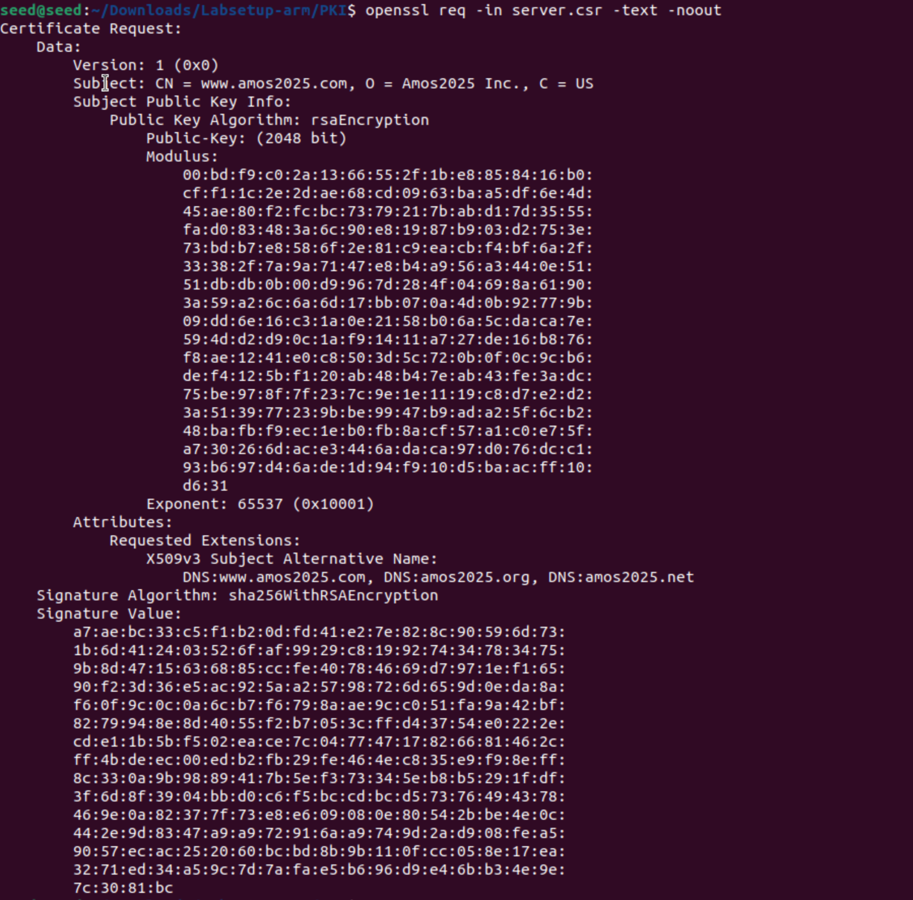
    - and `openssl rsa -in server.key -passin pass:dees -text -noout` gives output:
        - 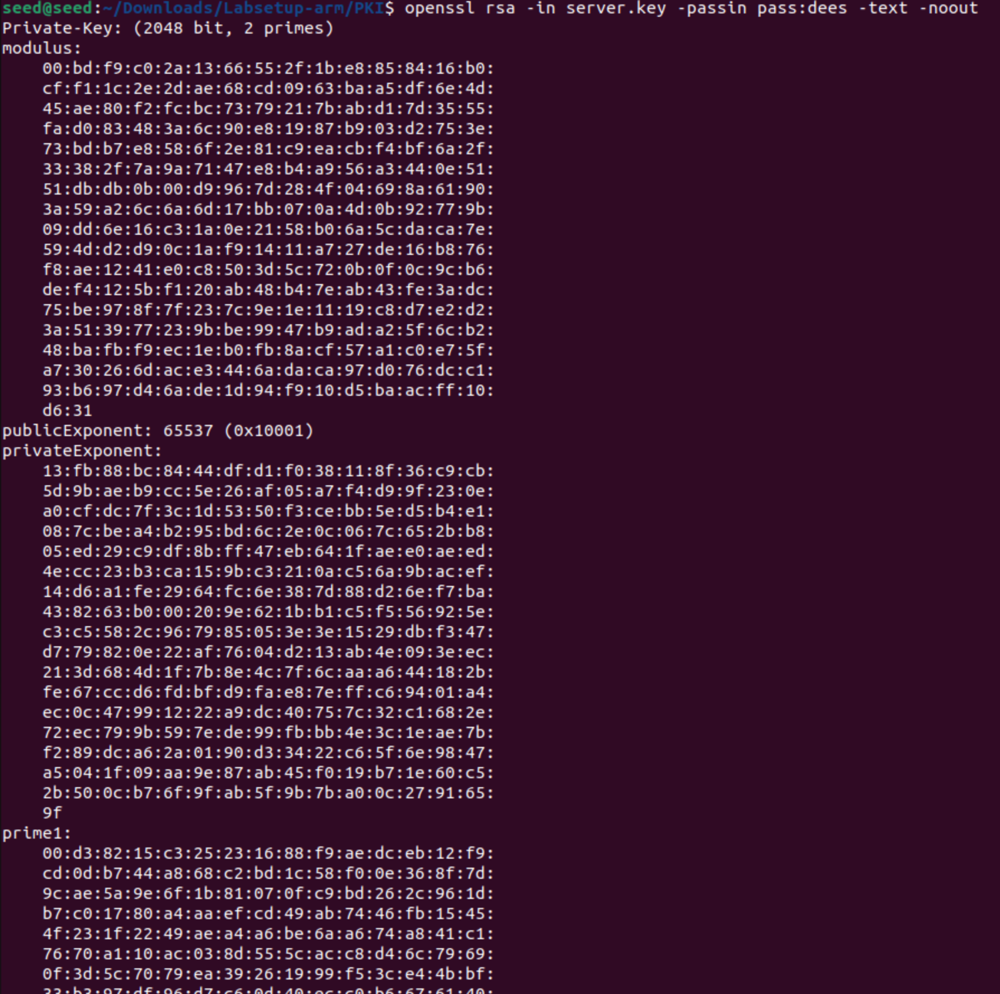
2. This CSR will be used by the CA in Task 3 to generate a certificate for the webserver.

## Task 3: Generating a certificate for the webserver
1. Using the command provided in the lab instructions, I generate a new certificate for the webserver `www.amos2025.com` using the CSR generated in Task 2 and sign it with my CA certificate.
    - I set the `copy_extensions = copy` in the `[ usr_cert ]` section of the `openssl.cnf` file to copy the SAN from the CSR to the issued certificate.
    - ```
        openssl ca -config openssl.cnf -policy policy_anything -md sha256 -days 3650 -in server.csr -out server.crt -batch -cert ca.crt -keyfile ca.key 
        ```
    - 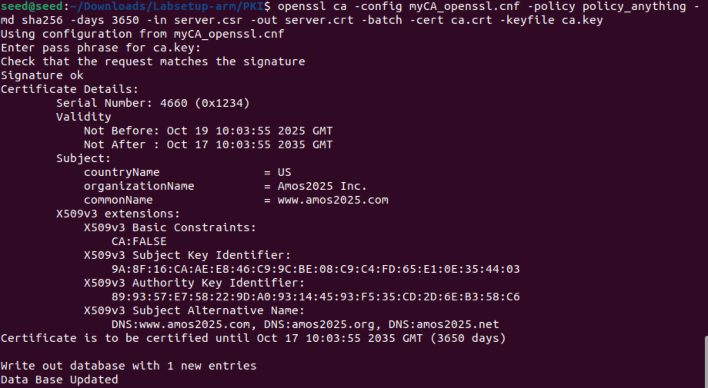
2. then i run `openssl x509 -in server.crt -text -noout` to view the certificate details:
    - 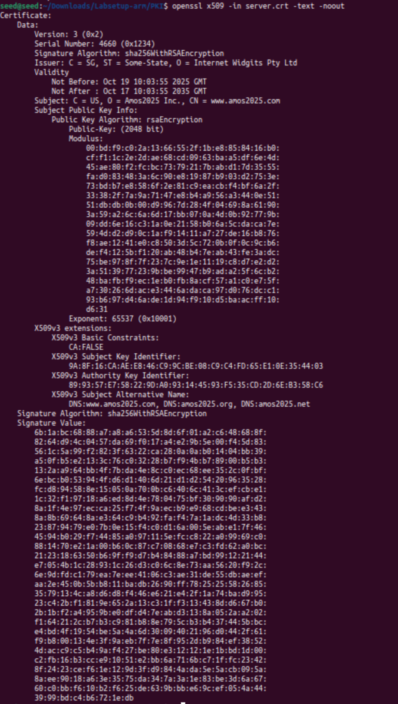

## Task 4: Deploying Certificate in an Apache-Based HTTPS Website
1. following the instructions i edited the apache configuration file for my `www.amos2025.com` site to use the generated certificate and private key.
    - 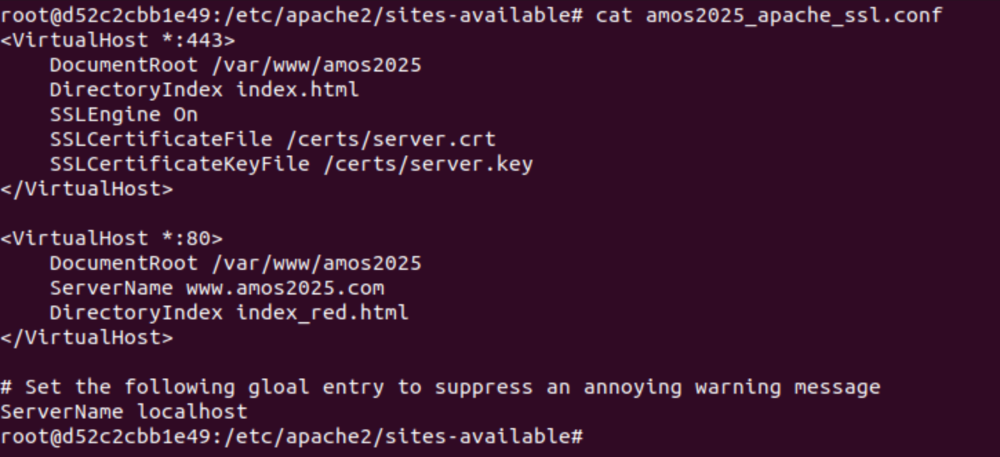
2. then made a copy of the `server.crt` and `server.key` files to the container and moved them to the directory `/certs/` inside the container.
3. then i restarted the apache server inside the container to apply the changes, `service apache2 reload`, then `service apache2 restart`.
4. then i try to access the website `www.amos2025.com` on my firefox browser in the host vm, but i see this red page, and that the webpage is not secure. 
    - 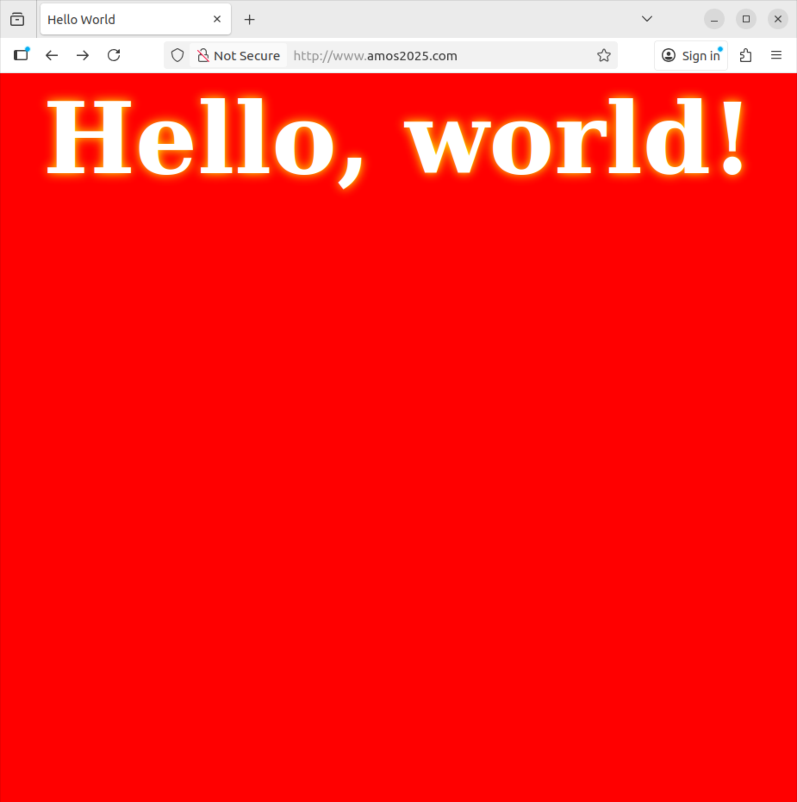
    - This is because the browser does not trust my CA certificate yet since it is a sefl-signed certificate, not a certificate issued by a well-known CA.
    - Due to this, the browser is defaulting to `http` instead of `https`, which uses port 80 instead of port 443, and port 80 shows the `index_red.html` page.
5. to fix this, i need to import my CA certificate `ca.crt` into firefox's trusted root certificate authorities.
    - 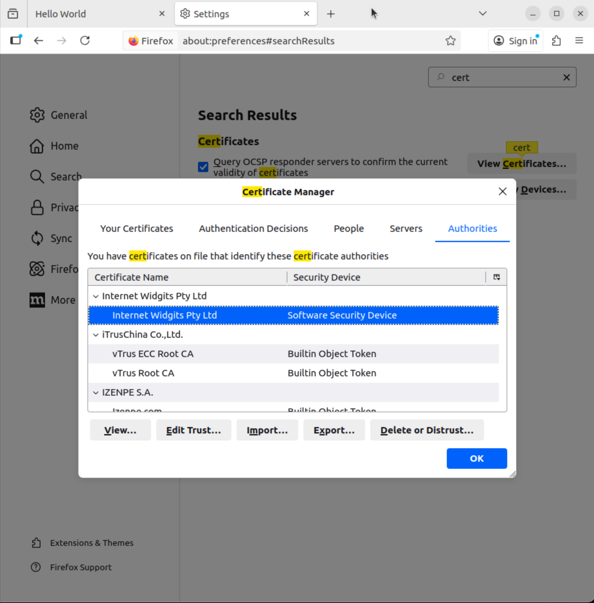
6. then now when we try to access the website `https://www.amos2025.com`, we see that the connection is secure and the certificate is trusted, the green website is shown as port 443 is used and the `index.html` page is displayed.
    - 

## Task 5: Launch Man-in-the-Middle Attack
we are asked to set up the apache server to impersonate some social media website, i chose `www.onlyfans.com`.
1. created the apache2 configuration file for `www.onlyfans.com` site as per task 4
    - 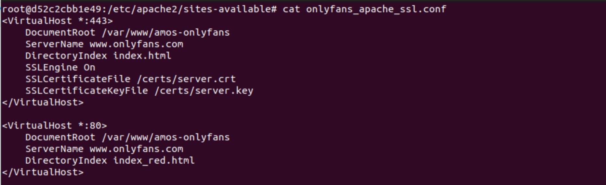
2. then i enable this site and restart apache server inside the container.
    - 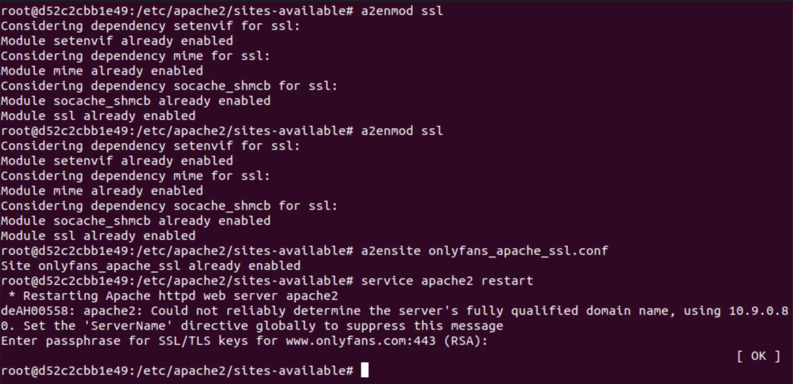
3. then i add an entry in the `/etc/hosts` file of the host VM to map `www.onlyfans.com` to the IP address of the apache server container.
    - 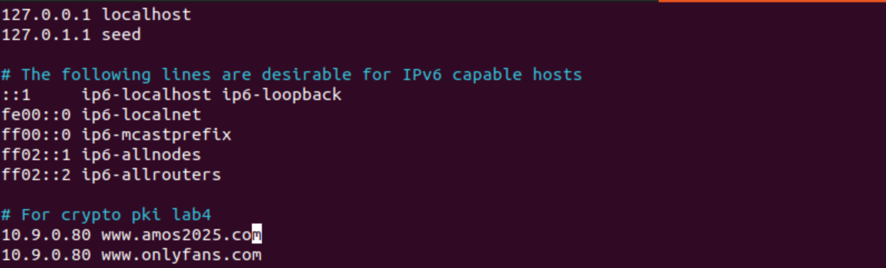
4. then why i try to access `https://www.onlyfans.com` on firefox browser in the host VM, i see this error that says that there is potential security issue. 
    - 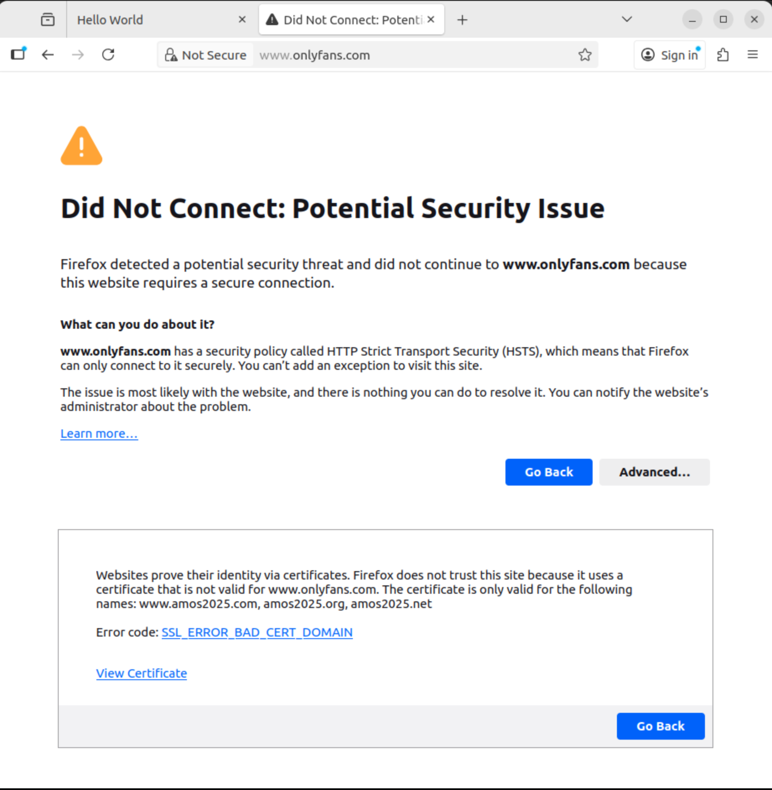
    - this is because the public key in the certificate presented by the apache server does not match the public key expected for `www.onlyfans.com`, as the certificate was signed by my own CA and not by a well-known CA that issued a certificate for `www.onlyfans.com`. The browser detects this mismatch and raises a security warning to alert the user of a potential man-in-the-middle attack.

## Task 6: Launching a Man-In-The-Middle Attack with a Compromised CA
1. Since we have a compromised CA, i.e the CA cert we created in Task 1, we can use it to sign a certificate for `www.onlyfans.com` and have the browser trust it.
2. I generate a new CSR for `www.onlyfans.com`:
    - ```
        openssl req -newkey rsa:2048 -sha256 -keyout onlyfans.key -out onlyfans.csr -subj "/CN=onlyfans.com/O=Fenix International Limited/C=GB" -passout pass:dees -addext "subjectAltName = DNS:onlyfans.com, DNS:www.onlyfans.com, DNS:assets.onlyfans.com"
        ```
    - 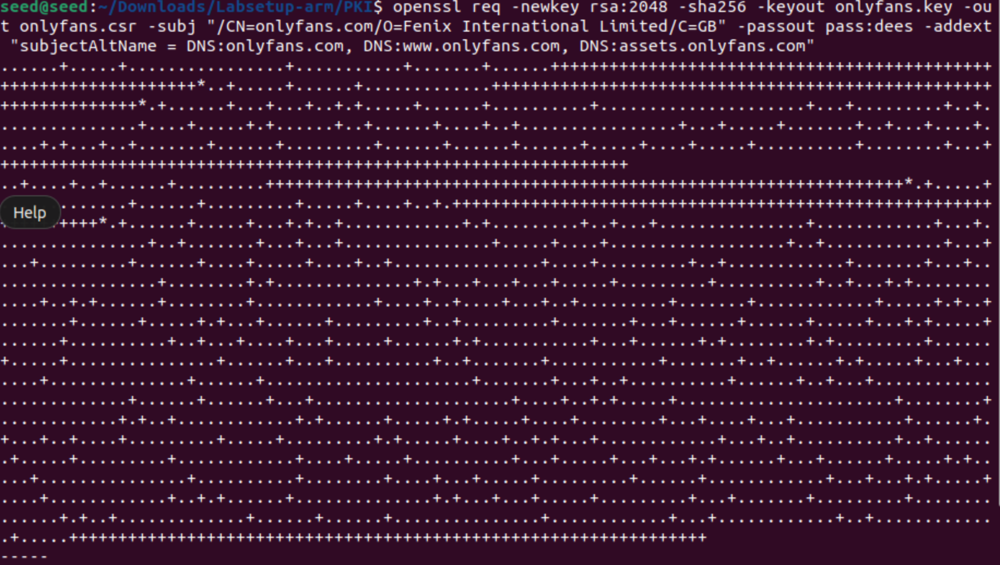
3. Then i sign this CSR with my compromised CA to generate a certificate for `www.onlyfans.com`:
    - ```
        openssl ca -config myCA_openssl.cnf -policy policy_anything -md sha256 -days 3650 -in onlyfans.csr -out onlyfans.crt -batch -cert ca.crt -keyfile ca.key
        ```
    - 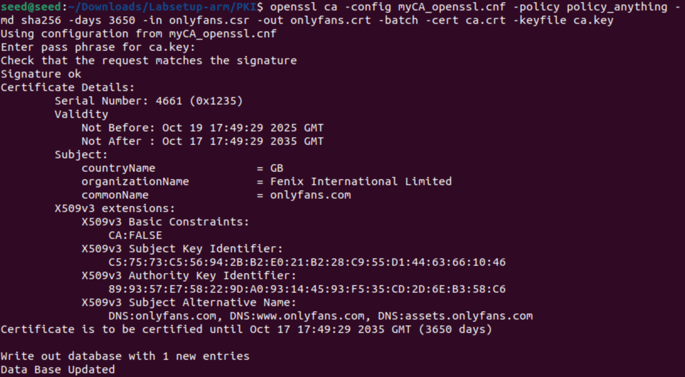
4. then i copy the generated `onlyfans.crt` and `onlyfans.key` files to the apache server container and move them to the `/certs/` directory.
5. then i edit the apache configuration file for `www.onlyfans.com` site to use the newly generated certificate and private key.
    - 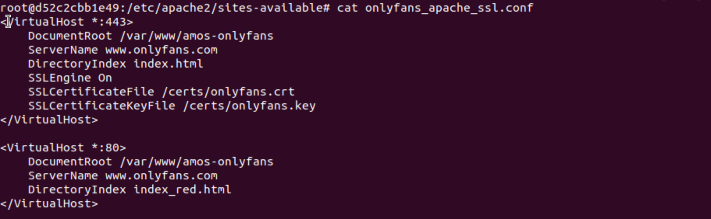
6. then i restart the apache server inside the container to apply the changes using `service apache2 reload` then `service apache2 restart`.
7. now when i try to access `https://www.onlyfans.com` on firefox browser i see my onlyfans website.
    - 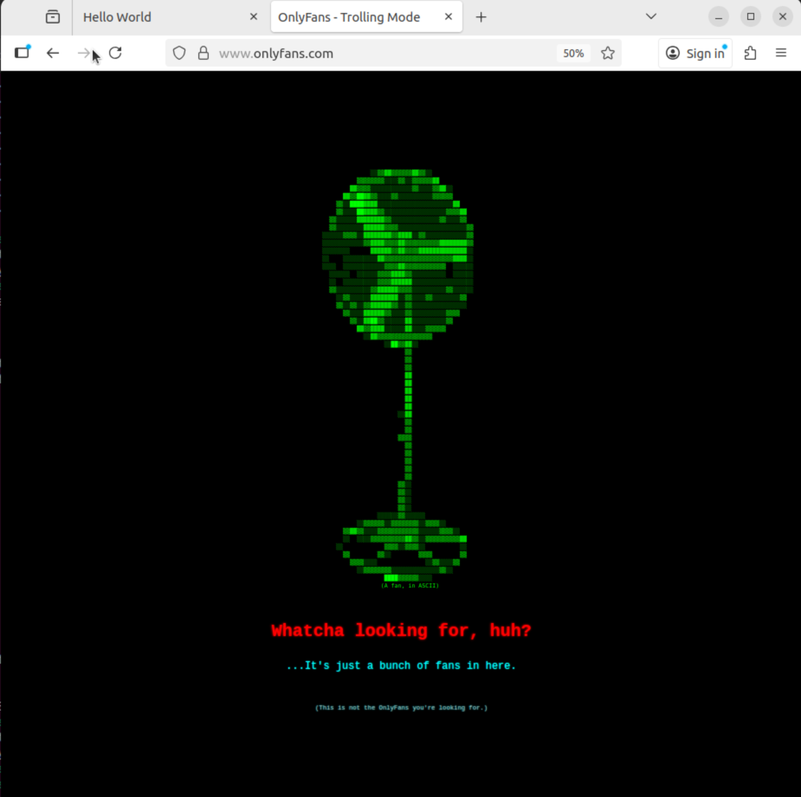
8. With this we have successfully launched a man-in-the-middle attack using a compromised CA to impersonate `www.onlyfans.com` and have the browser trust the certificate presented by our apache server. This shows that if we can compromise a CA and issue fraudulent certificates, we can impersonate any website and intercept secure communications without raising browser security warnings.


   

