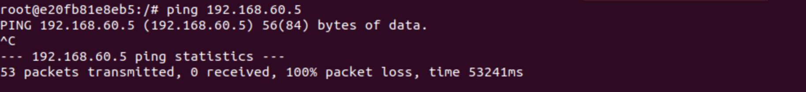
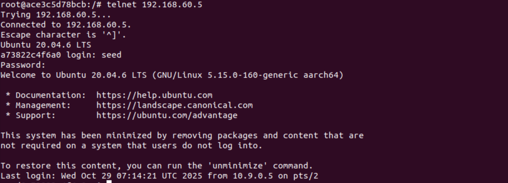

# 50.020 Network Security Lab 5 Firewall Exploration Writeup

## Task 1 - Implementing Simple Firewall (Optional)
- Is optional and was not attempted.

### Summary of iptables tables
1. `filter` table: used for packet filtering
    - `INPUT` chain
    - `FORWARD` chain
    - `OUTPUT` chain
2. `nat` table: used for network address translation, modified network addresses
    - `PREROUTING` chain
    - `INPUT` chain
    - `OUTPUT` chain
    - `POSTROUTING` chain
3. `mangle` table: used for packet content modification
    - `PREROUTING` chain: enforced at `NF_IP_PRE_ROUTING` hook
    - `INPUT` chain: enforced at `NF_INET_LOCAL_IN` hook
    - `FORWARD` chain: enforced at `NF_INET_FORWARD` hook
    - `OUTPUT` chain: enforced at `NF_INET_LOCAL_OUT` hook
    - `POSTROUTING` chain: enforced at `NF_IP_POST_ROUTING` hook

### iptable command line interface
- ```
    iptables -t <table> -<operation> <chain> <rule> -j <target>
    
    // List all the rules in a table (without line number)
    iptables -t <table> -L -n

    // List all the rules in a table (with line number)
    iptables -t <table> -L -n --line-numbers

    // Delete a rule in a table by specifying the line number
    iptables -t <table> -D <chain> <line-number>

    // Drop all packets that satisfy a certain <rule>
    iptables -t <table> -A <chain> <rule> -j DROP
    ```

## Task 2 - Experimenting with stateless firewall
### Task 2.A: Protecting the router
- In the router container, I run the following commands as per the instructions in the assignment:
    - ```
        iptables -A INPUT -p icmp --icmp-type echo-request -j ACCEPT
        iptables -A OUTPUT -p icmp --icmp-type echo-reply -j ACCEPT
        iptables -P OUTPUT DROP
        iptables -P INPUT DROP
        ```
    - 
- Then I try to ping the router (`10.9.0.11`) from the hostA container hosted on `10.9.0.5`.
    - 
    - We see that the ping is successful, which is expected since we have allowed ICMP echo-request and echo-reply packets in the iptables rules.
- Then I try to telnet to the router (`10.9.0.11`) from the hostA container hosted on `10.9.0.5`.
    - 
    - We see that the telnet attempt times out, which is expected since we have set the default policy for INPUT and OUTPUT chains to DROP, and we have not allowed any TCP packets in the iptables rules.
- Then I clean up the iptables rules as per the assignment instructions
    - ```
        iptables -F
        iptables -P INPUT ACCEPT
        iptables -P OUTPUT ACCEPT
        ```
    - 

### Task 2.B: Protecting internal network
- We want to setup rules to achieve this outcome:
    1. Outside host cannot ping internal hosts.
    2. Outside host can ping router.
    3. Internal hosts can ping outside host.
    4. All other packets between internal network and external network should be blocked.
- First we use `ip addr` to check the interfaces of the internal and external networks.
    - ```   
        root@3a83319fa079:/# ip addr
        1: lo: <LOOPBACK,UP,LOWER_UP> mtu 65536 qdisc noqueue state UNKNOWN group default qlen 1000
            link/loopback 00:00:00:00:00:00 brd 00:00:00:00:00:00
            inet 127.0.0.1/8 scope host lo
            valid_lft forever preferred_lft forever
            inet6 ::1/128 scope host 
            valid_lft forever preferred_lft forever
        2: eth0@if34: <BROADCAST,MULTICAST,UP,LOWER_UP> mtu 1500 qdisc noqueue state UP group default 
            link/ether 46:61:6c:8c:db:f6 brd ff:ff:ff:ff:ff:ff link-netnsid 0
            inet 192.168.60.11/24 brd 192.168.60.255 scope global eth0
            valid_lft forever preferred_lft forever
        3: eth1@if36: <BROADCAST,MULTICAST,UP,LOWER_UP> mtu 1500 qdisc noqueue state UP group default 
            link/ether d2:54:23:ad:a5:ad brd ff:ff:ff:ff:ff:ff link-netnsid 0
            inet 10.9.0.11/24 brd 10.9.0.255 scope global eth1
            valid_lft forever preferred_lft forever
        ```
    - we see that `eth0` is the internal network interface with IP `192.168.60.11`
    - we see that `eth1` is the external network interface with IP `10.9.0.11`
- To achieve the desired outcome, we need to setup the following iptables rules on the router container:
    1. By default, drop all packets in the FORWARD chain.
        - `iptables -P FORWARD DROP`
    2. In the FORWARD chain, drop all icmp echo-request packets coming from external network interface `eth1`.
        - `iptables -A FORWARD -i eth1 -p icmp --icmp-type echo-request -j DROP`
    3. In the FORWARD chain, allow all icmp echo-request packets coming from internal network interface `eth0`.
        - `iptables -A FORWARD -i eth0 -p icmp --icmp-type echo-request -j ACCEPT`
    4. In the FORWARD chain, allow all icmp echo-reply packets from external network interface `eth1`.
        - `iptables -A FORWARD -i eth1 -p icmp --icmp-type echo-reply -j ACCEPT`
- 
- Then we test the rules:
    1. From external network hostA (`10.9.0.5`), we try to ping internal host1 (`192.168.60.5`).
        - 
        - We see that all the ping attempts fail and results in 100% packet loss, which is expected since we have dropped all icmp echo-request packets from external network in the FORWARD chain.
    2. From external network hostA (`10.9.0.5`), we try to ping the router (`10.9.0.11`).
        - 
        - We see that the ping is successful, which is expected since we have not blocked any icmp packets to the router in the INPUT chain.
    3. From internal host1 (`192.168.60.5`), we try to ping external hostA (`10.9.0.5`).
        - 
        - We see that the ping is successful, which is expected since we have allowed icmp echo-request and echo-reply packets from internal network in the FORWARD chain.
    4. We try to telnet from internal host1 (`192.168.60.5`) to external hostA (`10.9.0.5`), which sends a TCP SYN packet.
        - 
        - We see that the telnet attempt times out, which is expected since we have set the default policy for FORWARD chain to DROP, and we have not allowed any TCP packets in the iptables rules.
    5. We try to telnet from external hostA (`10.9.0.5`) to internal host1 (`192.168.60.5`), which sends a TCP SYN packet.
        - 
        - We see that the telnet attempt times out, which is expected since we have set the default policy for FORWARD chain to DROP, and we have not allowed any TCP packets in the iptables rules.
- With this, we have successfully setup the iptables rules to achieve the desired outcome.
- cleaning up the iptables rules as per the assignment instructions
    - ```
        iptables -F
        iptables -P FORWARD ACCEPT
        ```

### Task 2.C: Protecting Internal Servers
- The assignment requires us to setup these rules:
    1. Outside hosts can only access host1's telnet server on `192.168.60.5/23`, not the other internal hosts' servers.
    2. Outside hosts cannot access all other internal servers.
    3. Internal hosts can access all internal servers.
    4. Internal hosts cannot access external servers.
    5. Connection tracking mechanism is not allowed.
- To achieve the desired outcome, we need to setup the following rules on the router's FORWARD chain:
    1. By default, drop all packets in the FORWARD chain.
        - `iptables -P FORWARD DROP`
    2. In the FORWARD chain, allow all TCP packets to internal host1's telnet server on `192.168.60.5/23` from external network interface `eth1`. 
        - `iptables -A FORWARD -i eth1 -p tcp -d 192.168.60.5 --dport 23 -j ACCEPT`
    3. In the FORWARD chain, allow all TCP packets from internal host1's telnet server on `192.168.60.5/23` to all internal network servers on interface `eth0`. 
        - `iptables -A FORWARD -i eth0 -p tcp -s 192.168.60.5 --sport 23 -j ACCEPT`
- 
    - Note that requirement 3 is automatically satisfied since all internal hosts are in the same subnet `192.168.60.0/24`, their traffic will not go through the router, so no iptables rules are needed on the router for internal hosts to access internal servers.
- Then we test the rules:
    1. Outside hosts can only access host1's telnet server on `192.168.60.5/23`
        - From external hostA (`10.9.0.5`), we try to telnet internal host1 (`192.168.60.5`).
        - 
        - We see that the telnet is successful, which is expected since we have allowed TCP packets to internal host1's telnet server from external network in the FORWARD chain.
    2. Outside hosts cannot access all other internal servers.
        - From external hostA (`10.9.0.5`), we try to telnet internal host2 (`192.168.60.6`).
            - 
            - We see that the telnet attempt times out, which is expected since we have not allowed any TCP packets to internal host2's telnet server from external network in the FORWARD chain.
        - From external hostA (`10.9.0.5`), we try to telnet internal host3 (`192.168.60.7`).
            - 
            - We see that the telnet attempt times out, which is expected since we have not allowed any TCP packets to internal host3's telnet server from external network in the FORWARD chain.
    3. Internal hosts can access all internal servers.
        - From internal host1 (`192.168.60.5`), we try to telnet internal host2 (`192.168.60.6`).
            - 
        - From internal host1 (`192.168.60.5`), we try to telnet internal host3 (`192.168.60.7`).
            - 
        - From internal host2 (`192.168.60.6`), we try to telnet internal host3 (`192.168.60.7`).
            - 
        - From internal host2 (`192.168.60.6`), we try to telnet internal host1 (`192.168.60.5`).
            - 
        - From internal host3 (`192.168.60.7`), we try to telnet internal host1 (`192.168.60.5`).
            - 
        - From internal host3 (`192.168.60.7`), we try to telnet internal host2 (`192.168.60.6`).
            - 
        - We see that all the telnet attempts between internal hosts are successful, which is expected since internal hosts are in the same subnet and their traffic does not go through the router and the iptables rules do not affect them.
    4. Internal hosts cannot access external servers.
        - From internal host1 (`192.168.60.5`), we try to telnet external hostA (`10.9.0.5`).
            - 
        - From internal host2 (`192.168.60.6`), we try to telnet external hostA (`10.9.0.5`).
            - 
        - From internal host3 (`192.168.60.7`), we try to telnet external hostA (`10.9.0.5`).
            - 
        - We see that the telnet attempt times out, which is expected since we have set the default policy for FORWARD chain to DROP, and we have not allowed any TCP packets from internal network to external network in the FORWARD chain.
    5. Connection tracking mechanism is not allowed.
        - We have not used any connection tracking mechanism in our iptables rules, so this requirement is satisfied.
- With this, we have successfully setup the iptables rules to achieve the desired outcome.
- cleaning up the iptables rules as per the assignment instructions
    - ```
        iptables -F
        iptables -P FORWARD ACCEPT
        ``` 
## Task 3 - Connection tracking and stateful firewall
### Task 3.A: Experimenting with connection tracking
- To test for ICMP connection tracking, we run the ping commands to `192.168.60.5` from `10.9.0.5` as per the instructions in the assignment, then on the router, we check the connection tracking table using `conntrack -L`.
    - 
    - We see that before the ping commands, there are no entries in the connection tracking table.
    - During the ping commands, we see that there are entries in the connection tracking table for the ICMP packets between `10.9.0.5` and `192.168.60.5`.
    - After the ping commands, we see that the entries in the connection tracking table for the ICMP packets between `10.9.0.5` and `192.168.60.5` are still present, indicating that the connection tracking mechanism is still tracking the state of the ICMP connection.
    - When repeatedly running the `conntrack -L` command, we see that the 3rd value in the entry changes from 29 to 0, then after 0 the entry is removed, indicating that the connection tracking mechanism has a timeout for the ICMP connection state after 30 seconds of inactivity.
- To test for UDP connection tracking, we run the `nc -lu 9090` on internal host1 (`192.168.60.5`) and then run netcat on external hostA (`10.9.0.5`) to send a UDP packet to internal host1.
    - 
    - We see that before sending the UDP packet, there are no entries in the connection tracking table.
    - After sending the UDP packet, we see that there are entries in the connection tracking table for the UDP packets between `10.9.0.5` and `192.168.60.5`.
    - When repeatedly running the `conntrack -L` command, we see that the 3rd value in the entry changes from 29 to 0, then after 0 the entry is removed, indicating that the connection tracking mechanism has a timeout for the UDP connection state after 30 seconds of inactivity.
    - Every time we send a new UDP packet from external hostA to internal host1, if the connection tracking entry has expired, a new entry is created in the connection tracking table, if the connection tracking entry is still present, the existing entry is refreshed for another 30 seconds with the new timestamp.
- To test for TCP connection tracking, we run the `nc -l 9090` on internal host1 (`192.168.60.5`) and then run netcat on external hostA (`10.9.0.5`) to send a TCP packet to internal host1.
    - 
    - We see that before sending the TCP packet, there are no entries in the connection tracking table.
    - After sending the TCP packet, we see that there are entries in the connection tracking table for the TCP packets between `10.9.0.5` and `192.168.60.5`.
    - The entries in the connection tracking table for TCP connections do not expire after 30 seconds of inactivity like ICMP and UDP connections. Instead, they remain in the table for a long time while the connection is still established, 432000 seconds (5 days) after the last packet is seen. 
    - When the TCP connection is closed (by sending a FIN packet), the connection tracking entry is marked as `TIME_WAIT` state, and it will be removed from the connection tracking table after 120 seconds of inactivity.
### Task 3.B: Setting up a stateful firewall
- As outlined by the assignment, we are to implement the same set of rules as in Task 2.C, but now with additional rule that allows internal hosts to access external servers using connection tracking mechanism.
- We recall `eth0` is the internal network interface, and `eth1` is the external network interface.
- These is the outcome we have to achieve:
    1. Outside hosts can only access host1's telnet server on `192.168.60.5/23`, not the other internal hosts' servers.
    2. Outside hosts cannot access all other internal servers.
    3. Internal hosts can access all internal servers.
    4. Internal hosts can access external servers.
- To achieve the desired outcome, we need to setup the following rules on the router's FORWARD chain:
    1. By default, drop all packets in the FORWARD chain.
        - `iptables -P FORWARD DROP`
    2. In the FORWARD chain, allow SYN TCP packets to internal host1's telnet server on `192.168.60.5/23`, from external network interface `eth1`. 
        - `iptables -A FORWARD -i eth1 -p tcp -d 192.168.60.5 --dport 23 --syn -m conntrack --ctstate NEW -j ACCEPT`
    3. In the FORWARD chain, allow SYN TCP packets from internal hosts to external servers, from internal network interface `eth0`.
        - `iptables -A FORWARD -i eth0 -p tcp --syn -m conntrack --ctstate NEW -j ACCEPT`
    4. In the FORWARD chain, allow all established and related packets.
        - `iptables -A FORWARD -m conntrack --ctstate ESTABLISHED,RELATED -j ACCEPT`
- We setup the iptables rules as shown:
    - 
- Then we test the rules:
    1. Outside hosts can only access host1's telnet server on `192.168.60.5/23`, not the other internal hosts' servers.
        - From external hostA (`10.9.0.5`), we can successfully connect to host1's telnet server on `192.168.60.5:23`.
            - 
        - We see that the telnet is successful, which is expected since we have allowed SYN TCP packets to internal host1's telnet server from external network in the FORWARD chain, then after the connection is established, the ESTABLISHED packets are allowed by the last rule through the connection tracking mechanism.
    2. Outside hosts cannot access all other internal servers.
        - From external hostA (`10.9.0.5`), we cannot connect to host2's telnet server on `192.168.60.6:23`.
            - 
        - From external hostA (`10.9.0.5`), we cannot connect to host3's telnet server on `192.168.60.7:23`.
            - 
        - We see that the telnet attempts time out, which is expected since we have not allowed any SYN TCP packets to internal host2 and host3's telnet servers from external network in the FORWARD chain.
    3. Internal hosts can access all internal servers.
        - From internal host1 (`192.168.60.5`), we can connect to host2's telnet server on `192.168.60.6:23`.
            - 
        - From internal host1 (`192.168.60.5`), we can connect to host3's telnet server on `192.168.60.7:23`.
            - 
        - From internal host2 (`192.168.60.6`), we can connect to host1's telnet server on `192.168.60.5:23`.
            - 
        - From internal host2 (`192.168.60.6`), we can connect to host3's telnet server on `192.168.60.7:23`.
            - 
        - From internal host3 (`192.168.60.7`), we can connect to host1's telnet server on `192.168.60.5:23`.
            - 
        - From internal host3 (`192.168.60.7`), we can connect to host2's telnet server on `192.168.60.6:23`.
            - 
        - We see that all the telnet attempts between internal hosts are successful, which is expected since internal hosts are in the same subnet and their traffic does not go through the router and the iptables rules do not affect them.
    4. Internal hosts can access external servers.
        - From internal host1 (`192.168.60.5`), we can connect to an telnet server on external hostA (`10.9.0.5`).
            - 
        - From internal host2 (`192.168.60.6`), we can connect to an telnet server on external hostA (`10.9.0.5`).
            - 
        - From internal host3 (`192.168.60.7`), we can connect to an telnet server on external hostA (`10.9.0.5`).
            - 
        - We see that the telnet attempts are successful, which is expected since we have allowed SYN TCP packets from internal network on `eth0` to external network on `eth1` in the FORWARD chain, then after the connection is established, the ESTABLISHED packets are allowed by the last rule through the connection tracking mechanism.
- We can achieve the same result with a stateless firewall using the following iptable rules:
    ```
    iptables -P FORWARD DROP
    # Allow external → host1 telnet (SYN)
    iptables -A FORWARD -i eth1 -p tcp -d 192.168.60.5 --dport 23 --syn -j ACCEPT
    # Allow host1 telnet → external (return traffic: SYN-ACK, ACK, data, FIN)
    iptables -A FORWARD -i eth0 -p tcp -s 192.168.60.5 --sport 23 -j ACCEPT
    # Allow external → host1 telnet (ACK, data, FIN for established connection)
    iptables -A FORWARD -i eth1 -p tcp -d 192.168.60.5 --dport 23 -j ACCEPT

    # Allow internal → external (NEW connections)
    iptables -A FORWARD -i eth0 -o eth1 -p tcp --syn -j ACCEPT
    # Allow external → internal (return traffic)
    iptables -A FORWARD -i eth1 -o eth0 -p tcp -j ACCEPT
    ```
- The advantage of using a stateful firewall:
    1. **Simpler rules** - Fewer rules needed, more concise
    2. **Better security** - Automatically tracks connection state, only allows legitimate return traffic
    3. **Protection against spoofing** - Can't just send packets with arbitrary source ports; they must belong to actual established connections
    4. **Handles complex protocols** - RELATED state helps with protocols like FTP that open secondary connections
    5. **Easier to maintain** - Adding new services requires fewer rules
- The disadvantage of using a stateful firewall:
    1. **Memory overhead** - Must maintain connection tracking table in kernel memory
    2. **Performance impact** - CPU cycles needed to track every connection
    3. **Scalability issues** - Connection table can fill up on high-traffic routers
    4. **DoS vulnerability** - Attackers can exhaust connection tracking table with SYN floods
    5. **State complexity** - State can desynchronize (e.g., router reboot loses all connection state)
- The advantages of using a stateless firewall:
    1. **No memory overhead** - Doesn't need to track connections
    2. **Better performance** - Faster packet processing (just match rules)
    3. **Better scalability** - Can handle more simultaneous connections
    4. **No state synchronization issues** - Router reboot doesn't break existing connections
    5. **More predictable** - Each packet evaluated independently
- The disadvantages of using a stateless firewall:
    1. **Weaker security** - Must allow broad return traffic (any packet from sport 23)
        - Attacker could craft packets with `--sport 23` to bypass firewall
        - Example: External attacker could send packets claiming to be from port 23 to any internal port
    2. **More complex rules** - Need explicit rules for both directions of traffic
    3. **Harder to maintain** - Each service needs multiple rules (outbound SYN, inbound return, etc.)
    4. **Can't handle asymmetric routing well** - Must allow any return traffic matching source/dest ports
    5. **Vulnerable to port scanning** - Easier for attackers to probe for open ports
- With this, we have successfully setup the iptables rules to achieve the desired outcome using a stateful firewall.
- cleaning up the iptables rules as per the assignment instructions
    - ```
        iptables -F
        iptables -P FORWARD ACCEPT
        ```
## Task 4 - Limiting Network Traffic
1. Based on the instructions in the assignment, we run the following commands first
    - ```
        iptables -A FORWARD -s 10.9.0.5 -m limit --limit 10/minute --limit-burst 5 -j ACCEPT
        ```
    - 
2. Then we run a ping host1 (`192.168.60.5`) from hostA (`10.9.0.5`)
    - 
    - We see that the ping is successful and sequential pings are received and replied to, even past the rate limit.
    - This is likely because the default policy of the FORWARD chain was set to ACCEPT, so all packets, even those exceeding the rate limit, are accepted by default.
3. Then we add rule 2 as per the assignment instructions
    - ```
        iptables -A FORWARD -s 10.9.0.5 -j DROP
        ```
    -
4. Then we run a ping host1 (`192.168.60.5`) from hostA (`10.9.0.5`) again
    - 
    - This time we see that the ping requests if the first 5 pings are replied to sequentially and none are dropped, since the rule allows a burst of 5 packets.
    - After the first 5 pings, subsequent pings are dropped as expected, since they exceed the rate limit of 10 pings per minute, and we implemented rule 2 to drop all other packets from `10.9.0.5` that are exceeding the rate limit.
5. Yes the 2nd rule is necessary to enforce the rate limiting effectively. 
    - The first rule alone only specifies the rate limit but does not drop packets that exceed the limit. 
    - Without the second rule, packets exceeding the limit would still be accepted by default if the default policy is ACCEPT.
    - The second rule ensures that any packets from `10.9.0.5` that exceed the rate limit are dropped.

## Task 5 - Load Balancing
- As instructed by the assignment, we first start the netcat server on all three internal hosts on port 8080 using the following command:
    - `nc -luk 8080`
- Then we setup the iptables rules on the router to achieve load balancing using the nth mode with the following commands such that incoming UDP traffic on port 8080 is distributed evenly among the three internal hosts:
    - ```
        iptables -t nat -A PREROUTING -p udp --dport 8080 -m statistic --mode nth --every 3 --packet 0 -j DNAT --to-destination 192.168.60.5:8080
        iptables -t nat -A PREROUTING -p udp --dport 8080 -m statistic --mode nth --every 2 --packet 0 -j DNAT --to-destination 192.168.60.6:8080
        iptables -t nat -A PREROUTING -p udp --dport 8080 -m statistic --mode nth --every 1 --packet 0 -j DNAT --to-destination 192.168.60.7:8080
        ```
    - Then when we use the `echo hello | nc -u 10.9.0.11 8080` command from external hostA (`10.9.0.5`) 3 times, we see that the UDP packets are distributed evenly among the three internal hosts as shown as each internal host receives one packet each in a round-robin fashion:
        - 
    - Host 1 (`192.168.60.5`) receives the 1st packet
        - 
    - Host 2 (`192.168.60.6`) receives the 2nd packet, 
        - 
    - Host 3 (`192.168.60.7`) receives the 3rd packet.
        - 

    - This works because as the `statistic` module processes each incoming packet, it uses the `--every` parameter to determine the frequency of packets that match each rule and each rule is evaluated in order.
        - The first rule uses `--every 3` to match every 1/3 packets to be sent to host1, leaving the remaining 2/3 packets to be evaluated by the next rules.
        - The second rule uses `--every 2` to match every 1/2 of the remaining packets (which is 1/3 of the original packets) to be sent to host2, leaving the remaining 1/3 packets to be evaluated by the last rule.
        - The last rule uses `--every 1` to match all remaining packets (which is 1/3 of the original packets) to be sent to host3.
    - With this, we have successfully setup load balancing using iptables to distribute incoming UDP traffic on port 8080 evenly among the three internal hosts.
    - cleaning up the iptables rules as per the assignment instructions 
        - ```
            iptables -t nat -F
            ```
- Then now we want to use the random mode to achieve the same load balancing effect.
    - We setup the iptable rules on the router using the following commands:
        - ```
            iptables -t nat -A PREROUTING -p udp --dport 8080 -m statistic --mode random --probability 0.333 -j DNAT --to-destination 192.168.60.5:8080
            iptables -t nat -A PREROUTING -p udp --dport 8080 -m statistic --mode random --probability 0.5 -j DNAT --to-destination 192.168.60.6:8080
            iptables -t nat -A PREROUTING -p udp --dport 8080 -m statistic --mode random --probability 1 -j DNAT --to-destination 192.168.60.7:8080
            ```
    - Then when we use the `echo hello | nc -u 10.9.0.11 8080` command from external hostA (`10.9.0.5`) 12 times, we see that the UDP packets are distributed roughly evenly among the three internal hosts, where Host 1 receives 4 packets, Host 2 receives 5 packets, and Host 3 receives 3 packets:
        - 
        - 
        - 
        - 
    - This works because as the `statistic` module processes each incoming packet, it uses the `--probability` parameter to determine the likelihood of packets that match each rule and each rule is evaluated in order.
        - The first rule uses `--probability 0.333` to match approximately 1/3 of the packets to be sent to host1, leaving the remaining packets to be evaluated by the next rules.
        - The second rule uses `--probability 0.5` to match approximately 1/2 of the remaining packets (which is approximately 1/3 of the original packets) to be sent to host2, leaving the remaining packets to be evaluated by the last rule.
        - The last rule uses `--probability 1` to match all remaining packets (which is approximately 1/3 of the original packets) to be sent to host3.
    - With this, we have successfully setup load balancing using iptables in random mode to distribute incoming UDP traffic on port 8080 roughly evenly among the three internal hosts.
