# 50.020 Network Security Lab 7 VPN
## Task 1: Setting up the Lab Environment
1. The lab zip file uses images, hence there is no need to build them from Dockerfiles.  
    - We just need to run `sudo docker-compose up` and the images will be downloaded and ran automatically.  
    - 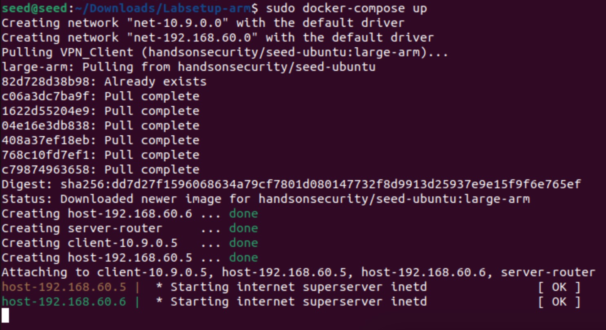
    - we now know the following:
        - Host U IP: `10.9.0.5`
        - Host V IP: `192.168.60.5`
        - VPN Server IP `10.9.0.11` (external ip), `192.168.60.11` (internal ip)
        
2. Then we run the tests instructed by the lab instructions to test if the setup was correct.
    1. To test if Host U (`10.9.0.5`) can communicate with VPN server (`10.9.0.11`), we can ssh into the Hosts machines and run `ping` commands.
        - 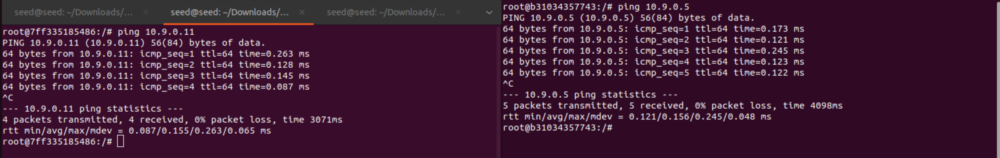
    2. To test if Host V (`192.168.60.5`) can communicate with VPN server (`192.168.60.11`)
        - 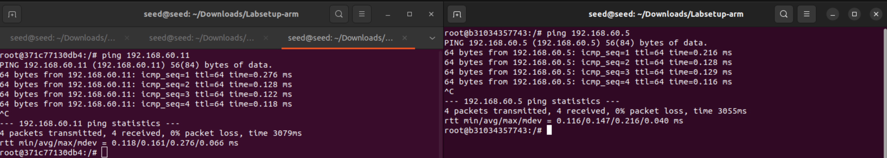
    3. Test if Host U cannot communicate with Host V directly
        - We try to from Host U to ping Host V and see it fails
            - 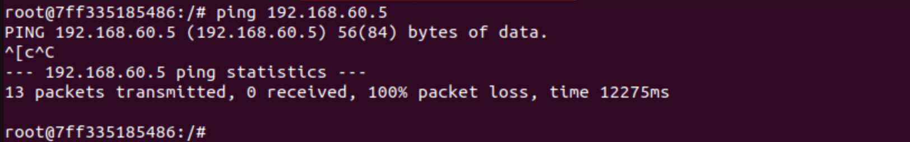
        - We try to from Host V to ping Host U and see it fails
            - 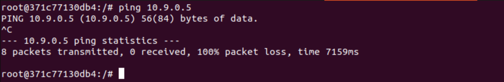
    4. Running tcpdump on VPN server to see if packets are captured:
        - We try to ping from Host V (`192.168.60.5`) to `192.168.60.6`
            - 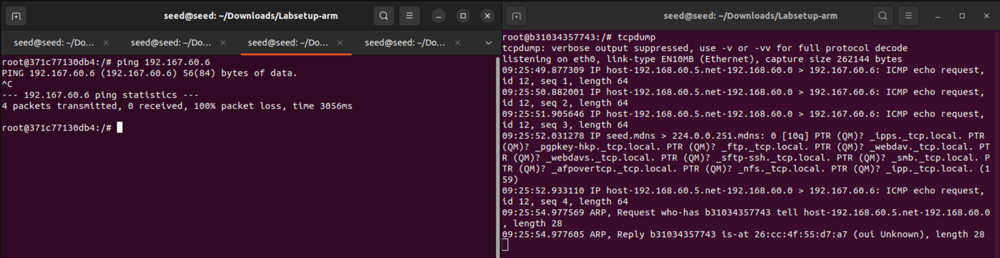
            - We see that the packets are captured on the tcpdump output for the `eth0` interface.
        - We try to ping from Host U (`10.9.0.5`) to `10.9.0.11` the VPN server
            - 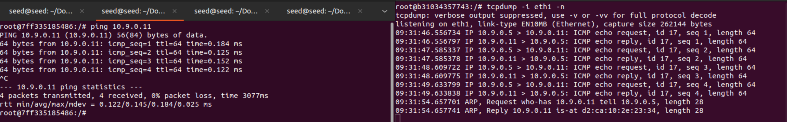
            - We see that the packets are captured on the tcpdump output for the `eth1` interface.
## Task 2: Create and configure TUN interface
### Task 2.a: Create TUN interface on Host U
- After following the lab instructions and funning `tun.py`, then I ssh from a separate terminal into Host U and run `ip address`, and I see that the `tun0` interface is created.
- 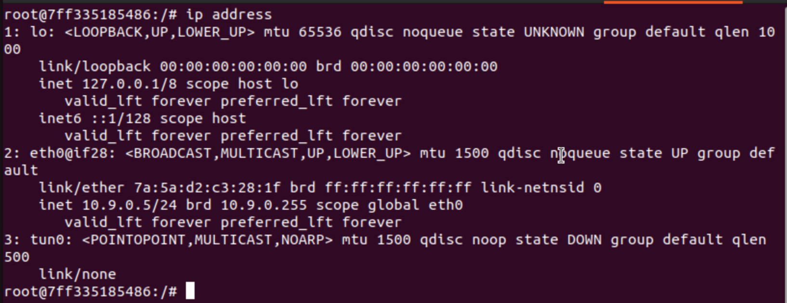
### Task 2.b: Setup the TUN interface
- After following the lab instruction and running `ip addr add 192.168.53.99/24 dev tun0` and `ip link set dev tun0 up`, I run `ip address` again to verify that the `tun0` interface is setup correctly.
- 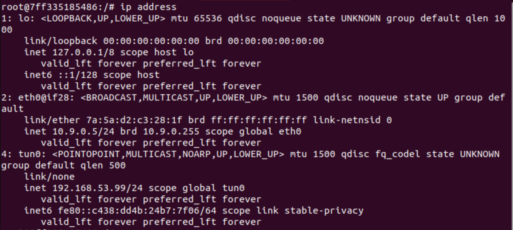
- The ip link `set dev tun0 up` command activated the interface, which triggered the automatic IPv6 address generation, while the `ip addr add` command explicitly added the IPv4 address `192.168.53.99/24`.
### Task 2.c: Read from the TUN interface
- By following the lab instruction i edit the `tun.pt` file to now contain this python code
- ```python
    #!/usr/bin/env python3
    import fcntl
    import struct
    import os
    import time
    from scapy.all import *

    TUNSETIFF = 0x400454ca
    IFF_TUN   = 0x0001
    IFF_TAP   = 0x0002
    IFF_NO_PI = 0x1000

    # Create the tun interface
    tun = os.open("/dev/net/tun", os.O_RDWR)
    ifr = struct.pack('16sH', b'tun%d', IFF_TUN | IFF_NO_PI)
    ifname_bytes  = fcntl.ioctl(tun, TUNSETIFF, ifr)

    # Get the interface name
    ifname = ifname_bytes.decode('UTF-8')[:16].strip("\x00")
    print("Interface Name: {}".format(ifname))

    # used to up the TUN interface
    os.system("ip addr add 192.168.53.99/24 dev {}".format(ifname))
    os.system("ip link set dev {} up".format(ifname))

    while True:
        # Get a packet from the tun interface
        packet = os.read(tun, 2048)
        if packet:
            ip = IP(packet)
            print(ip.summary())
    ```
1. Then I run the modified `tun.py` on Host U, and from another terminal I ssh into Host U and run `ping 192.168.53.8` to ping a host running on the `192.168.53.0/24` subnet.
    - 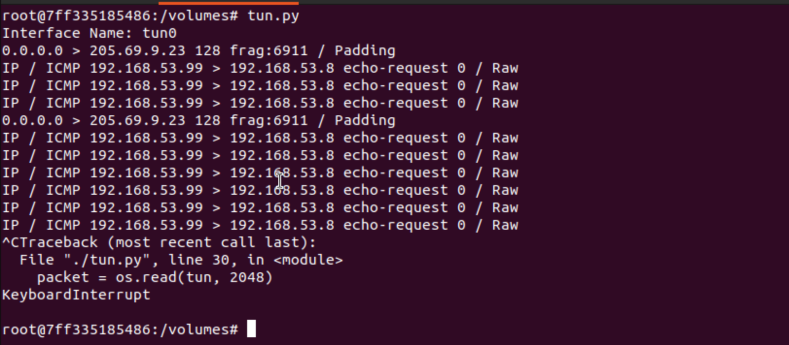
    - 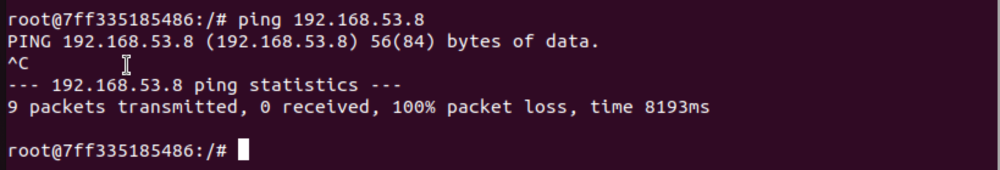
    - We see that the ICMP echo packet are captured by the `tun.py` script, indicating that the TUN interface is successfully reading packets, but we do not get a reply since the interface is still not configured to forward packets, however since they are on the same LAN network, the packets are still sent out, which are captured by the `tun.py` script.
2. Then I run the modified `tun.py` on Host U again and from another terminal I ssh into Host U and run `ping 192.168.60.6` to ping a host running on the internal `192.168.60.0/24` subnet.
    - 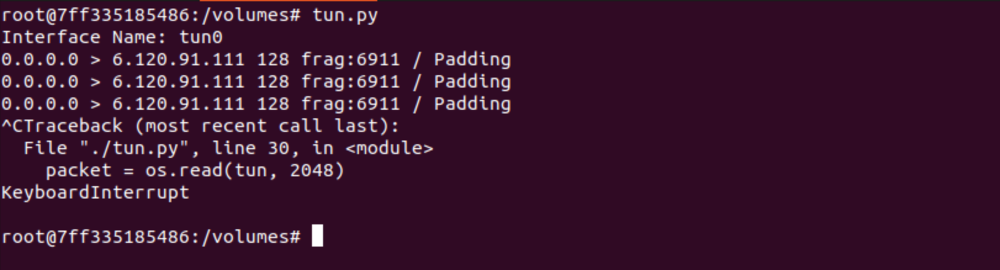
    - 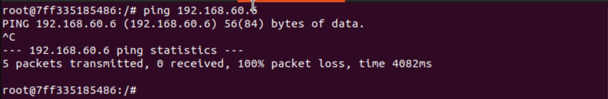
    - We see that the ICMP echo packet from this `ping 192.168.60.6` is not captured by the `tun.py` script. This is because the host U trying to send packets to a network outside of its LAN network, hence no packets are sent out as the network is unreachable.
    - Therefore we see that `tun.py` does not capture any ICMP echo packets as no packets are sent out from the TUN interface.

### Task 2.d: Write to the TUN interface
- Following the requirements set in the lab instructions, I modified the `tun.py` file to execute the 2 following requirements:
    - If receive an ICMP echo packet, construct an ICMP echo reply packet and write it back to the TUN interface.
    - Instead of writing a IP packet to the TUN interface, write some arbitrary data to the TUN interface.
1. For the first requirement, I modified the `tun.py` file to the following code:
    - ```python
        #!/usr/bin/env python3
        import fcntl
        import struct
        import os
        import time
        from scapy.all import *

        TUNSETIFF = 0x400454ca
        IFF_TUN   = 0x0001
        IFF_TAP   = 0x0002
        IFF_NO_PI = 0x1000

        # Create the tun interface
        tun = os.open("/dev/net/tun", os.O_RDWR)
        ifr = struct.pack('16sH', b'tun%d', IFF_TUN | IFF_NO_PI)
        ifname_bytes  = fcntl.ioctl(tun, TUNSETIFF, ifr)

        # Get the interface name
        ifname = ifname_bytes.decode('UTF-8')[:16].strip("\x00")
        print("Interface Name: {}".format(ifname))

        # used to up the TUN interface
        os.system("ip addr add 192.168.53.99/24 dev {}".format(ifname))
        os.system("ip link set dev {} up".format(ifname))

        while True:
            # Get a packet from the tun interface
            packet = os.read(tun, 2048)
            if packet:
                ip = IP(packet)
                print(ip.summary())

                # Check if the packet is an ICMP echo request
                if ip.haslayer(ICMP) and ip[ICMP].type == 8:
                    # Construct ICMP echo reply packet from 
                    icmp_reply = IP(src =ip.dst, dst = ip.src)
                    icmp_reply_ptkt = icmp_reply/ip.payload
                    os.write(tun, bytes(icmp_reply_ptkt)) 

        ```
    - Then now when I run `ping 192.168.53.8` on Host U, I see that the `tun.py` script captures the ICMP echo request packets and construct ICMP echo reply packets and write them back to the TUN interface, and Host U is able to receive the ICMP echo reply packets and display the ping results.
        - 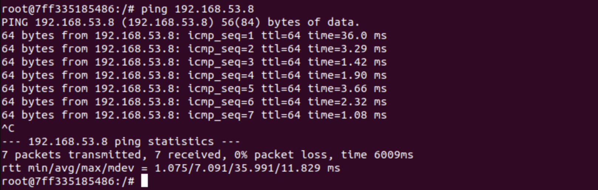
        - 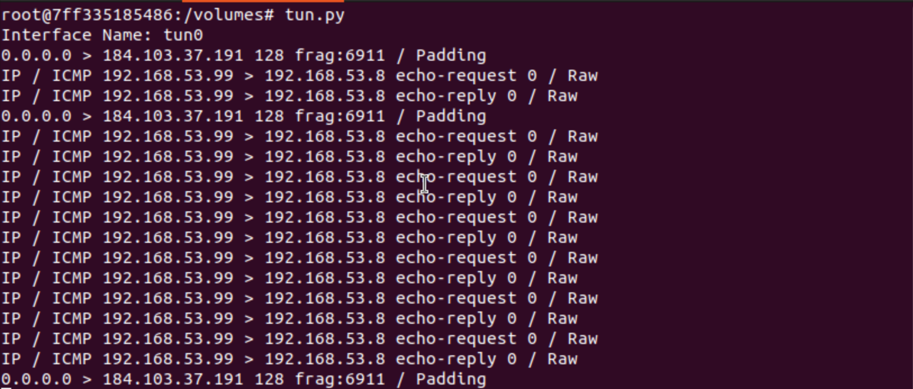
2. For the second requirement, I modified the `tun.py` file to the following code:
    - ```python
        #!/usr/bin/env python3
        import fcntl
        import struct
        import os
        import time
        from scapy.all import *

        TUNSETIFF = 0x400454ca
        IFF_TUN   = 0x0001
        IFF_TAP   = 0x0002
        IFF_NO_PI = 0x1000

        # Create the tun interface
        tun = os.open("/dev/net/tun", os.O_RDWR)
        ifr = struct.pack('16sH', b'tun%d', IFF_TUN | IFF_NO_PI)
        ifname_bytes  = fcntl.ioctl(tun, TUNSETIFF, ifr)

        # Get the interface name
        ifname = ifname_bytes.decode('UTF-8')[:16].strip("\x00")
        print("Interface Name: {}".format(ifname))

        # used to up the TUN interface
        os.system("ip addr add 192.168.53.99/24 dev {}".format(ifname))
        os.system("ip link set dev {} up".format(ifname))

        while True:
            # Get a packet from the tun interface
            packet = os.read(tun, 2048)
            if packet:
                ip = IP(packet)
                print(ip.summary())
                
                if ICMP in ip:
                    os.write(tun, bytes("Hello,world!", encoding='utf-8')) 
        ```
    - Then we run `tun.py` again, then start a `tcpdump -i tun0 -n` on a separate Host U terminal, and ping `192.168.53.8` from Host U, we see that the `tun.py` script captures the ICMP echo request packets, then the tcpdump output shows that the packets are being captured but the payload containing the arbitrary data "Hello,world!" does not appear in the tcpdump output nor the `tun.py` output.
        - 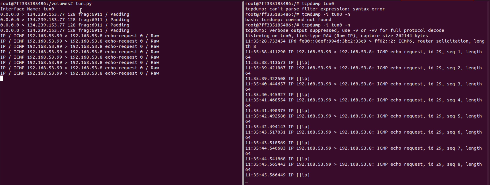
    - We also see that the echo ping does not receive any reply as the `tun.py` script is not constructing ICMP echo reply packets anymore.
        - 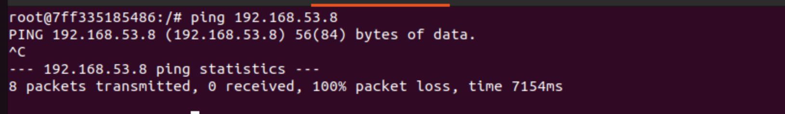 

## Task 3: Send the IP packets through to VPN server through Tunnel
- Following the instruction from the lab manual, I modified the `tun_client.py` and `tun_server.py` files to contain the following code:
1. `tun_client.py`:
    - ```python
        #!/usr/bin/env python3
        import fcntl
        import struct
        import os
        import time
        from scapy.all import *

        TUNSETIFF = 0x400454ca
        IFF_TUN   = 0x0001
        IFF_TAP   = 0x0002
        IFF_NO_PI = 0x1000

        # Create the tun interface
        tun = os.open("/dev/net/tun", os.O_RDWR)
        ifr = struct.pack('16sH', b'tun%d', IFF_TUN | IFF_NO_PI)
        ifname_bytes  = fcntl.ioctl(tun, TUNSETIFF, ifr)

        # Get the interface name
        ifname = ifname_bytes.decode('UTF-8')[:16].strip("\x00")

        os.system("ip addr add 192.168.53.99/24 dev {}".format(ifname))
        os.system("ip link set dev {} up".format(ifname))

        sock = socket.socket(socket.AF_INET,socket.SOCK_DGRAM)
        SERVER_IP, SERVER_PORT = '10.9.0.11', 9090
        while True:
            # Get a packet from the tun interface
            packet = os.read(tun, 2048)
            if packet:
                # Send the packet via the tunnel
                sock.sendto(packet, (SERVER_IP, SERVER_PORT))
        ```
2. `tun_server.py`:
    - ```python
        #!/usr/bin/env python3

        from scapy.all import *

        IP_A = "0.0.0.0"
        PORT = 9090

        sock = socket.socket(socket.AF_INET, socket.SOCK_DGRAM)
        sock.bind((IP_A, PORT))

        while True:
            data, (ip, port) = sock.recvfrom(2048)
            print("{}:{} --> {}:{}".format(ip, port, IP_A, PORT))
            pkt = IP(data)
            print(" Inside: {} --> {}".format(pkt.src, pkt.dst))

        ``` 
3. Then we run the `tun_client.py` on Host U and `tun_server.py` on the VPN server.
4. Then on another ssh instance on Host U, we run `ping 192.168.53.1` to ping a host on the `192.168.53.0/24` subnet.
    - 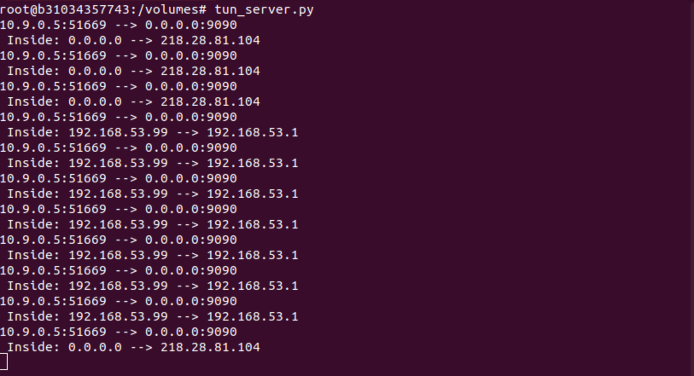
    - We see that the `tun_server.py` script captures the ICMP echo request packets and prints out the source of the packets, from Host U and its port `10.9.0.5:51669` and the IP address and port of the `tun_server.py` on the VPN server on the UDP port `0.0.0.0:9090`.
    - We also see that the packet is transmitted through the internal interface from `192.168.53.99` to `192.168.53.1` since we have set up the tun0 interface on the VPN server, when the client tries to ping a host in the `192.168.53.0/24` subnet, the packet is routed through the tun0 interface on the VPN server `192.168.53.99` to reach the destination host `192.168.53.1`.
    - However, we do not receive any ICMP echo reply packets since the `tun_server.py` is not configured to send any reply packets back to the client.
    - 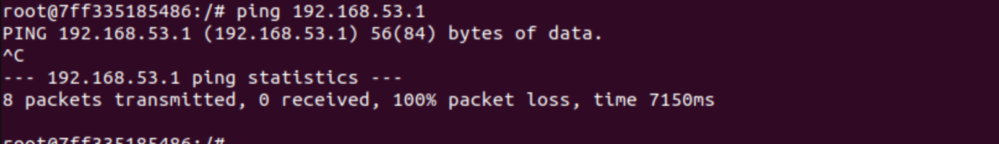
5. Next, as the lab manual says we try to ping the internal Host V `192.168.60.5` from external Host U `10.9.0.5`, but we see that the `tun_server.py` VPN server does not even capture any packets.
    - 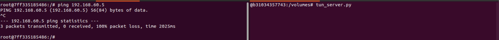
    - We need to modifier the `tun_client.py` to add an interface for the `192.168.60.0/24` subnet to route packets through the TUN interface.
6. Therefore, as per the instructions in the lab, just modify the `tun_client.py` to:
    - ```python
        #!/usr/bin/env python3

        import fcntl
        import struct
        import os
        import time
        from scapy.all import *


        TUNSETIFF = 0x400454ca
        IFF_TUN   = 0x0001
        IFF_TAP   = 0x0002
        IFF_NO_PI = 0x1000

        # Create the tun interface
        tun = os.open("/dev/net/tun", os.O_RDWR)
        ifr = struct.pack('16sH', b'tun%d', IFF_TUN | IFF_NO_PI)
        ifname_bytes  = fcntl.ioctl(tun, TUNSETIFF, ifr)

        # Get the interface name
        ifname = ifname_bytes.decode('UTF-8')[:16].strip("\x00")

        os.system("ip addr add 192.168.53.99/24 dev {}".format(ifname))
        os.system("ip link set dev {} up".format(ifname))
        os.system("ip route add 192.168.60.0/24 dev {} via 192.168.53.99".format(ifname))


        sock = socket.socket(socket.AF_INET,socket.SOCK_DGRAM)
        SERVER_IP, SERVER_PORT = '10.9.0.11', 9090

        while True:
            # Get a packet from the tun interface
            packet = os.read(tun, 2048)
            if packet:
                # Send the packet via the tunnel
                sock.sendto(packet, (SERVER_IP, SERVER_PORT))
        ```
    - 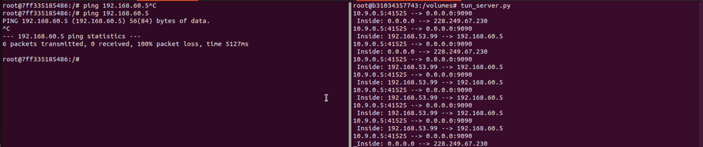
    - We just added the line `os.system("ip route add 192.168.60.0/24 dev {} via 192.168.53.99".format(ifname))`, then now we see that the `tun_server.py` on the VPN server is able to capture the ICMP echo request packets when we ping Host V.

## Task 4: Setting up the VPN server
1. Based on the instructions of the manual, we need to modify the `tun_server.py` script to have the following features
    1. Create a TUN interface and configure it.
    2. Get the data from the socket interface; treat the received data as an IP packet.
    3. Write the packet to the TUN interface.
2. This is the modified `tun_server.py` script:
    - ```python
        #!/usr/bin/env python3
        import fcntl
        import struct
        import os
        import time
        from scapy.all import *

        TUNSETIFF = 0x400454ca
        IFF_TUN   = 0x0001
        IFF_TAP   = 0x0002
        IFF_NO_PI = 0x1000

        # 1.Create the tun interface and configure it.
        tun = os.open("/dev/net/tun", os.O_RDWR)
        ifr = struct.pack('16sH', b'tun%d', IFF_TUN | IFF_NO_PI)
        ifname_bytes  = fcntl.ioctl(tun, TUNSETIFF, ifr)

        # Get the interface name
        ifname = ifname_bytes.decode('UTF-8')[:16].strip("\x00")
        # up the interface
        os.system("ip addr add 192.168.53.11/24 dev {}".format(ifname))
        os.system("ip link set dev {} up".format(ifname))

        # setup UDP socket and bind it to 0.0.0.0:9090
        IP_A = "0.0.0.0"
        PORT = 9090
        sock = socket.socket(socket.AF_INET,socket.SOCK_DGRAM)
        sock.bind((IP_A, PORT))

        while True:
            # 2. Get data from the socket interface
            data, (ip,port) = sock.recvfrom(2048)
            print("{}:{} --> {}:{}".format(ip, port, IP_A, PORT))
            # treat as IP packet
            pkt = IP(data)
            print(" Inside: {} --> {}".format(pkt.src, pkt.dst))
            # 3. Write the packet to the TUN interface
            os.write(tun, bytes(pkt))
        ```
3. Now we run the modified `tun_server.py` on the VPN server, and the `tun_client.py` on Host U.
    - ```python
        #!/usr/bin/env python3
        import fcntl
        import struct
        import os
        import time
        from scapy.all import *

        TUNSETIFF = 0x400454ca
        IFF_TUN   = 0x0001
        IFF_TAP   = 0x0002
        IFF_NO_PI = 0x1000

        # 1.Create the tun interface and configure it.
        tun = os.open("/dev/net/tun", os.O_RDWR)
        ifr = struct.pack('16sH', b'tun%d', IFF_TUN | IFF_NO_PI)
        ifname_bytes  = fcntl.ioctl(tun, TUNSETIFF, ifr)

        # Get the interface name
        ifname = ifname_bytes.decode('UTF-8')[:16].strip("\x00")
        # up the interface
        os.system("ip addr add 192.168.53.11/24 dev {}".format(ifname))
        os.system("ip link set dev {} up".format(ifname))


        # setup UDP socket and bind it to 0.0.0.0:9090
        IP_A = "0.0.0.0"
        PORT = 9090
        sock = socket.socket(socket.AF_INET,socket.SOCK_DGRAM)
        sock.bind((IP_A, PORT))

        while True:
            # 2. Get data from the socket interface
            data, (ip,port) = sock.recvfrom(2048)
            print("{}:{} --> {}:{}".format(ip, port, IP_A, PORT))
            # treat as IP packet
            pkt = IP(data)
            print(" Inside: {} --> {}".format(pkt.src, pkt.dst))
            # 3. Write the packet to the TUN interface
            os.write(tun, bytes(pkt))
        ```
    - Then we ssh into Host U and run `ping 192.168.60.5` to ping Host V, we see that the `tun_server.py` on the VPN server is able to capture the ICMP echo request packets, and write them to the TUN interface on the VPN server, which then routes the packets to Host V.
    - This can be verified by running `tcpdump -i eth0 -n` on Host V, we see that the ICMP echo request packets are captured on Host V and come from `192.168.53.99` which is the TUN interface IP of Host U, which was setup in the `tun_client.py` script.
    - 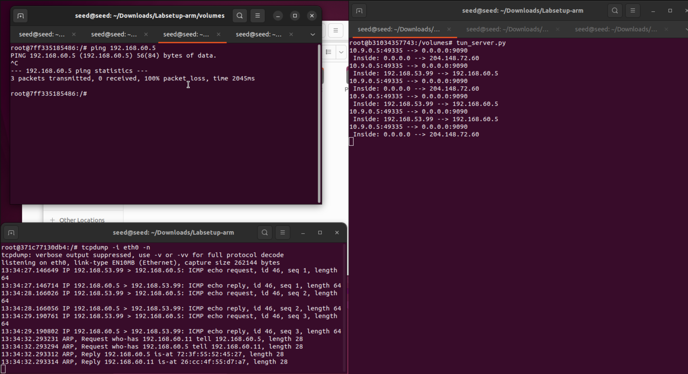

## Task 5: Handling traffic in both directions
1. As per the lab instructions, we need to modify the `tun_server.py` and `tun_client.py` to handle traffic in both directions.
2. Modified `tun_server.py`:
    - ```python
        #!/usr/bin/env python3
        import fcntl
        import struct
        import os
        import time
        from scapy.all import *

        TUNSETIFF = 0x400454ca
        IFF_TUN   = 0x0001
        IFF_TAP   = 0x0002
        IFF_NO_PI = 0x1000

        # 1.Create the tun interface and configure it.
        tun = os.open("/dev/net/tun", os.O_RDWR)
        ifr = struct.pack('16sH', b'tun%d', IFF_TUN | IFF_NO_PI)
        ifname_bytes  = fcntl.ioctl(tun, TUNSETIFF, ifr)

        # Get the interface name
        ifname = ifname_bytes.decode('UTF-8')[:16].strip("\x00")
        # up the interface
        os.system("ip addr add 192.168.53.11/24 dev {}".format(ifname))
        os.system("ip link set dev {} up".format(ifname))


        # setup UDP socket and bind it to 0.0.0.0:9090
        IP_A = "0.0.0.0"
        PORT = 9090
        HOST_U_IP = "10.9.0.5"
        HOST_U_PORT = 9090
        sock = socket.socket(socket.AF_INET,socket.SOCK_DGRAM)
        sock.bind((IP_A, PORT))
        while True:
                
            # this will block until at least one interface is ready
            ready, _, _ = select.select([sock, tun], [], [])
            for fd in ready:
                if fd is sock:
                    data, (HOST_U_IP, HOST_U_PORT) = sock.recvfrom(2048)
                    pkt = IP(data)
                    print("From socket <==: {} --> {}".format(pkt.src, pkt.dst))
                    os.write(tun, bytes(pkt))
                if fd is tun:
                    packet = os.read(tun, 2048)
                    pkt = IP(packet)
                    print("From tun ==>: {} --> {}".format(pkt.src, pkt.dst))
                    sock.sendto(packet, (HOST_U_IP, HOST_U_PORT))

        ```
3. Modified `tun_client.py`:    
    - ```python
        #!/usr/bin/env python3
        import fcntl
        import struct
        import os
        import time
        from scapy.all import *

        TUNSETIFF = 0x400454ca
        IFF_TUN   = 0x0001
        IFF_TAP   = 0x0002
        IFF_NO_PI = 0x1000

        # Create the tun interface
        tun = os.open("/dev/net/tun", os.O_RDWR)
        ifr = struct.pack('16sH', b'tun%d', IFF_TUN | IFF_NO_PI)
        ifname_bytes  = fcntl.ioctl(tun, TUNSETIFF, ifr)

        # Get the interface name
        ifname = ifname_bytes.decode('UTF-8')[:16].strip("\x00")

        os.system("ip addr add 192.168.53.99/24 dev {}".format(ifname))
        os.system("ip link set dev {} up".format(ifname))
        os.system("ip route add 192.168.60.0/24 dev {} via 192.168.53.99".format(ifname))

        sock = socket.socket(socket.AF_INET,socket.SOCK_DGRAM)
        VPN_SERVER_IP, VPN_SERVER_PORT = '10.9.0.11', 9090
        while True:
                    
            # this will block until at least one interface is ready
            ready, _, _ = select.select([sock, tun], [], [])
            for fd in ready:
                if fd is sock:
                    data, (VPN_SERVER_IP, VPN_SERVER_PORT) = sock.recvfrom(2048)
                    pkt = IP(data)
                    print("From socket <==: {} --> {}".format(pkt.src, pkt.dst))
                    os.write(tun, bytes(pkt))
                if fd is tun:
                    packet = os.read(tun, 2048)
                    pkt = IP(packet)
                    print("From tun ==>: {} --> {}".format(pkt.src, pkt.dst))
                    sock.sendto(packet, (VPN_SERVER_IP, VPN_SERVER_PORT))
        ```
4. Now we run the modifier `tun_server.py` on the VPN server and `tun_client.py` on Host U.
5. Then we ssh into Host U and run `ping 192.168.60.5` to ping Host V, we see that the `tun_server.py` on the VPN server is able to capture the ICMP echo request packets, and write them to the TUN interface on the VPN server, which then routes the packets to Host V, and our ping command is able to receive ICMP echo reply packets from Host V.
    - 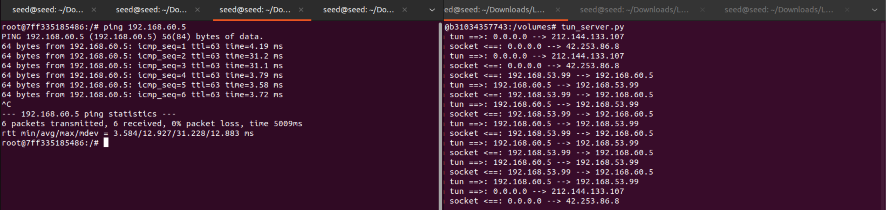
6. Using Wireshark we can also check the ping packets from Host U to Host V.
    - 
        - We see that the ICMP echo request packets are sent from Host U `10.9.0.5` to `10.9.0.11` the VPN server, as UDP packets as they are encapsulated in UDP by the `tun_client.py` script.
        - The replies are also UDP packets from the VPN server `10.9.0.11` to Host U `10.9.0.5` and contain the ICMP echo reply packets.
        - We see that the ICMP echo request packets are sent from the VPN server in the internal network `192.168.53.99` to Host V `192.168.60.5`, as normal ICMP packets as they are written to the TUN interface by the `tun_server.py` script.
        - The replies are also normal ICMP packets from Host V `192.168.60.5` to the VPN server `192.168.53.99`.
7. Using Wireshark we can also check the telnet packets from Host U to Host V.
    - 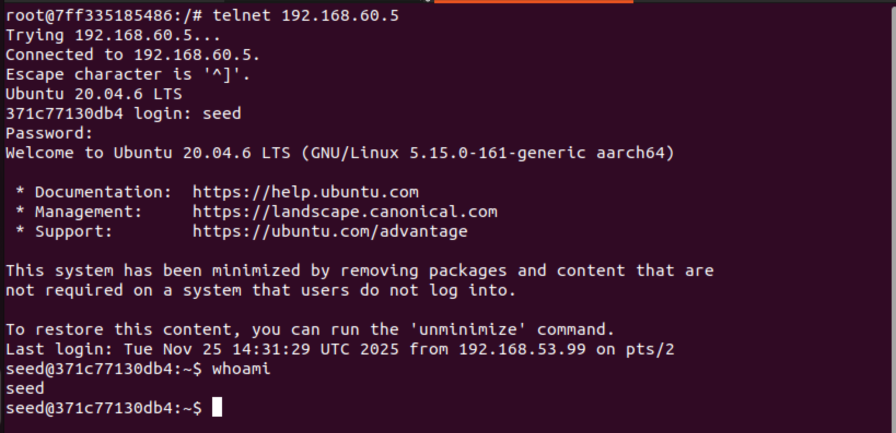
    - We see that the telnet is successful.
    - 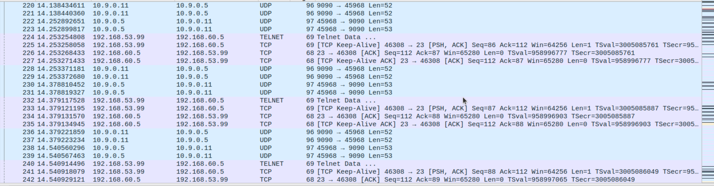
    - In Wireshark, we can also see, similar to the ping packets, that the telnet packets are encapsulated in UDP packets when sent from Host U `10.9.0.5` to the VPN server `10.9.0.11` through the `tun_client.py` script, and are normal TCP packets when sent from the VPN server on the internal network `192.168.53.99` to Host V `192.168.60.5`, through the `tun_server.py` script.

## Task 6: Tunnel Breaking Experiment
1. When we run `telnet` from host U to host V, then we stop the `tun_server.py` on the VPN server, we see that the telnet terminal becomes unresponsive and nothing is displayed when we type anything into the terminal.
2. Then we restart both the `tun_server.py` on the VPN server and `tun_client.py` on Host U, and we see that the telnet session is restored, whatever we typed into the keyboard when the terminal was unresponsive shows up all at once, and we can type commands into the terminal again and the output works as expected.
    - 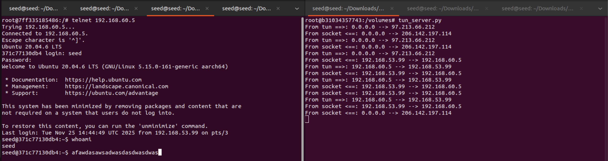
3. The reason for this behavior is that when the `tun_server.py` is stopped, the VPN tunnel between Host U and Host V is broken, causing packets sent from Host U to be lost as there is no server to receive and forward them to Host V. This results in the telnet session becoming unresponsive since the packets cannot reach their destination, but the telnet packets are buffered on Host U's shell, then when the `tun_server.py` is restarted, the VPN tunnel is re-established, allowing the buffered packets to be sent to Host V all at once, restoring the telnet session, the buffered packets are sent in a burst to Host V, which is why they all appear at once in the terminal.


