# Writeup for lab 8 IDS (NOT SEED LAB)

## Setting Up
- I did this on windows since the mac setup had issues, the window instructions worked properly on the SEED-Labs Ubuntu 20.04 virtualbox VM.
- 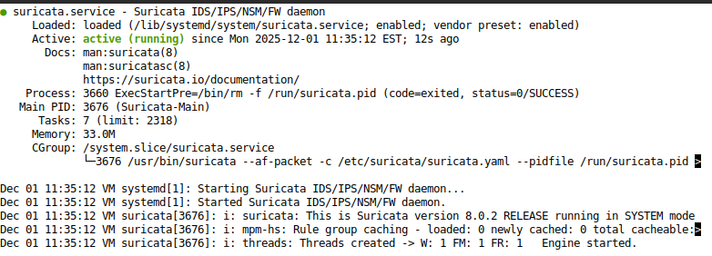
- Setup was successful on windows as seen on the screenshot above suricata worked properly.

## Attack 1
- Following the instructions in the lab, I send the `attack1.pcap` to suricata using the following command:
    - ```
        sudo suricata -r attack1.pcap -c /etc/suricata/suricata.yaml -l /var/log/suricata
        ```
- Then on a seperate terminal I use the following command to read the logs from suricata:
    - ```
        sudo cat /var/log/suricata/eve.json | grep -a "Suspicious"
        ```
- 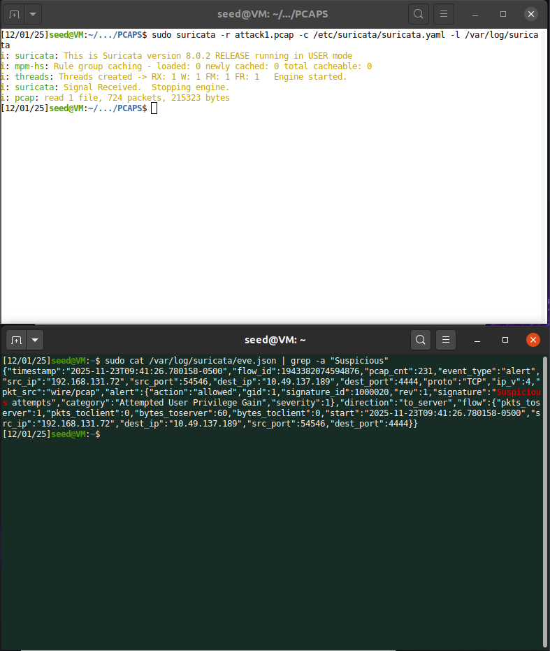
- Then we indeed see that there is 1 reponse in the log:
    - ```
        {"timestamp":"2025-11-23T09:41:26.780158-0500","flow_id":1943382074594876,"pcap_cnt":231,"event_type":"alert","src_ip":"192.168.131.72","src_port":54546,"dest_ip":"10.49.137.189","dest_port":4444,"proto":"TCP","ip_v":4,"pkt_src":"wire/pcap","alert":{"action":"allowed","gid":1,"signature_id":1000020,"rev":1,"signature":"Suspicious attempts","category":"Attempted User Privilege Gain","severity":1},"direction":"to_server","flow":{"pkts_toserver":1,"pkts_toclient":0,"bytes_toserver":60,"bytes_toclient":0,"start":"2025-11-23T09:41:26.780158-0500","src_ip":"192.168.131.72","dest_ip":"10.49.137.189","src_port":54546,"dest_port":4444}}
    ```
- Then I open the PCAP file in wireshark and analyze the contents.
    - 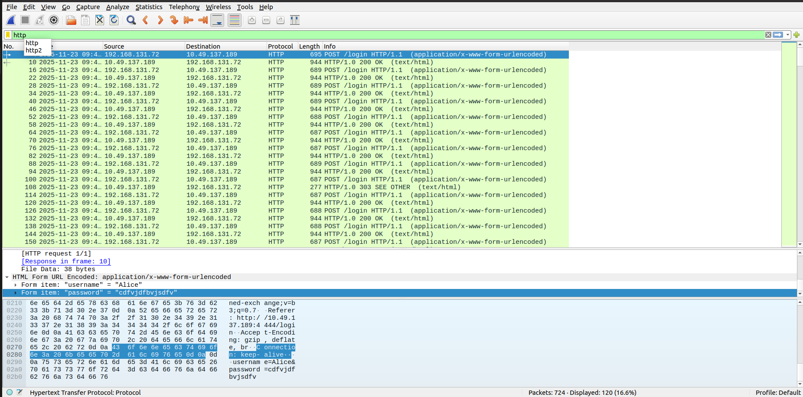
- We can see that there are many http POST requests from ip source address `192.168.131.72` to ip destination address `10.49.137.189` to the `/login` endpoint.
- We can also see that the POST requests contain a encoded URL form item that has the username as `Alice` and the password is changed every request.
- This suggests that the attacker at `192.168.131.72` is trying to brute force the password to login as `Alice`
- Then we also see that in wireshark that the response for a failed login attempt is consistent with length of 944.
    - 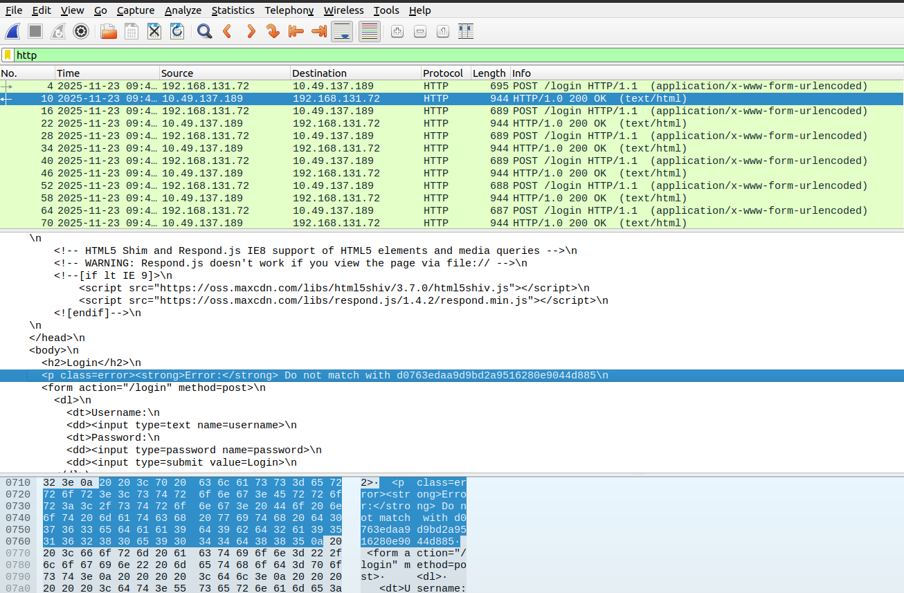
- Then we can filter the pcap to exlude the fail attempts so that we can see if there were successful attempts made, we can use this filter `http and frame.len!=944`
    - 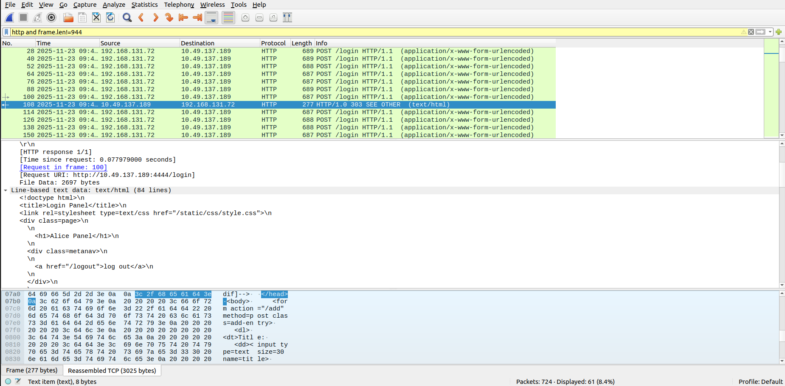
- Then we see that packet 108 is a status code 303 response, and the html content of the response shows a logout page, which suggests that the login was **successful** by the attacker.
- To get the user name and password, all we have to do is check which request was used to achieve this response, and we find out the username is `Alice` and the password is `monkey` as seen in the POST request packet information:
    - 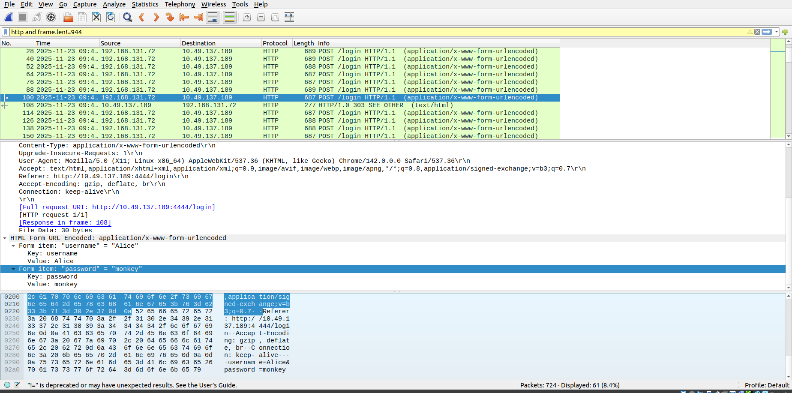

## Attack 2
- When we open up the `attack2.pcap` file in wireshark we see that there are many TCP SYN packets being sent from source ip and port `192.168.131.72:63986` to destination ip `10.49.161.151` with different ports.
    - 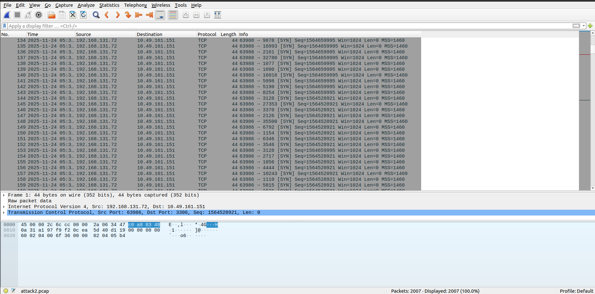
- This ressambles a reconnaissance port scan attack, where the attacker is trying to find an open port on the target ip address by randomly sending TCP SYN pacckets to different ports and wait for a SYN-ACK response, which indicates that the port is open.
- Then to setup a rule on suricata to detect this type of attack, we can use the following rule:
    - ```
        alert tcp any any -> any any (msg:"Potential TCP SYN Port Scanning Detected"; flags:S; threshold:type threshold, track by_src, count 1000, seconds 10; classtype: network-scan; sid:1000021; rev:1;)
        ```
- This rule will trigger an alert when more than 1000 TCP SYN packets are sent from a same source ip address within 10 second.
- After adding this rule to our `custom.rules` file, in `/etc/suricata/rules/` directory, I restart suricata using `sudo systemctl restart suricata`.
- We can run the `attack2.pcap` file through suricata again using the same command as before:
    - ```
        sudo suricata -r attack2.pcap -c /etc/suricata/suricata.yaml -l /var/log/suricata
        ```
- Then we can check the logs again using the same command as before:
    - ```
        sudo cat /var/log/suricata/eve.json | grep -a "Potential TCP SYN Port Scanning Detected"
        ```
- 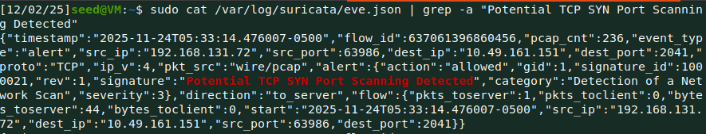
- We can see in our logs that our rule successfully detected the port scanning attack in the `attack2.pcap` file, and the alert was triggered for source ip `92.168.131.72` as expected.
- From all the findings we have above, we know that the attacker was performing a port scanning attack from the target ip `92.168.131.72` to the destination ip `10.49.161.151`

## Attack 3
- Looking through the `attack3.pcap` file in wireshark, we can first filter the file using the filter `http and ip.src==192.168.131.72` to only show http traffic from the attacker ip address.
- Then we see that there is a suspicious http POST request to the `/login` endpoint that is trying to do a `' union select` sql injection attack.
    - 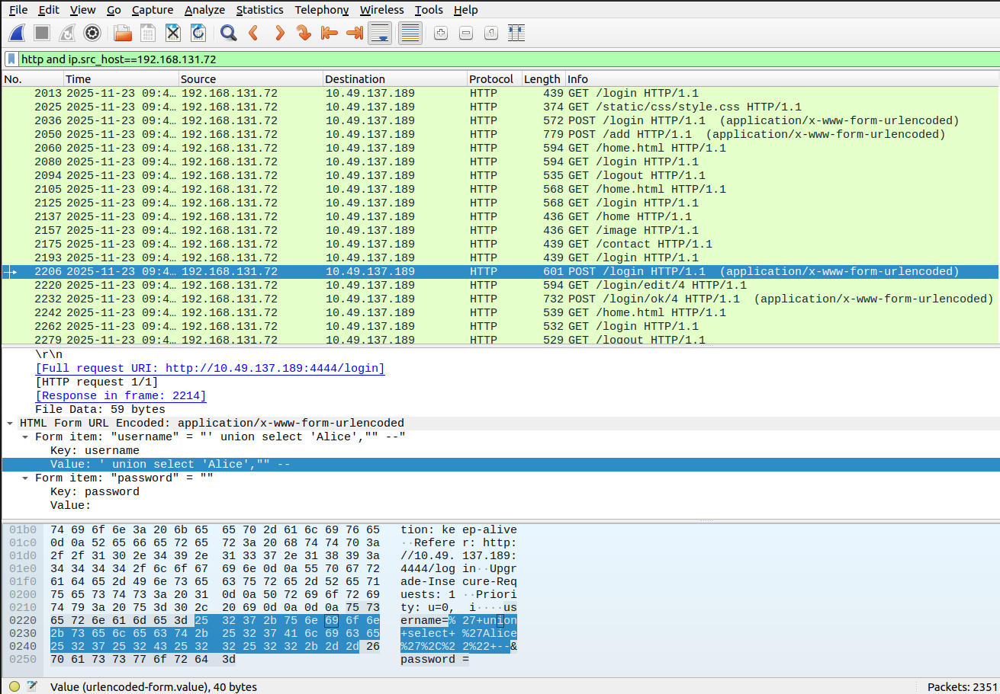
- We see that in the login form, the username field contains the value  `' union select 'Alice', "" --`.
- This is a classic sql injection attack where the attacker is trying to use the `union select` sql command to extract additional information from the database.
- Then to detect this type of `union select` sql injection attacks, using suricata, we can use the following rule:
    - ```
        alert http any any -> any any (msg:"Potential Union Select SQLI Detected"; content:"union"; nocase; content:"select"; nocase; distance:0; classtype:web-application-attack; sid:1000022; rev:1;)
        ```
- This rule will trigger an alert when an http request containing both the keywords `union` and `select` is detected.
- After adding this rule to our `custom.rules` file, in `/etc/suricata/rules/` directory, I restart suricata using `sudo systemctl restart suricata`.
- We can run the `attack3.pcap` file through suricata again using the same command as before:
    - ```
        sudo suricata -r attack3.pcap -c /etc/suricata/suricata.yaml -l /var/log/suricata
        ```
- Then we can check the logs again using the same command as before:
    - ```
        sudo cat /var/log/suricata/eve.json | grep -a "Potential Union Select SQLI Detected"
        ```
- 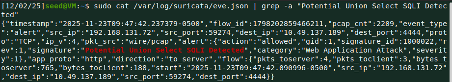
- We see that in the log files that our rule successfully detected the sql injection attack in the `attack3.pcap` file, and the alert was triggered for source ip `192.168.131.72` as expected.
- From all the findings we have above, we know that the attacker was performing a `union select` sql injection attack.

## Attack 4
- Opening the `attack4.pcap` file in wireshark, we can filter the file using the filter `http and ip.src==192.168.131.72` to only show http traffic from the attacker ip address.
- Then we see that there is a suspicious http GET request: 
    - 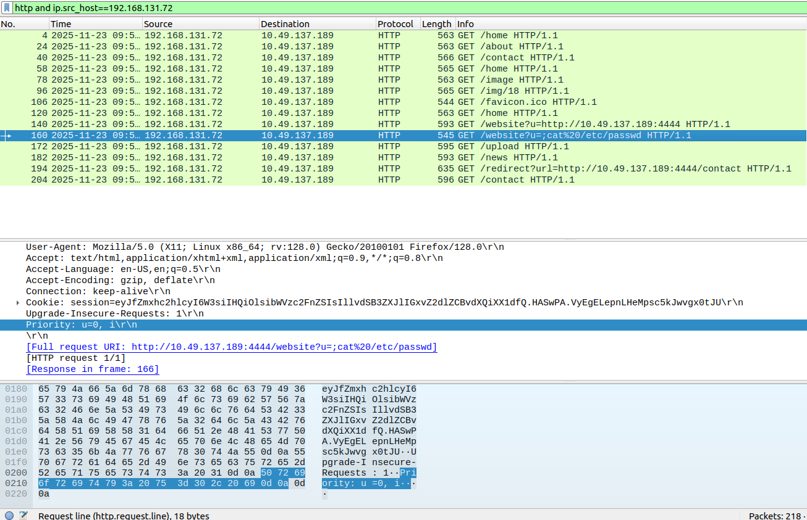
- We see that in packet 160, there is a GET request to `http://10.49.137.189:4444/website?u=;cat%20/etc/passwd`, trying to get the contents of  the `/etc/passwd` file using a command injection attack.
- To detect such type of command injection attacks using suricata, we can setup the following rule:
    - ```
        alert http any any -> any any (msg:"Potential Command Injection Detected";flow:established, to_server;http.uri; pcre:"/(\;|\|\||\||&&)/"; classtype:web-application-attack; sid:1000023; rev:1;)
        ```
- Then this rule will trigger an alert when an http request containing special characters such as `;`, `|`, `||`, or `&&` in the URI is detected, which are commonly used in command injection attacks.
- After adding this rule to our `custom.rules` file, in `/etc/suricata/rules/` directory, I restart suricata using `sudo systemctl restart suricata`.
- We can run the `attack4.pcap` file through suricata again using the same command as before:
    - ```
        sudo suricata -r attack4.pcap -c /etc/suricata/suricata.yaml -l /var/log/suricata
        ```
- 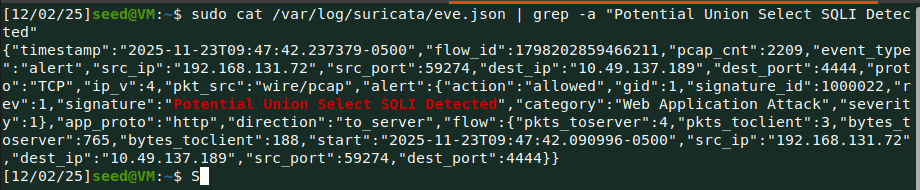
- We can see from the log file that our rule successfully detected the command injection attack in the `attack4.pcap` file, and the alert was triggered.
- From all the findings we have above, we know that the attacker was performing a command injection attack.
- 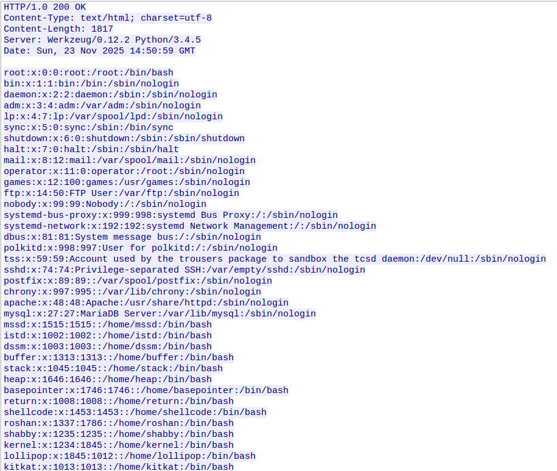
- Then as we can see from following the packet in wireshark, we can see that the contents of the `/etc/passwd` file was indeed sent back to the attacker. Hence the attacker was able to the entire contents of the `/etc/passwd` file.

## Attack 5 (Trickbot Trojan)
- We open the `attack5.pcap` file in wireshark, and we can filter the file using tthe filter `http.request.method=="POST"` as mentioned by the lab instructions.
- Then we see that packet 5165 is a packet that has user agent `test` 
    - 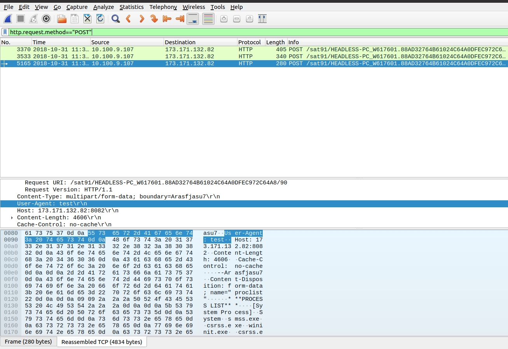
- Then we when we follow the packet stream, we can see this:
    - 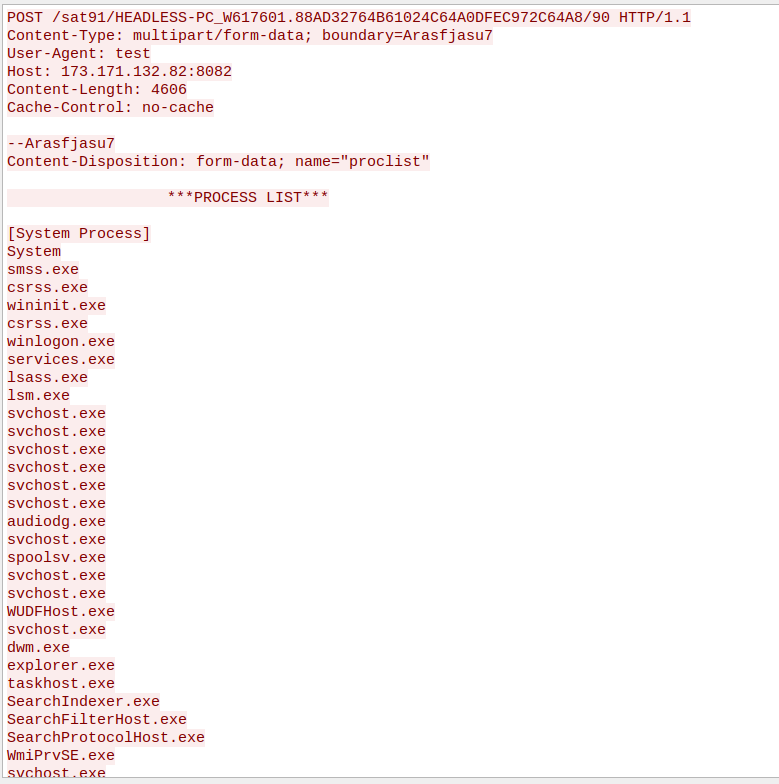
- We see that the process list, system info and machine information are being sent back to the attacker's ip address at `173.171.132.82` from the victim ip address at `10.100.9.107`.
- To detect this trojan activity using suricata we can setup the following rule:
    - ```
        alert http any any -> any any (msg:"Potential Trickbot Trojan Activity Detected - User-Agent test";flow:established,to_server;content:"POST";http_method;content:"User-Agent: test";http_header;sid:1000024;rev:1;)
        ```
- This rule will trigger an alert when an http POST request with user agent `test` is detected.
- After adding this rule to our `custom.rules` file, in `/etc/suricata/rules/` directory, I restart suricata using `sudo systemctl restart suricata`.
- We can run the `attack5.pcap` file through suricata again using the same command as before:
    - ```
        sudo suricata -r attack5.pcap -c /etc/suricata/suricata.yaml -l /var/log/suricata
        ```
- Then we can check the logs again using the same command as before:
    - ```
        sudo cat /var/log/suricata/eve.json | grep -a "Potential Trickbot Trojan Activity Detected - User-Agent test"
        ```
- 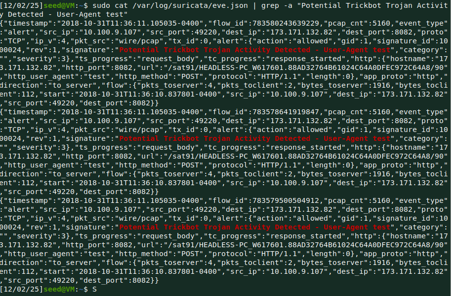
- We see that in the log files that our rule successfully detected the Trickbot Trojan activity in the `attack5.pcap` file, and the alert was triggered
- The ip address of the infected machine client is `10.100.9.107` i.e the source ip address of the POST request. This can also be confirmed by looking at the machine information sent to the attacker's server, where we can see the ipconfig output of the machine.
    - 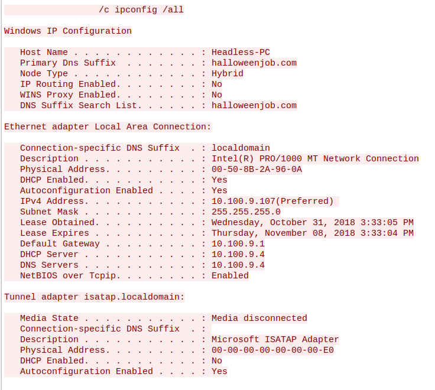
- The domain name of the infected machine is `halloweenjob.com` as seen from the local machine data being sent back to the attacker's server.
    - 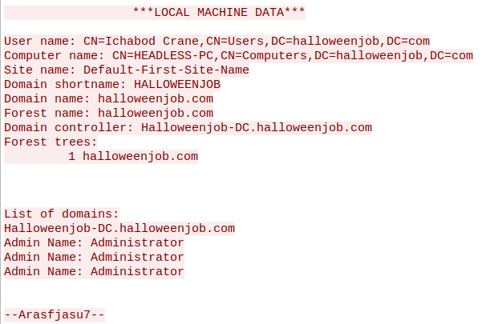
- To find the name of the malware executable file, first we can export the http objects from the pcap file using wireshark:
    - 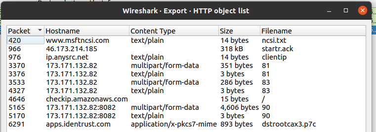
- Then we see that packer 966 is a suspiciously large file of size 318kb compared to the rest of the files and has the file name `startr.ack`.
- Then when checking the content of packet 966, we can take a look at the data content:
    - 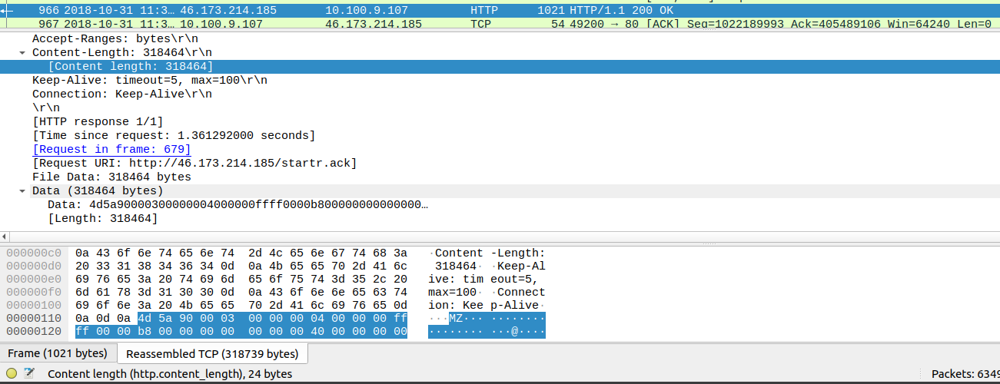
- We see that the data binary start with a `0x4d5a` hex signature, which according to wikepedia corresponds to the `MZ` header of a Windows executable file.
    - 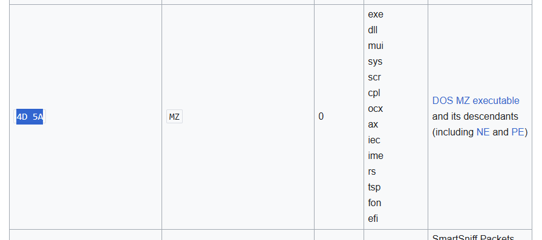
- We can conclude that the name of the malware executable file is `startr.ack` as seen from the http object export window.

## Attack 6
- After opening the `attack6.pcap` file in wireshark, learning from attack 5 where we use the packet size to spot suspicious packets, we can first export the http objects from the pcap file:
    - 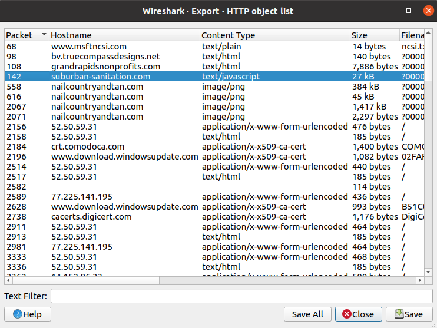
- Then we can see that there are 4 unusually large packets, packets `142`, `558`, `616`, and `2067`.
- When checking the content of packet `558`, we notice that the even though the media type indicates that it's a png image, the data content starts with the same `0x4d5a` hex signature as before.
    - 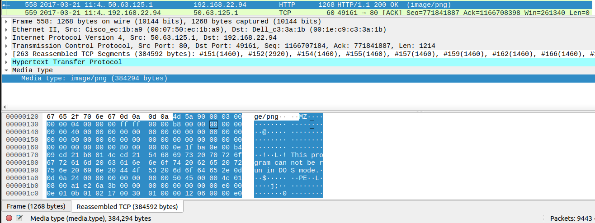
- This indicates that the file is actually a Windows executable file disguised as a png image.
- This is similar for packets `616` and `2067` as well, where they also start with the `0x4d5a` hex signature.
- packet `616` content:
    - 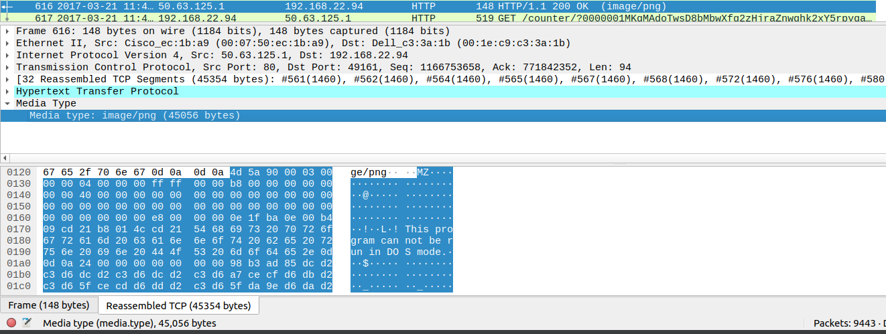
- packet `2067` content:
    - 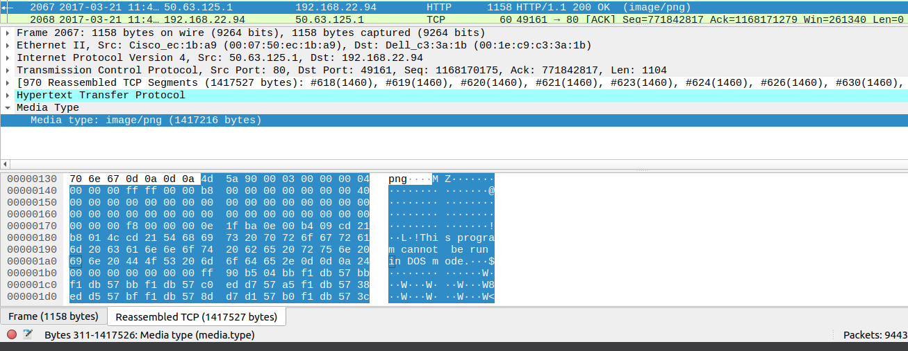
- As such we can see that the attacker using media files to disguise malware executable files is the common theme here, and we can set a suricata rule to detect such activity:
    -```
        alert http any any -> any any (msg:"Potential Malware Disguised as Media File Detected -0x4d5a"; flow:established, to_client; content: "MZ"; distance:0;content:"Content-Type: image/png"; http_header; classtype:trojan-activity; sid:1000025; rev:1;)
        ```
- This rule will trigger an alert when an http response with content type `image/png` containing the `0x4d5a` hex signature is detected.
- After adding this rule to our `custom.rules` file, in `/etc/suricata/rules/` directory, I restart suricata using `sudo systemctl restart suricata`.
- We can run the `attack6.pcap` file through suricata again using the same command as before:
    - ```
        sudo suricata -r attack6.pcap -c /etc/suricata/suricata.yaml -l /var/log/suricata
        ```
- 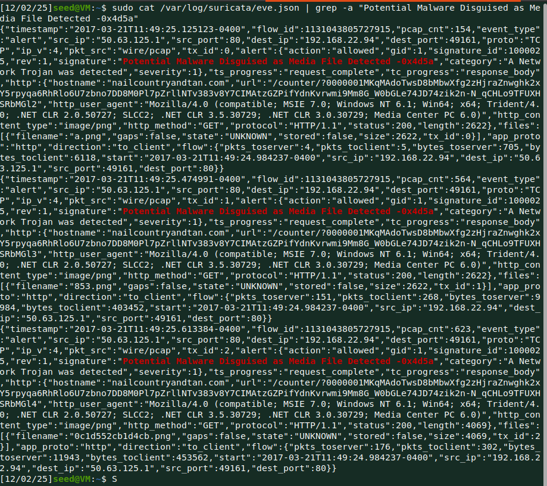
- We see that in the log files that our rule successfully detected the malware disguised as media file activity in the `attack6.pcap` file, and the alert was triggered 3 times as expected.
- The type of file being used by the attacker in this attack to disguise the malware being downloaded by the client victim is a `png` image file, as seen from the content type in the http response headers in the wireshark packet:
    - 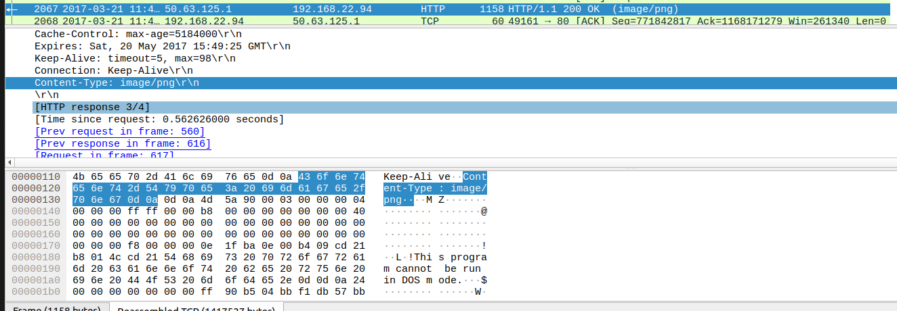